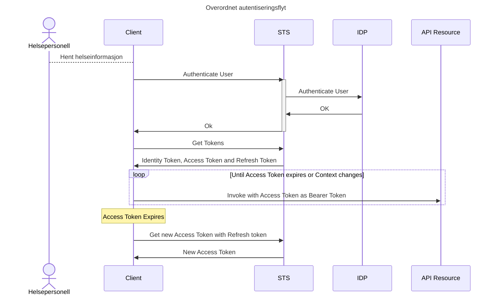

# Bruk av OpenID Connect for deling av helseopplysninger via API

## 1. Introduksjon
Dette dokumentet er en teknisk spesifikasjon som beskriver hvordan OpenID Connect og OAuth 2.0 skal benyttes ved deling av helseopplysninger innad i Helsenettet. Dokumentet er ment for utviklere og tekniske arkitekter som skal konsumere API hvor det er et krav at helsepersonellet er autentisert.

OpenID Connect er en protokoll som lar utvikleren selv velge en del sikkerhetsmessige egenskaper ved protokollen. Når man deler helseopplysninger er det forventet at sikkerheten blir ivaretatt på god nok måte. Denne spesifikasjonen er ikke en generell beskrivelse av hvordan OpenID Connect skal benyttes, men en spesifikk beskrivelse av hvordan HelseID skal brukes ved deling av helseopplysninger. 

HelseID gjør det mulig å gjenbruke en autentisering mellom to eller flere applikasjoner, såkalt Single Sign-On (SSO).  HelseID gjør det også mulig for applikasjonen som ber om autentisering, også kalt Relying Party (RP), å gjenbruke en pålogget brukersesjon når RP også er en OAuth klient som skal be om tilgang til et API. 

> **_TODO:_** [Legg inn en tegning her]

## 2. Forutsetninger og underliggende krav
- OpenID Connect (RFC Lenke)
- OAuth 2.0 (RFC Lenke)
- HelseID sikkerhetsprofil (basert på FAPI 2.0)
- JWT profil for tillitsrammeverk - "trusted_claims"

### 2.1 Tillitsrammeverk for deling av helseopplysninger
Tillitsrammeverk for deling av helseopplysninger i norsk helsesektor er beskrevet i egne dokumenter.

> **_TODO:_** [Legg inn lenker til rammeverket, samt en kort oppsummering.}

- Helsenettet 
- Norm for informasjonssikkerhet 
- eID i tillitsrammeverket 
- Avtaleverk 

## 3. Beskrivelse av autentiseringsflyt
### 3.1 Autentiseringsforespørsel

RP ber om autentisering av den fysiske personen ved bruk av normal flyt iht. protokoll, men med følgende presiseringer: 
* RP skal benytte en av følgende mekanismer ved forespørsler mot HelseID: 
  * Request Object, som beskrevet i …., eller   
    **Spørsmål:_** Skal vi kreve at parametre inkluderes i RO, eller forsette dagens policy hvor det er valgfritt   
  * Pushed Authorization Requests, som beskrevet i.. 
  
* Dersom Request Object benyttes skal denne overføres til HelseID som et form parameter.

* Når støtte er på plass, skal DPoP benyttes for å krypografisk binde Access Token til klient.

* RP/API klient skal overføre informasjon som beskriver bakgrunnen for tilgangsforespørselen ved bruk av mekanismen Rich Authorization Requests, som beskrevet i > **_TODO:_** [Lenke til eget dokument]

* Informasjon som beskriver bakgrunn for tilgangsforespørselen skal følge standarden som er angitt i… (autentiseringsforespørsler) 

* RP skal autentisere brukeren iht. regler i tillitsrammeverket **_TODO:_** [Lenke her}
   * Dette inkluderer å verifisere at lokal brukeridentitet (om noen) i RP er lik brukeridentiteten returnert fra HelseID.

Hvert enkelt steg i flyten over er beskrevet i detalj under

#### 3.1.1 Legg inn sekvensdiagram som viser første versjon
#### 3.1.1 Legg inn sekvensdiagram som viser målbilde (PAR, DPoP)

#### 3.1.1 Kall fra RP for brukerautentisering
* Authorization Details (context, virksomhet, annet)
  - Forslag: I målbilde, men ikke nødvendig i første iterasjon

* Resource Indicators (Required)
  - Use case: RP konsumerer flere API-er med krav 
* Request Object (Optional)
* POST til HelseID (Required if Request Object is used)
* Vis til profil for krav (dokumentasjon.helseid.no)

#### 3.1.2 Kontroller i HelseID

* Vise kontroller i HelseID 
  * Vise autentisering av klient 
    (Krav til signeringsalg, levetid på token, JTI)
  * Vise kontroll av klient 
    (Godkjent for PDS)
  * Vise sjekk av systemidentitet
    (Ikke implementert ennå) 
  * Vise sjekk av virksomhetsidentitet 
  * Vise berikelse av personinformasjon 
  * Vise berikelse av HPR informasjon 

#### 3.1.3 Kall til IDP

* Vise kall til IdP 
  * Ikke bruk videre føderering 
* Vise kontroll av autentisering 

#### 3.1.3 Kall fra RP til Token-endepunkt
* Authorization Details (context, virksomhet, annet)
* Client Assertion

* Vise utstedelse av access token og id token 
* Vise kall til token endepunktet med Auth Code 
* Vise utstedelse av Access Token 

#### 3.1.4 Kontroll i RP av Identity Token
* Pek til profil
* Kontroll av lokal identitet vs Identity Token

### 3.2 Generering av Access Token 
- Peke på "trusted_claims" profilen 

### 3.3 Forespørsel til API
- Validering av token 
- DPoP 
- eID 
- Validering og bruk av informasjon i token 
- Revisjonslogging 

### 3.4 Bruk av refreshtoken

## 4. Sikkerhetsvurderinger
HelseID krever sikkerhetsprofilen FAPI 2.0 (lenke til vår versjon av profilen)
Pek til Security BCP og Trusselmodell

Beskriv konkrete sikkerhetstiltak på klienten:
- XSS (for nettlesere)
- Sjekk av parametre som sendes til HelseID 
- Kontroll av tokens 
- Riktig URL til HelseID

Sikkerhet i API:
- Kreve DPoP eller mTLS

Sikkerhet i OP:
- Nøkkelmateriale 
- Sikkerhet i registre brukt til berikelse av informasjon 

 