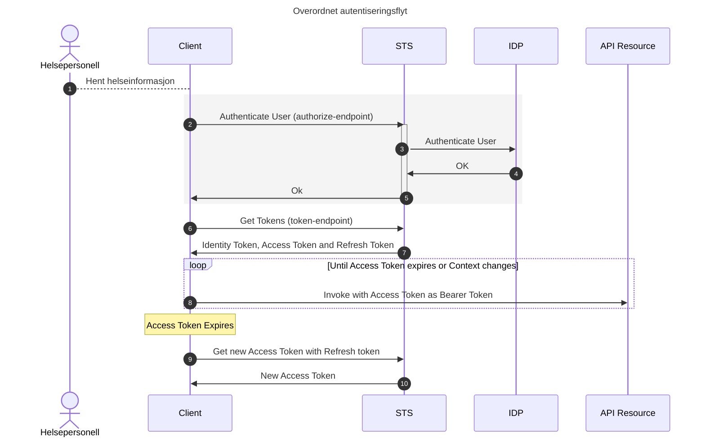
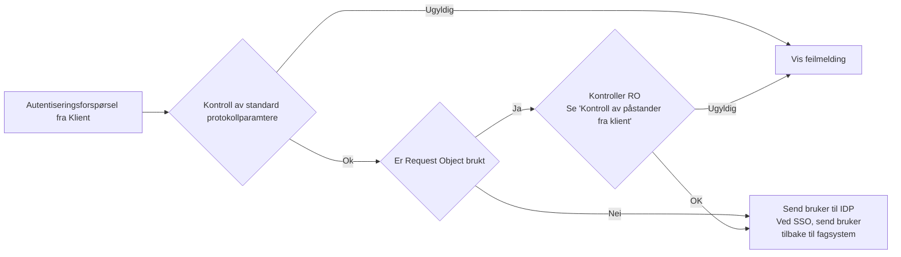
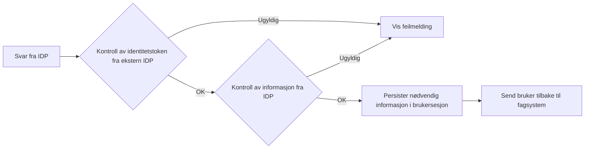
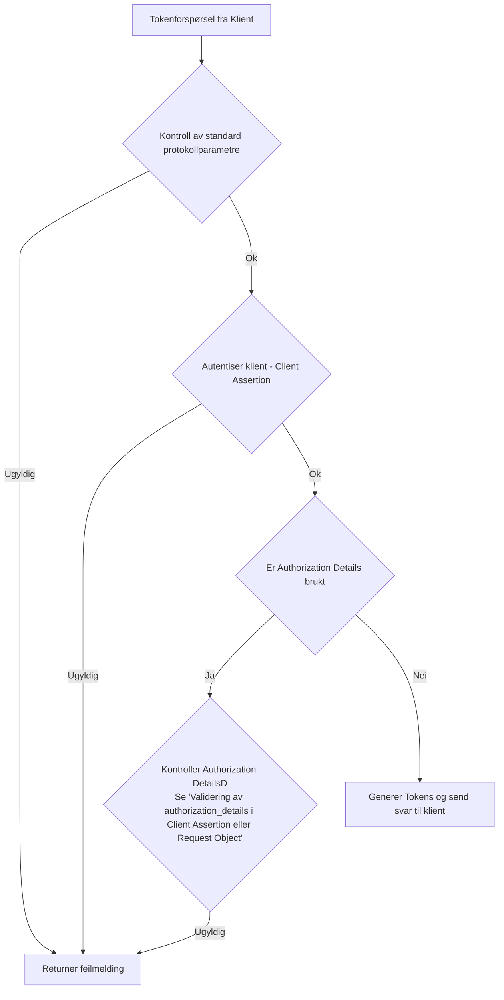

# Bruk av OpenID Connect for deling av helseopplysninger via API
Versjon: 0.1

Dato: 14.02.2023

## Definisjon av begrep og forkortelser
Dokuemntet benytter begreper og terminologi som er definert i følgende spesifikasjoner: [@!RFC6749], [@!RFC6750], [@!RFC7636], [@!OIDC] og ISO29100.

| Begrep | Definisjon |
| --- | --- |
| API | Application Programming Interface |
| HTTP | Hyper Text Transfer Protocol |
| REST | Representational State Transfer |
| OIDC | [OpenID Connect  Core](https://openid.net/specs/openid-connect-core-1_0.html) |
| OAuth 2.0 | [The OAuth 2.0 Authorization Framework](https://www.ietf.org/rfc/rfc6749.txt) |
| RP | OpenID Connect Relying Party.  Som "client" i OAuth. |
| Klient | Som i "client" i OAuth 2. Se også "RP" |
| RAR | [Rich Authorization Requests](https://datatracker.ietf.org/doc/html/draft-ietf-oauth-rar) |

## Innholdsfortegnelse
- [Bruk av OpenID Connect for deling av helseopplysninger via API](#bruk-av-openid-connect-for-deling-av-helseopplysninger-via-api)
  - [Definisjon av begrep og forkortelser](#definisjon-av-begrep-og-forkortelser)
  - [Innholdsfortegnelse](#innholdsfortegnelse)
  - [Introduksjon](#introduksjon)
  - [Forutsetninger og underliggende krav](#forutsetninger-og-underliggende-krav)
    - [Underliggende spesifikasjoner og profiler](#underliggende-spesifikasjoner-og-profiler)
    - [Tillitsrammeverk for deling av helseopplysninger](#tillitsrammeverk-for-deling-av-helseopplysninger)
    - [Krav knyttet til bruk av HelseID](#krav-knyttet-til-bruk-av-helseid)
      - [Krav til RP/Klient](#krav-til-rpklient)
      - [Krav til API/Tjeneste](#krav-til-apitjeneste)
      - [Krav til HelseID](#krav-til-helseid)
  - [Bruk av HelseID ved deling av helseopplysninger](#bruk-av-helseid-ved-deling-av-helseopplysninger)
    - [Overordnet beskrivelse av bruksmønster](#overordnet-beskrivelse-av-bruksmønster)
      - [Kall fra RP for brukerautentisering](#kall-fra-rp-for-brukerautentisering)
        - [Krav knyttet til forespørsler om brukerautentisering](#krav-knyttet-til-forespørsler-om-brukerautentisering)
        - [Overføre informasjon om grunnlaget for tilgang fra RP](#overføre-informasjon-om-grunnlaget-for-tilgang-fra-rp)
        - [Forspørsel om tilgang til flere API-er](#forspørsel-om-tilgang-til-flere-api-er)
      - [Kontroller i HelseID av forespørsler om brukerautentisering](#kontroller-i-helseid-av-forespørsler-om-brukerautentisering)
        - [Kontroll av standard protokollparamtere](#kontroll-av-standard-protokollparamtere)
        - [Kontroll av Request Object](#kontroll-av-request-object)
        - [Kall til IDP](#kall-til-idp)
      - [Kontroller av svar fra ekstern IDP](#kontroller-av-svar-fra-ekstern-idp)
        - [Kontroll av svar fra ekstern IDP](#kontroll-av-svar-fra-ekstern-idp)
        - [Kontroll av informasjon fra ekstern IDP](#kontroll-av-informasjon-fra-ekstern-idp)
      - [Håndtering av resultat av brukerautentisering i klient](#håndtering-av-resultat-av-brukerautentisering-i-klient)
      - [Kall fra klient for å hente tokens](#kall-fra-klient-for-å-hente-tokens)
        - [Bruk av PKCE](#bruk-av-pkce)
        - [Bruk av Client Assertion](#bruk-av-client-assertion)
        - [Bruk av Resource Indicators](#bruk-av-resource-indicators)
        - [Bruk av RAR ("authorization\_details")](#bruk-av-rar-authorization_details)
      - [Kontroller i HelseID av forespørsel om tokens](#kontroller-i-helseid-av-forespørsel-om-tokens)
        - [Kontroll av standard protokollparametre](#kontroll-av-standard-protokollparametre)
      - [Generering av Identity Token og Access Token](#generering-av-identity-token-og-access-token)
    - [Bruk av RAR](#bruk-av-rar)
    - [Kontroller i klient av Identity Token](#kontroller-i-klient-av-identity-token)
    - [Kontroller i klient av Access Token](#kontroller-i-klient-av-access-token)
    - [Kontroller av Access Token i API](#kontroller-av-access-token-i-api)
    - [Bruk av refreshtoken](#bruk-av-refreshtoken)
  - [Sikkerhetsvurderinger](#sikkerhetsvurderinger)

## Introduksjon
Dette dokumentet er en teknisk spesifikasjon som beskriver hvordan OpenID Connect og OAuth 2.0 skal benyttes ved deling av helseopplysninger innad i Helsenettet. Dokumentet er ment for utviklere og tekniske arkitekter som skal konsumere API hvor det er et krav at helsepersonellet er autentisert.

OpenID Connect er en protokoll som lar utvikleren selv velge en del sikkerhetsmessige egenskaper ved protokollen. Når man deler helseopplysninger er det forventet at sikkerheten blir ivaretatt på god nok måte. Denne spesifikasjonen er ikke en generell beskrivelse av hvordan OpenID Connect skal benyttes, men en spesifikk beskrivelse av hvordan HelseID skal brukes ved deling av helseopplysninger. 

HelseID gjør det mulig å gjenbruke en autentisering mellom to eller flere applikasjoner, såkalt Single Sign-On (SSO).  HelseID gjør det også mulig for applikasjonen som ber om autentisering, også kalt Relying Party (RP), å gjenbruke en pålogget brukersesjon når RP også er en OAuth klient som skal be om tilgang til et API. 

Merk at begrepene RP og klient brukes synonymt i dette dokument.

> **_TODO:_** [Legg inn en tegning her]

## Forutsetninger og underliggende krav
- Underliggende spesifikasjoner og profiler
- Tillitsrammeverk for deling av helseopplysninger

### Underliggende spesifikasjoner og profiler

- [OpenID Connect](https://openid.net/specs/openid-connect-core-1_0.html)
- [OAuth 2.0](https://www.rfc-editor.org/rfc/rfc6749)
- [FAPI 2.0](https://openid.bitbucket.io/fapi/fapi-2_0-security-profile.html) Ikke normativ, men underlag for HelseID sin sikkerhetsprofil
- [OAuth 2.0 Security Best Current Practice](https://datatracker.ietf.org/doc/html/draft-ietf-oauth-security-topics)

### Tillitsrammeverk for deling av helseopplysninger
Tillitsrammeverk for deling av helseopplysninger i norsk helsesektor er beskrevet i egne dokumenter.

- [JWT profil for tillitsrammeverk](jwt_access_token_format.md)
- [RAR profil for tillitsrammeverk](profil_for_authorization_details.md)
- Helsenettet **_TODO_**
- Norm for informasjonssikkerhet **_TODO_**
- eID i tillitsrammeverket **_TODO_**
- Avtaleverk **_TODO_**

### Krav knyttet til bruk av HelseID
#### Krav til RP/Klient
- Skal
- Bør
- Kan
- Kommende krav

#### Krav til API/Tjeneste
- Skal
- Bør
- Kan
- Kommende krav

#### Krav til HelseID
- Skal
- Bør
- Kan
- Kommende krav

## Bruk av HelseID ved deling av helseopplysninger

### Overordnet beskrivelse av bruksmønster
RP ber om autentisering av den fysiske personen ved bruk av normal flyt iht. protokoll, men med følgende presiseringer: 
* RP skal benytte en av følgende mekanismer ved forespørsler mot HelseID: 
  * Request Object, som beskrevet i …., eller   
  * Pushed Authorization Requests, som beskrevet i.. 
  
* Dersom Request Object benyttes skal denne overføres til HelseID som et FORM parameter.

* Det er et krav at et token ikke skal kunne stjeles eller misbrukes. Mekanismene som skal forhindre dette er ikke tilgjengelig i HelseID enda, men når de er på plass skal klienten bruke DPoP eller mTLS for å binde seg krypografisk til Access Tokens.

* RP/API klient skal overføre informasjon som beskriver bakgrunnen for tilgangsforespørselen ved bruk av mekanismen Rich Authorization Requests, som beskrevet i **_TODO:_** [Lenke til eget dokument]

* Informasjon som beskriver bakgrunn for tilgangsforespørselen skal følge standarden som er angitt i… (autentiseringsforespørsler) 

* RP skal autentisere brukeren iht. regler i tillitsrammeverket **_TODO:_** [Lenke her]
   * Dette inkluderer å verifisere at lokal brukeridentitet (om noen) i RP er lik brukeridentiteten returnert fra HelseID.

Hvert enkelt steg i flyten over er beskrevet i detalj under

**_TODO:_** [Legg inn sekvensdiagram som viser målbilde med PAR og DPoP]

#### Kall fra RP for brukerautentisering
Når et helsepersonell ønsker å få tilgang til helseopplysninger i andre virksomheter SKAL helsepersonellet autentiseres i HelseID, ref steg 1 og 2 i figuren over.

Brukeren SKAL sendes i nettleser til endepunktet [/authorize](https://openid.net/specs/openid-connect-core-1_0.html#AuthorizationEndpoint) i HelseID. Endepunktet er dokumentert [her](https://helseid.atlassian.net/wiki/spaces/HELSEID/pages/5571605/Authorize+Endpoint).

Utover normal protokollflyt er det følgende nødvendig

##### Krav knyttet til forespørsler om brukerautentisering
Basert på FAPI 2.0, med egne tilpassinger [lenke til vår profil]
* Request Object (signert med klienthemmeligheten)
* Hvordan velge IdP

##### Overføre informasjon om grunnlaget for tilgang fra RP
Ved deling av helseopplysninger på tvers av virksomheter i helsesektoren krever tillitsrammeverket at konsumentens EPJ-system overfører informasjon som beskriver hvorfor helsepersonellet har fått tilgang til pasientens helseopplysninger.
Datamodellen er [beskrevet i en egen spesifikasjon](https://github.com/NorskHelsenett/Tillitsrammeverk/blob/main/specs/informasjons_og_datamodell.md).

HelseID krever at denne informasjonen struktureres og formatteres i henhold til spesifikasjonen [profil for authorization_details" struktur](https://github.com/NorskHelsenett/Tillitsrammeverk/blob/main/specs/profil_for_authorization_details.md).

Strukturen som inneholder informasjon om grunnlaget for at helsepersonellet har fått tilgang til pasientens helseopplysninger skal enten:
* sendes til HelseID i autentiseringsforespørselen ved å benytte parameteret "request" i henhold til [OpenID Connect - Request Object](https://openid.net/specs/openid-connect-core-1_0.html#RequestObject), eller
* sendes til [token endepunktet](https://www.rfc-editor.org/rfc/rfc6749#section-3.2) som del av klientautentiseringen i henhold til [client_assertion](https://www.rfc-editor.org/rfc/rfc7521#page-13), og [OpenID Connect Core](https://openid.net/specs/openid-connect-core-1_0.html#ClientAuthentication). 

Det er opp til leverandør å velge mekanismen som passer best.

**_TODO:_** [Lenke til konkret eksempel + eksempelkode].

Et request object SKAL overføres som et FORM verdier i en POST request.

##### Forspørsel om tilgang til flere API-er
Tjenester som inngår i tillitsmodellen krever at Access Tokens ment for dem, ikke skal kunne brukes for å få tilgang andre API-er. I praksis innebærer dette at claimet "aud" (audience) ikke kan ha mer enn en verdi. *Audience* er navnet som identifiserer API-et i HelseID

HelseID gjør det enkelt for klienter å hente ett Access Token per tjeneste ved å tilby mekanismen [Resource Indicators](https://www.rfc-editor.org/rfc/rfc8707). Bruk av Resource indikators er beskrevet [her](https://helseid.atlassian.net/wiki/spaces/HELSEID/pages/481755152/Requesting+multiple+access+tokens+with+single+audiences).

#### Kontroller i HelseID av forespørsler om brukerautentisering
Figuren under viser hvilke kontroller HelseID gjør når en klient forespør brukerautentisering.

##### Kontroll av standard protokollparamtere
Det første som skjer en en kontroll av protokollparametre i forespørselen i henhold til OpenID Connect og sikkerhetsprofilen til HelseID. Dette inkluderer, men er ikke begrenset til:

  * Sjekk av at klienten er registrert og aktivert i HelseID
  * Sjekk av at klienten forspør API-er og annen informasjon den har tilgang til
  * Sjekk av at klienten sender med en gyldig redirect_uri
  * Sjekk av at klienten bruker PKCE
  * (Fremtidig) Sjekk av systemidentitet

Dersom noen av disse kontrollene feiler, vil sluttbrukeren se en feilmelding i sin nettleser.

Merk at protokollparametre både kan sendes som GET eller POST parametre, eller som en del av et Request Object. 

##### Kontroll av Request Object
Dersom klienten har inkludert et Request Object for å overføre kontekstuell informasjon til HelseID (f.eks virksomhet eller brukerkontekst), vil kontroll av dette skje på samme måte som for client assertions i Token-endepunktet. Se [Validering av authorization_details i Client Assertion eller Request Object](validering-av-authorizationdetails-i-client-assertion-eller-request-object).

Dersom noen av disse kontrollene feiler, vil sluttbrukeren se en feilmelding i sin nettleser.

##### Kall til IDP

Dersom alle kontroller er ok, sjekker HelseID om brukeren allerede har en sesjon i HelseID. Dersom dette er tilfelle, og klienten ikke eksplisitt har spurt om å ikke benytte Single sign-on, sendes brukeren tilbake til klienten (fagsystemet).

Om ikke, sendes brukeren til ekstern IDP for autentisering.

#### Kontroller av svar fra ekstern IDP
Etter at en bruker har autentisert seg hos en ekstern IDP, vil HelseID kontrollere resultatet.

##### Kontroll av svar fra ekstern IDP
Etter at brukeren har autentisert seg i ekstern IDP, sendes informasjon om dette tilbake til HelseID. Dette vil alltid være et Identity Token. HelseID validerer først gyldigheten på dette tokenet i henhold til protokollspesifikasjon og egen sikkerhetsprofil. 

Dersom noen av disse kontrollene feiler, vil sluttbrukeren se en feilmelding i sin nettleser.

##### Kontroll av informasjon fra ekstern IDP
HelseID forventer å få informasjon fra IDP om identitet til bruker, sikkerhetsnivå, påloggingsmekanisme mm. HelseID kontroller at denne informasjon er tilstede og gyldig.

Dersom dette feiler, vil sluttbrukeren se en feilmelding i sin nettleser.

#### Håndtering av resultat av brukerautentisering i klient
Når klienten mottar resultatet fra brukerautentiseringen fra HelseID, skal dette benyttes for å hente Identity-, Refresh- og Access Tokens. Dette gjøres i henhold i protokkspesifikasjon og HelseID sin sikkerhetsprofil.

#### Kall fra klient for å hente tokens
Etter vellykket brukesautentisering skal klient kalle token-endepunktet til HelseID for å hente Identity Token, Access Token og Refresh Token. Det skal benyttes POST.

Dette gjøres i henhold til spesifikasjon og sikkerhetsprofil og inkluderer:
- Bruk av PKCE
- Bruk av Client Assertion (privat_key_jwt) for klientautentisering
- Bruk av Resource Indicators for å hente ut API-spesifikke Access Token. 
- Bruk av RAR for å sende inn nye eller oppdaterte kontekstuelle claims.
- (Fremtidig) Bruk av DPoP

##### Bruk av PKCE
Klienten skal bruke PKCE (også beskrevet for brukerautentisering) som beskrevet i [rfc7636](https://www.rfc-editor.org/rfc/rfc7636).

##### Bruk av Client Assertion
For klientautentisering skal klienten brukes en client assertion som beskrevet i [rfc7523](https://www.rfc-editor.org/rfc/rfc7523.html#section-2.2).  

Klient skal bruke den private nøkkelen som tilsvarer offentlig nøkkel registrert hos HelseID.
 
##### Bruk av Resource Indicators
Uthenting av API-spesifikke Access Tokens skal gjøres som beskrevet [her](https://helseid.atlassian.net/wiki/spaces/HELSEID/pages/481755152/Requesting+multiple+access+tokens+with+single+audiences).

##### Bruk av RAR ("authorization_details")
Klienten kan sende inn utvidet informasjon til HelseID ved bruk av "authorization_details"-claimet. 
Verdien på dette er en json-struktur. HelseID støtter flere typer informasjonselementer:
* Informasjon om organisasjonsnummer
* Informasjon om behandlingskonteksten
* Annen informasjon.

For å sende denne informasjonen til token-endepunktet, må "authorization_details" inkluderes i JWT-en som postes som client assertion. 

Se egen profil i [Profil for bruk av Rich Authorization Requests](profil_for_authorization_details.md)

#### Kontroller i HelseID av forespørsel om tokens
Figuren under viser hvilke kontroller HelseID gjør når en klient forespør tokens i forbindelse med en brukerautentisering.

##### Kontroll av standard protokollparametre
I forbindelse med forspørsel om token etter brukerautentisering utføres kontroll av følgende parameter:
* grant_type (authorization_code eller refresh_token)

* client_id. Klientn må være godkjent for tillitsrammeverket.

* code_verifier (pkce, valideres opp i mot verdi som ble sendt til authorization-endepunktet)
* code (gyldig og ikke utgått på tid) 
ELLER
* refresh_token (gyldig refresh token, ikke utgått på tid)

* client_assertion (signert med gyldig privat nøkkel, gyldige claims, ikke utgått på tid)

* redirect_uri (lik verdi som ble sendt til authorize-endepunktet)

* resource (dersom Resource Indicators ble brukt, må denne være lik en av ressursene som ble oppgitt mot authorize-endepunktet)

~~* Vise kontroller i HelseID~~
~~  * Vise kontroll av klient ~~
~~    (Godkjent for PDS)~~
  * Vise sjekk av systemidentitet
    (Ikke implementert ennå) 
  * Vise sjekk av virksomhetsidentitet 
  * Vise berikelse av personinformasjon 
  * Vise berikelse av HPR informasjon 

#### Generering av Identity Token og Access Token
Etter at forspørsel om token er godkjent, returner HelseID tokens med de informasjonselementer (claims) som klient og API-er har forspurt. Merk at dataminimering settes opp for både klient.
* Identity Tokenet innholder claims ment for klienten. 
* Access Token innholder claims ment for det forespurte API-et. 

I forbindelse med deling av helseopplysninger, vil informasjon om helsepersonellet og tilhørende virksomhet bli oversendt som spesifisert i [JWT Access Token Format](jwt_access_token_format.md).

Andre claims er i henhold til [dette](https://helseid.atlassian.net/wiki/spaces/HELSEID/pages/5570914/Claims) dokumentet.

### Bruk av RAR 
Klienten kan sende inn utvidet informasjon til HelseID ved bruk av "authorization_details"-claimet som definert i RAR-spesifikasjonen.

Verdien til dette claimet er en json-struktur. HelseID støtter flere typer informasjonselementer:
* Informasjon om organisasjonsnummer
* Informasjon om behandlingskonteksten
* Annen informasjon.

For å sende denne informasjonen til authorization-endepunktet, må "authorization_details" inkluderes i JWT-en som POSTes som et Request Object. 

For å sende denne informasjonen til token-endepunktet, må "authorization_details" inkluderes i JWT-en som POSTes som en Client Assertion. 

Se egen profil i [Profil for bruk av Rich Authorization Requests](profil_for_authorization_details.md)

### Kontroller i klient av Identity Token
Når klienten mottar svar fra token-endepunktet, skal den kontrollere Identity Tokens. Dette skal gjøres som beskrevet **_TODO:_** [Lenke til eget dokument for validering av ID-tokens]. Utover standard JWT-validering, inkluderer dette:
* Sjekke at sikkerhetnivå på brukerautentisering er korrekt (4 / High)
* Dersom klient også har lokal brukerinnlogging, skal det kontrolleres at lokalt innlogget helsepersonell er det samme som logget seg inn med HelseID. Dette er normalt en sjekk på fødselsnummer eller helsepersonellnummer.

### Kontroller i klient av Access Token
Klienten skal ikke kontrollere Access Token, men sende dette videre til API-et som et Bearer Token som beskrevet i [rfc6750](https://www.rfc-editor.org/rfc/rfc6750).

### Kontroller av Access Token i API

- Validering av token i API
- DPoP 
- eID 
- Validering og bruk av informasjon i token 
- Revisjonslogging 

### Bruk av refreshtoken
Klienten skal bruke Refresh Tokens i følgende tilfeller:
* Dersom at Access Tokens ikke er varig lengre.
* Dersom det er behov for et Access Tokens for et spesifikt API
* Dersom konteksten til et helsepersonell har endret seg (f.eks bytte av roller eller virsomhet)

Refresh Tokens brukes som spesifisert i [rfc6749](https://www.rfc-editor.org/rfc/rfc6749#section-1.5), og i sikkerhetsprofilen til HelseID.
Dersom kontekst skal oppdates gjøres dette som beskrevet [Bruk av RAR](#bruk-av-rar).

## Sikkerhetsvurderinger
HelseID krever sikkerhetsprofilen FAPI 2.0 (lenke til vår versjon av profilen)
Pek til Security BCP og Trusselmodell

Beskriv konkrete sikkerhetstiltak på klienten:
- XSS (for nettlesere)
- Sjekk av parametre som sendes til HelseID 
- Kontroll av tokens 
- Riktig URL til HelseID

Sikkerhet i API:
- Kreve DPoP eller mTLS

Sikkerhet i OP:
- Nøkkelmateriale 
- Sikkerhet i registre brukt til berikelse av informasjon 

 