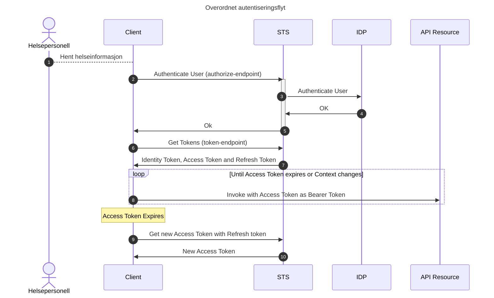
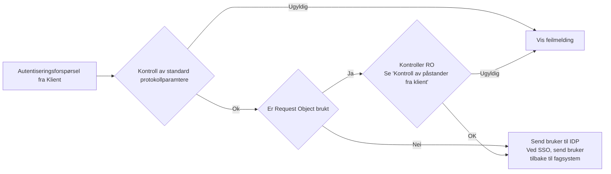
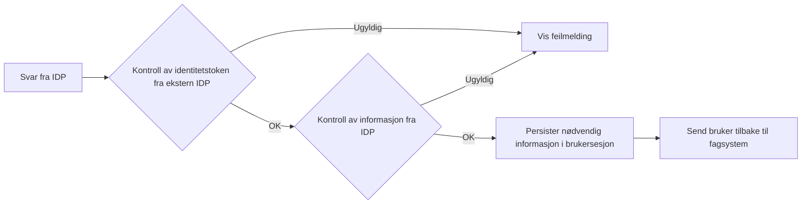

# Bruk av OpenID Connect for deling av helseopplysninger via API

## 1. Introduksjon
Dette dokumentet er en teknisk spesifikasjon som beskriver hvordan OpenID Connect og OAuth 2.0 skal benyttes ved deling av helseopplysninger innad i Helsenettet. Dokumentet er ment for utviklere og tekniske arkitekter som skal konsumere API hvor det er et krav at helsepersonellet er autentisert.

OpenID Connect er en protokoll som lar utvikleren selv velge en del sikkerhetsmessige egenskaper ved protokollen. Når man deler helseopplysninger er det forventet at sikkerheten blir ivaretatt på god nok måte. Denne spesifikasjonen er ikke en generell beskrivelse av hvordan OpenID Connect skal benyttes, men en spesifikk beskrivelse av hvordan HelseID skal brukes ved deling av helseopplysninger. 

HelseID gjør det mulig å gjenbruke en autentisering mellom to eller flere applikasjoner, såkalt Single Sign-On (SSO).  HelseID gjør det også mulig for applikasjonen som ber om autentisering, også kalt Relying Party (RP), å gjenbruke en pålogget brukersesjon når RP også er en OAuth klient som skal be om tilgang til et API. 

> **_TODO:_** [Legg inn en tegning her]

## 2. Forutsetninger og underliggende krav

- [OpenID Connect](https://openid.net/specs/openid-connect-core-1_0.html)
- [OAuth 2.0](https://www.rfc-editor.org/rfc/rfc6749)
- [HelseID sikkerhetsprofil for klienter](https://helseid.atlassian.net/wiki/spaces/HELSEID/pages/128352260/Security+profile+for+clients+using+HelseID) (basert på FAPI 2.0)
- JWT profil for tillitsrammeverk - "trusted_claims"  **_TODO:_** [Legg til lenke]

### 2.1 Tillitsrammeverk for deling av helseopplysninger
Tillitsrammeverk for deling av helseopplysninger i norsk helsesektor er beskrevet i egne dokumenter.

> **_TODO:_** [Legg inn lenker til rammeverket, samt en kort oppsummering.}

- Helsenettet 
- Norm for informasjonssikkerhet 
- eID i tillitsrammeverket 
- Avtaleverk 

## 3. Beskrivelse av autentiseringsflyt
### 3.1 Autentiseringsforespørsel

RP ber om autentisering av den fysiske personen ved bruk av normal flyt iht. protokoll, men med følgende presiseringer: 
* RP skal benytte en av følgende mekanismer ved forespørsler mot HelseID: 
  * Request Object, som beskrevet i …., eller   
    **Spørsmål:_** Skal vi kreve at parametre inkluderes i RO, eller forsette dagens policy hvor det er valgfritt   
  * Pushed Authorization Requests, som beskrevet i.. 
  
* Dersom Request Object benyttes skal denne overføres til HelseID som et form parameter.

* Når støtte er på plass, skal DPoP benyttes for å krypografisk binde Access Token til klient.

* RP/API klient skal overføre informasjon som beskriver bakgrunnen for tilgangsforespørselen ved bruk av mekanismen Rich Authorization Requests, som beskrevet i **_TODO:_** [Lenke til eget dokument]

* Informasjon som beskriver bakgrunn for tilgangsforespørselen skal følge standarden som er angitt i… (autentiseringsforespørsler) 

* RP skal autentisere brukeren iht. regler i tillitsrammeverket **_TODO:_** [Lenke her]
   * Dette inkluderer å verifisere at lokal brukeridentitet (om noen) i RP er lik brukeridentiteten returnert fra HelseID.

Hvert enkelt steg i flyten over er beskrevet i detalj under

#### 3.1.1 Legg inn sekvensdiagram som viser første versjon
#### 3.1.1 Legg inn sekvensdiagram som viser målbilde (PAR, DPoP)

#### 3.1.1 Kall fra RP for brukerautentisering
Når et helsepersonell ønsker å få tilgang til ekstern helseinformasjon (f.eks dokumenter i Kjernejournal), er det nødvendig å autentisere personellet i HelseID, ref steg 1 og 2 i figuren over.

Brukeren skal sendes i nettleser til endepunktet /authorize i HelseID. Endepunktet er dokumentert [her](https://helseid.atlassian.net/wiki/spaces/HELSEID/pages/5571605/Authorize+Endpoint).

Utover normal protokollflyt er det følgende nødvendig

#### 3.1.1.1 Overføre ekstra informasjon fra RP
Tillitsmodellen krever at det overføres ekstra informasjon om helsepersonell-kontekst. Informasjonsmodellen er beskrevet her **_TODO:_** [Lenke her].
Denne informasjonen kan sendes til HelseID som en signert JWT i parameteret "request" - et såkalt [Request Object](https://openid.net/specs/openid-connect-core-1_0.html#RequestObject). 

Merk at denne informasjonen også kan sendes til token endepunktet som en del av client_assertion. Det er opp til leverandør å velge mekanisme.

**_TODO:_** [Lenke til konkret eksempel + eksempelkode].

Et request object SKAL overføres som et form parameter i en POST request.

#### 3.1.1.2 Forspørsel om tilgang til flere API-er
API-er som inngår i tillitsmodellen krever at Access Tokens ment for dem, ikke skal kunne brukes mot andre API-er. I praksis innebærer dette at claimet "aud" (audience) ikke kan ha mer enn en verdi. Audience er navnet som identifiserer API-et i HelseID

Vi støtter mekanismen [Resource Indicators](https://www.rfc-editor.org/rfc/rfc8707) som gjør det enkelt å hente ut ett Access Token per API for en klient. Bruk av Resource indikators er beskrevet [her](https://helseid.atlassian.net/wiki/spaces/HELSEID/pages/481755152/Requesting+multiple+access+tokens+with+single+audiences).

### 3.1.2 Kontroller i HelseID av forespørsler om brukerautentisering
Figuren under viser hvilke kontroller HelseID gjør når en klient forespør brukerautentisering.

#### 3.1.2.1 Kontroll av standard protokollparamtere
Det første som skjer en en kontroll av protokollparametre i forespørselen i henhold til OpenID Connect og sikkerhetsprofilen til HelseID. Dette inkluderer, men er ikke begrenset til:

  * Sjekk av at klienten er registrert og aktivert i HelseID
  * Sjekk av at klienten forspør API-er og annen informasjon den har tilgang til
  * Sjekk av at klienten sender med en gyldig redirect_uri
  * Sjekk av at klienten bruker PKCE
  * (Fremtidig) Sjekk av at klienten bruker DPoP dersom et forespurt API krever det
  * (Fremtidig) Sjekk av systemidentitet

Dersom noen av disse kontrollene feiler, vil sluttbrukeren se en feilmelding i sin nettleser.

Merk at protokollparametre både kan sendes som GET eller POST parametre, eller som en del av et Request Object. 

#### 3.1.2.2 Kontroll av Request Object
Dersom klienten har inkludert et Request Object for å overføre kontekstuell informasjon til HelseID (f.eks virksomhet eller brukerkontekst), vil kontroll av dette skje på samme måte som for client assertions i Token-endepunktet. Se **_TODO:_** [LEGG INN LENKE TIL AVSNITT].

Dersom noen av disse kontrollene feiler, vil sluttbrukeren se en feilmelding i sin nettleser.

#### 3.1.2.3 Kall til IDP

Dersom alle kontroller er ok, sjekker HelseID om brukeren allerede har en sesjon i HelseID. Dersom dette er tilfelle, og klienten ikke eksplisitt har spurt om å ikke benytte Single sign-on, sendes brukeren tilbake til klienten (fagsystemet).

Om ikke, sendes brukeren til ekstern IDP for autentisering.

### 3.1.3 Kontroller av resultat fra ekstern IDP
Etter at en bruker har autentisert seg hos en ekstern IDP, vil HelseID kontrollere resultatet.

### 3.1.3.1 Kontroll av svar fra ekstern IDP
Etter at brukeren har autentisert seg i ekstern IDP, sendes informasjon om dette tilbake til HelseID. Dette vil alltid være et Identity Token. HelseID validerer først gyldigheten på dette tokenet i henhold til protokollspesifikasjon og egen sikkerhetsprofil. 

Dersom noen av disse kontrollene feiler, vil sluttbrukeren se en feilmelding i sin nettleser.

### 3.1.3.1 Kontroll av informasjon fra ekstern IDP
HelseID forventer å få informasjon fra IDP om identitet til bruker, sikkerhetsnivå, påloggingsmekanisme mm. HelseID kontroller at denne informasjon er tilstede og gyldig.

Dersom dette feiler, vil sluttbrukeren se en feilmelding i sin nettleser.

#### 3.1.3 Kall fra RP til Token-endepunkt
* Authorization Details (context, virksomhet, annet)
* Client Assertion

* Vise kontroller i HelseID 
  * Vise autentisering av klient 
    (Krav til signeringsalg, levetid på token, JTI)
  * Vise kontroll av klient 
    (Godkjent for PDS)
  * Vise sjekk av systemidentitet
    (Ikke implementert ennå) 
  * Vise sjekk av virksomhetsidentitet 
  * Vise berikelse av personinformasjon 
  * Vise berikelse av HPR informasjon 

* Vise utstedelse av access token og id token 
* Vise kall til token endepunktet med Auth Code 
* Vise utstedelse av Access Token 

#### 3.1.4 Kontroller i RP av Identity Token
* Pek til profil
* Kontroll av lokal identitet vs Identity Token

### 3.2 Generering av Access Token 
- Peke på "trusted_claims" profilen 

### 3.3 Forespørsel til API
- Validering av token i API
- DPoP 
- eID 
- Validering og bruk av informasjon i token 
- Revisjonslogging 

### 3.4 Bruk av refreshtoken
 

## 4. Sikkerhetsvurderinger
HelseID krever sikkerhetsprofilen FAPI 2.0 (lenke til vår versjon av profilen)
Pek til Security BCP og Trusselmodell

Beskriv konkrete sikkerhetstiltak på klienten:
- XSS (for nettlesere)
- Sjekk av parametre som sendes til HelseID 
- Kontroll av tokens 
- Riktig URL til HelseID

Sikkerhet i API:
- Kreve DPoP eller mTLS

Sikkerhet i OP:
- Nøkkelmateriale 
- Sikkerhet i registre brukt til berikelse av informasjon 

 