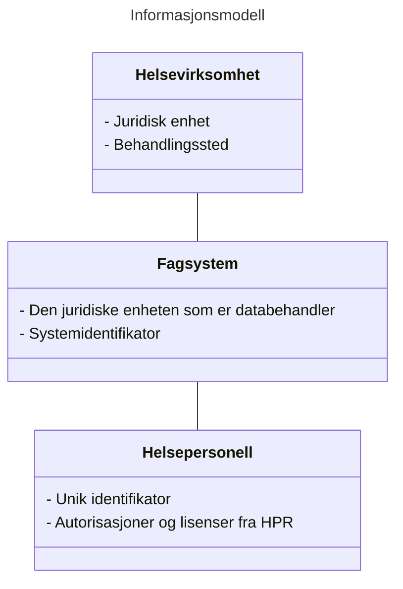

# Informasjons- og datamodell i tillitsrammeverk for deling av helseopplysninger på tvers av virksomheter i helse- og omsorgssektoren

## Sammendrag
Denne spesifikasjonen definerer en informasjons- og datamodell som inngår i tillitsrammeverk for deling av helseopplysninger på tvers av virksomheter i helse- og omsorgssektoren. Informasjonen i modellen beskriver helsepersonells grunnlag for tilgang til helseopplysninger.

Datamodellen skal benyttes ved utstedelse av sikkerhetsbilletter i ulikt format som f.eks. SAML Assertions og JWT.

## Dokumentets status

| Versjon | Dokumentets status | dato |
| --- | --- | --- |
| -0 | Utkast | 17.02.2023 |
| -1 | Utkast | 10.03.2023 |

Dette dokumentet utgjør ikke en formell standard, men inngår som en del av et kravsett knyttet til tillitsrammeverk for deling av helseopplysninger i helse- og omsorgssektoren.
Spesifikasjonen bør ikke benyttes uten føringene som ligger til grunn i tillitsrammeverket.

Spesifikasjonen skal versjoneres for å støtte endringer over tid.

## Innholdsfortegnelse
1. Innledning<br/>
2. Ordliste
3. Bakgrunn for spesifikasjonen
4. Spesifikasjon<br/>
	3.1 Informasjonsmodell<br/>
	3.2 Datamodell<br/>
5. Json profil for datamodell
6. Sikkerhets- og personvernshensyn<br/>
	4.1 Cybersikkerhet<br/>
	4.2 Personvern 
7. Anerkjennelse av bidragsytere til spesifikasjonen
8. Eksempler på bruk av datamodell<br/>
	6.1 JSON eksempel<br/>
	6.2 SAML eksempel<br/>
9. Normative referanser 

## 1. Innledning 
Når et helsepersonell har besluttet at opplysninger søkes opp og innhentes digitalt har både kilden til opplysningene og konsumenten behov for å kunne legge til grunn at dette var riktig forespørsel, dette fremgår av lovpålagte forpliktelser som påhviler helsevirksomheten.

NHN som tillitsanker formidler informasjon, datamodellen definerer hvordan denne informasjonen skal uttrykkes.


## 2. Ordliste
 
|  Begrep | Definisjon  |
| --- | --- |
|  |  |

## 3. Bakgrunn for spesifikasjonen
Aktørene i helse- og omsorgssektoren har samlet seg rundt en felles tillitsmodell som skisserer tillitsgrunnlaget for å dele helseopplysninger mellom helsepersonell på tvers av virksomhetene i sektoren.

Tillitsmodellen konkretiseres i et tillitsrammeverk som består av vilkår knyttet til bruken av tillitstjenestene. Den første anvendelsen av tillitsrammeverket, inklusivt denne spesifikasjonen, skjer i forbindelse med etablering av nasjonal dokumentdeling i Kjernejournal.

NHN som tillitsanker sørger for å  virksomheten er en helsevirksomhet som er medlem av helsenettet, og at virksomheten har akseptert vilkår for bruk av tjenestene den konsumerer.

* Dersom forespørselen kommer fra en databehandler som handler på vegne av helsevirksomheten vil tillitsankeret kontrollere følgende:
	* At helsevirksomheten har eksplisitt delegert representasjonsrett til sin databehandler
	* Databehandler har akseptert vilkår for å inngå i økosystemet (helsenettet)
* Programvaren er registert hos NHN
* Programvaren har rett til å bruke tjenesten
* Helsepersonellet som bruker programvaren er den han sier han er (i henhold til angitt tillitsnivå)
* Programvaren forteller NHN ved hvilket behandlingssted helsepersonellet yter helsehjelp, tillitsankeret kontrollerer at verdien er gyldig (org.nr)

Informasjonsmodell som beskriver:

## 4. Spesifikasjon
Informasjonsmodellen som spesifiseres i dette dokumentet beskriver hva de enkelte informasjonselementene er, og hvorfor de skal overføres.

Spesifikasjonen beskriver også en datamodell som består av  konkrete attributter som skal brukes for å overføre informasjonen, og hvilke kodeverk og verdier som er gyldige for attributtene.

Spesifikasjonen skal benyttes av programvare- og systemleverandører ved implementasjon av programvare som skal brukes ved deling av helseopplysninger på tvers av virksomheter i sektoren. Datamodellen vil også implementeres i relevante nasjonale ehelseløsninger og tillitstjenester.

Datamodellen skal benyttes til flere formål:
* for tilgangsstyring og tilgangskontroll i nasjonale ehelseløsninger, dokumentkilder og i API
* til logging og sporbarhet
* for å tilfredsstille pasientens rettigheter

### 4.1 Informasjonsmodell

For å underbygge sannsynligheten for at det foreligger et tjenstlig behov er det relevant at tre grunnleggende forutsetninger for tilgang verifiseres gjennom den tekniske prosessen. De følgende tre stegene vil gi kilden (utleverende virksomhet) tilstrekkelig tiltro til at det foreligger en gyldig forespørsel, og vil sørge for at sporbarheten blir ivaretatt på en tilfredsstillende måte: 

1. Kommer henvendelsen fra en helsevirksomhet der det ytes helsehjelp? I tillitsrammeverket inngår systemteknisk støtte for virksomhetsidentifisering som skaper tiltro til at konsumerende virksomhet er en helsevirksomhet.
2. Kommer henvendelsen fra et fagsystem som benyttes i helsehjelpsøyemed i en helsevirksomhet? I tillitsrammeverket inngår systemteknisk støtte for identifisering av fagsystemet som skaper tiltro til fagsystemet som sender forespørsel om opplysninger. 
3. Er det et helsepersonell og er helsepersonellet den det gir seg ut for å være? I tillitsrammeverket inngår systemteknisk støtte for autentisering som skaper tiltro til helsepersonellets identitet. 

I alle de tre stegene må det følge informasjon som gjør at den enkelte forespørsel om digital innhenting av helseopplysninger både kan benyttes for teknisk tilgangskontroll og for å kunne undersøke tilgang og utlevering av opplysninger. Dette er nødvendig for å få til trygg digitalisering på tvers av omsorgssektoren. Denne spesifikasjonen definerer et sett av attributter som inneholder den nødvendige informasjonen.

Informasjonen som skal overføres fra konsument til datakilde kan deles inn i tre hovedkategorier:
1. Informasjon som identifiserer helsevirksomheten hvor helsepersonellet yter helsehjelp til sin pasient
2. Informasjon som identifiserer fagsystemet som helsepersonellet benytter hos helsevirksomheten
3. Informasjon som identifiserer helsepersonellet som yter helsehjelp til sin pasient

Sannsynliggjør at det foreligger et tjenstlig behov hos konsumenten. 

#### 4.1.2 Helsevirksomhetens identitet
Å vite hvem den dataansvarlige er.. 

- Databehandler (juridisk enhet)
- Behandlingssted


#### 4.1.3 Fagsystemets identitet
Digital deling av pasientens helseopplysninger foregår alltid ved at et helsepersonell bruker en programvare for å utføre søk og å innhente informasjon fra datakilder.
Alle system som behandler og lagrer helseopplysninger er lovregulert av pasientjournalloven med tilhørende forskrift. Den som deler helseopplysninger med andre må være trygg på at helsepersonellet bruker en programvare som etterlever kravene i lovverket i henhold til norm for informasjonssikkerhet.

#### 4.1.1 Helsepersonellets Identitet
Helsepersonellets grunnleggende identitet består av informasjon som sjelden endres, slik som personens navn og fødselsnummer. I yrkessammenheng består også helsepersonellets identitet i tillegg av eventuelle offentlige godkjenninger og rettigheter.

Helsepersonellets identitet er nødvendig å overføre fordi vi må kunne knytte en tilgang til helseopplysninger til en gitt person. Identiteten vil benyttes i forbindelse med tilgangskontroll, slik som kontroll av hvorvidt pasienten har sperret for utlevering av helseopplysninger til helsepersonellet, logging og oppfølging av funn i logganalyse og for informasjon til pasienten. 


#### 4.1.4 Oppsummert informasjonsmodell



### 4.2 Datamodell 
Informasjonsmodellen skal overføres fra konsument til datakilde i form av attributter formattert som nøkkelverdipar. Disse attributtene danner datamodellen, og er en detaljert beskrivelse av hvordan informasjonen skal uttrykkes.
Attributtene kan ha NHN eller konsumenten som informasjonskilde.

#### 4.2.1 Prinsipper for datamodellen 
Datamodellen skal legge til rette for at helsevirksomhetene lettere kan samhandle med hverandre ved at man benytter samme språk for å uttrykke informasjonen som beskriver helsepersonellet og konteksten som helsepersonellet befinner seg i når han ber om tilgang til helseopplysningene. Den skisserte datamodellen legger til rette for en viss grad av dynamikk ved å angi hvilket kodeverk eller lister over gyldige verdier som er benyttet i datasettet.

Datamodellen skal overføres til og behandles av mange aktører og i mange systemer. Mottakeren av informasjonen må ha høy tillit til at informasjonen er korrekt og trygg.


#### 4.2.2 Oversikt over attributter i datamodellen 

```mermaid
---
title: Datamodell
---
classDiagram

	Helsevirksomhet -- Fagsystem
	Fagsystem -- Helsepersonell

	class Helsevirksomhet{
		"legal_entity": {},
		"point_of_care": {},
	}
		
	class Fagsystem{
		- "system_identifier": "[value]",
        - "software_identifier": "[value]",
        - "software_name": "[value]",
        - "operated_by": {[object]}
	}
	
	class Helsepersonell{
		- "subject": {[object]}
		- "pid": "[value]"
		- "hpr_nr": "[value]"
		- "authorization": {[object]}
	}	
		
```

#### 4.2.3 Oppsummering av påkrevd eller valgfri informasjon
Ikke all informasjon i datamodellen er relevant, noen informasjonselementer er valgfrie.

Vi har lagt vekt på å ivareta sporbarheten i delingssammenheng, derfor har vi angitt at alle identifikatorer er påkrevd, dette gjelder både fysiske og juridiske personer.

| Attributt | Beskrivelse | Informasjonskilde | Påkrevd | Status | Formål |
| --- | --- | --- | --- | --- | --- |
| "subject" | Fødselsnummer og navn fra folkeregisteret | HelseID | **Ja** | <span style="color: green; font-weight: bold;">Inkluderes</span> | Loggkontroll og sporbarhet |
| "hpr_nr" | Helsepersonellets HPR-nummer, dersom det finnes | HelseID | **Nei** | <span style="color: green; font-weight: bold;">Inkluderes</span> | Loggkontroll, sporbarhet og informasjon til pasienten |
| "authorization" | Helsepersonellets autorisasjon, dersom den finnes | HelseID<br/>Kjernerjournal | **Nei** | <span style="color: green; font-weight: bold;">Inkluderes</span> | Tilgangsstyring |
| "legal_entity" | Den dataansvarlige virksomhetens org.nr og navn. | - §9 samarbeid og multi-tenancy system: Konsumentens EPJ<br>- Single-tenancy/on-premise system: HelseID  | **Ja** | <span style="color: green; font-weight: bold;">Inkluderes</span> | Loggkontroll og sporbarhet og informasjon til pasienten |
| "point_of_care" | Behandlingsstedets org.nr. og navn.<br>Kan være lik verdi som i "legal_entity" | Konsumentens EPJ | **Ja** | <span style="color: green; font-weight: bold;">Inkluderes</span> | Loggkontroll, sporbarhet og informasjon til pasienten |

#### 4.2.5 Kategori: Helsepersonellet
Helsepersonellets identitet angis ved bruk av identifikator fra folkeregisteret, navn, og identifkator fra HPR.
Består av identifikatorer fra folkeregisteret og helsepersonellregisteret, samt informasjon som indikerer hvorvidt dette er et helsepersonell (med/uten lisens) eller administrativt personell.


##### 4.2.5.1 "subject": Identifikator for helsepersonellet som "fysisk person"
Attributtet "subject" i entitet Helsepersonell er en forkortelse for "personal identifier", hvor verdien identifiserer en fysisk  person. 
Denne er nødvendig for loggkontroll, sporbarhet og innsyn til innbygger. 
Det er bare navn som skal vises til innbygger.

|   |   |
| ---| ---|
| Attributt: | "subject" |
| Status: | <span style="color: green; font-weight: bold;">Inkluderes</span> |
| Informasjonselement | Unik identifikator og navn på helsepersonellet |
| Attributt EHDSI: | "urn:oasis:names:tc:xacml:1.0:subject:subject-id" |
| Obligatorisk: | **Ja** |
| Data type: | String |
| Autoritativ kilde: | Folkeregisteret - Skattedirektoratet |
| Informasjonskilde: | HelseID, basert på innlogging via eID ordning |
| Kodeverk: | 2.16.578.1.12.4.1.4.1 (F-nummer),<br/>2.16.578.1.12.4.1.4.2 (D-nummer),<br/>2.16.578.1.12.4.1.4.3 (H-nummer)|


###### "subject" - Attributt JSON format

````JSON
"subject":{
	"value": "xxxxxx34794",
	"name": "Lege Legesen",
	"system": "2.16.578.1.12.4.1.4.1",
	"authority": "www.skatteetaten.no" /* forvalter folkeregisteret - står i SAML token i dag */
}
````

##### 4.2.5.3 "professional_licence" - Informasjon om helsepersonellet fra Helsepersonellregisteret

###### "professional_licence" - overordnet struktur for attributter fra HPR i JSON

````JSON
"professional_license": {
	"hpr_nr": { 8<...>8 },
	"authorization": { 8<...>8 }
}
````

###### "hpr_nr": Helsepersonellnummer
Attributtet "hpr_nr" er en forkortelse for "Helsepersonellnummer" hvor verdien identifiserer et helsepersonell som har fått autorisasjon og/eller lisens til å praktisere som et helsepersonell i Norge.

Noe helsepersonell har ikke autorisasjon, men trenger likevel tilgang på helseopplysninger. Derfor kan ikke attributtet være påkrevd, men skal inkluderes i datamodellen dersom den fysiske personen har et innslag i HPR.

Er nødvendig for å slå opp i helsepersonellregisteret, og for å undersøke hvorvidt det foreligger sperringer hos kilden og Kjernejournal.
HelseID beriker brukersesjonen med hpr_nr basert på hp sitt fødselsnummer etter vellykket pålogging.
 
|   |   |
| ---| ---|
| Attributt: | "hpr_nr" |
| Status: | <span style="color: green; font-weight: bold;">Inkluderes</span> |
| Informasjonselement | Unik identifikator for helsepersonellet knyttet opp til formelle autorisasjoner eller lisenser |
| Attributt EHDSI: | N/A (?) |
| Obligatorisk: | **Nei** |
| Data type: | Objekt |
| Autoritativ kilde: | Helsepersonellregisteret - Helsedirektoratet |
| Informasjonskilde: | Helsepersonellregisteret |
| Kodeverk: | 2.16.578.1.12.4.1.4.4 |

###### "hpr_nr": Helsepersonellets gjeldende autorisasjon - JSON format
````JSON
"hpr_nr": {
	"id": "9144900",
	"system": "urn:oid:2.16.578.1.12.4.1.4.4",
	"authority": "https://www.helsedirektoratet.no/"
},
````

###### "authorization": Helsepersonellets gjeldende autorisasjon
Attributtet "authorization" angir den aktuelle autorisasjonen som gjelder for helsepersonellet ved forespørsel om helseopplysninger hos en annen virksomhet.

Noe helsepersonell har ikke autorisasjoner, men trenger likevel tilgang på helseopplysninger. Attributtet kan derfor ikke være påkrevd, men skal inkluderes i datamodellen dersom den fysiske personen har en eller flere gyldige autorisasjoner.

Formålet med attributtet er loggkontroll og eventuell tilgangsstyring. Dersom noen dokumenter krever en autorisasjon vil dette attributtet måtte benyttes til dette. Ved at dette attributtet er tilgjengelig legger vi til rette for at tilgangsstyring kan utføres.

I dag benyttes autorisasjonen som gir størst grad av tilgang av KJ, men det er ønskelig at det er den autorisasjonen som "benyttes" i tilgangsforespørselen som formidles.
 
|   |   |
| ---| ---|
| Attributt: | "authorization" |
| Status: | <span style="color: green; font-weight: bold;">Inkluderes</span> |
| Informasjonselement | Den gjeldende autorisasjonen for helsepersonellet i behandlingen av pasienten  |
| Attributt EHDSI: | N/A (?) |
| Obligatorisk: | **Nei** |
| Data type: | Objekt |
| Autoritativ kilde: | Helsepersonellregisteret - Helsedirektoratet |
| Informasjonskilde: | Kjernejournal |
| Kodeverk: | 2.16.578.1.12.4.1.1.9060 |


###### "authorization": Helsepersonellets gjeldende autorisasjon - JSON format
````JSON
"authorization": {
	"code": "LE",
	"text": "Lege",
	"system": "urn:oid:2.16.578.1.12.4.1.1.9060",
	"assigner": "https://www.helsedirektoratet.no/"
}
````

###### "professional_licence" - JSON struktur med "hpr_nr" og "authorization"

````JSON
"professional_license": {
	"hpr_nr": {
		"id": "9144900",
		"system": "urn:oid:2.16.578.1.12.4.1.4.4",
		"authority": "https://www.helsedirektoratet.no/"
	},
	"authorization": {
		"code": "LE",
		"text": "Lege",
		"system": "urn:oid:2.16.578.1.12.4.1.1.9060",
		"assigner": "https://www.helsedirektoratet.no/"
	}
}	
````


#### 4.2.6 Kategori: Helsevirksomhet
Attributter som beskriver virksomheten hvor helsepersonellet yter helsehjelp.

##### "legal_entity": den dataansvarlige virksomheten 
Attributtet "legal_entity" identifiserer den dataansvarlige for helseopplysningene som behandles i journalsystemet som brukes av helsepersonellet som forespør tilgang til helseopplysninger i en annen virksomhet.

Den juridiske enheten er eier medlemsskapet i Helsenettet, og benyttes til tilgangsstyring i forb. med signerte bruksvilkår (medlem i helsenett, helseid, kj)
Formål med attributtet er også sporbarhet (det juridiske ansvaret - "notoritet"), kan vurderes vist til pasienten i innsynslogg.

Informasjonskilden til dette attributtet er avhengig av systemarkitektur eller hvorvidt systemet brukes i §9-samarbeid.

- For multi-tenancy løsninger og §9-samarbeid må journalsystemet hos konsumenten angi "legal_entity". HelseID kontrollerer at databehandler har rett til å opptre på vegne av helsevirksomheten ved å gjøre oppslag i delegeringer som er utført i Altinn.
- For single-tenancy/on-premise løsninger vil HelseID utlede helsevirksomhet.

|   |   |
| ---| ---|
| Status: | <span style="color: green; font-weight: bold;">Inkluderes</span> |
| Informasjonselement | Virksomheten (hovedenhet) som har dataansvaret der hvor helsepersonellet yter helsehjelp |
| Attributt: | "legal_entity" |
| Attributt EHDSI: | "urn:oasis:names:tc:xspa:1.0:subject:organization"<br/>"urn:oasis:names:tc:xspa:1.0:subject:organization-id" |
| Obligatorisk: | **Ja** |
| Data type: | String |
| Autoritativ kilde: | Enhetsregisteret - SSB |
| Informasjonskilde: | - §9/multi tenancy: Konsumentens journalsystem<br>- Single-tenancy: Utledes av HelseID  |
| Kodeverk: | 2.16.578.1.12.4.1.4.101 |


###### Den dataansvarlige virksomheten - Attributter JSON format

````JSON
"legal_entity": {
	"id": "921592761",
	"name": "Lege Leif Lagesen ENK",
	"system": "2.16.578.1.12.4.1.4.101",
	"authority": "www.brreg.no"
}
```` 

##### "point_of_care": Behandlingssted

Attributtet "point_of_care" identifiserer behandlingsstedet hvor helsepersonellet yter helsehjelp,
og skal peke på en virksomhet i enhetsregisteret.
<br>
Attributtet er obligatorisk, men dersom verdiene for "legal_entity" og "point_of_care" er like verdien gjentas i begge attributter.

| :warning:               | Intern kommentar fra team dok.deling |
|--------------------------|:------------------------|
| "point_of_care"           | Informasjonselement bør være den som pasienten gjenkjenner igjen, som f.eks. "Legevakt på Hamar" i stedet for "Hamar kommune". Bør ikke settes absolutt krav til knytting til enhetsregister men støttes ellers |

Attributtet "point_of_care" skal brukes til loggkontroll, sporbarhet og informasjon til pasient.

Eksempler på gyldige sammensetninger av "legal_entity" og "point_of_care: 
**Spesialisthelsetjenesten**
* legal_enitity: "nordlandssykehuset hf" 
* point_of_care: "nordlandssykehuset somatikk gravdal"

**Kommune**
* legal_entity: "Oslo Kommune helseetaten"
* point_of_care: "Legevakten storgata"

**Fastlege**
* legal_entity: "Fastlege Lege Legesen"
* point_of_care: "Fastlege Lege Legesen"


|   |   |
| ---| ---|
| Status: | <span style="color: green; font-weight: bold;">Inkluderes</span> |
| Informasjonselement | Virksomheten (underenhet) hvor helsepersonellet yter helsehjelp |
| Attributt: | "point_of_care" |
| Obligatorisk: | **JA** |
| Data type: | String |
| Autoritativ kilde: | Enhetsregisteret - SSB |
| Informasjonskilde: | Konsumentens journalsystem |
| Kodeverk: | 2.16.578.1.12.4.1.4.101 |

###### Behandlingssted - Attributter JSON format

````JSON
"point_of_care": {
	"id": "123456789",
	"name": "Det beste legekontoret i byen AS",
	"system": "2.16.578.1.12.4.1.4.101",
	"authority": "www.brreg.no"
}
````


## 5. JSON profil for datamodell
Full modell - valgfrie elementer er tatt med

````JSON
{
	"practicioner": {
		"pid": {
			"id": "04056600324",
			"name": "Magnar Koman",
			"system": "urn:oid:2.16.578.1.12.4.1.4.1",
			"authority": "https://www.skatteetaten.no"
		},
		"professional_license": {
			"hpr_nr": {
				"id": "9144900",
				"system": "urn:oid:2.16.578.1.12.4.1.4.4",
				"authority": "https://www.helsedirektoratet.no/"
			},
			"authorization": {
				"code": "LE",
				"text": "Lege",
				"system": "urn:oid:2.16.578.1.12.4.1.1.9060",
				"assigner": "https://www.helsedirektoratet.no/"
			}
		},
	}
	"care_relationship": {
		"legal_entity": {
			"id": "993467049",
			"name": "OSLO UNIVERSITETSSYKEHUS HF",
			"system": "urn:oid:2.16.578.1.12.4.1.4.101",
			"authority": "https://www.skatteetaten.no"
		},
		"point_of_care": {
			"id": "974589095",
			"name": "OSLO UNIVERSITETSSYKEHUS HF ULLEVÅL - SOMATIKK",
			"system": "urn:oid:2.16.578.1.12.4.1.4.101",
			"authority": "https://www.skatteetaten.no"
		},		
	}
}
````

## 6. Sikkerhets- og personvernshensyn
### 6.1 Cybersikkerhet
Både egenprodusert og tredjeparts programvarekomponenter som brukes til datalagring samt behandling og presentasjon av informasjonen i datamodellen kan inneholde svakheter som lar en angriper utnytte data som overføres mellom partene til å utføre forskjellige typer angrep på innsiden av en organisasjon.

Informasjonen i datamodellen flyter mellom flere aktører hvor den lagres og behandles av forskjellige typer programvare. Sikkerhetsangrep som utføres i forbindelse med datalagring er svært vanlig, og utgjør en generell sikkerhetsrisiko som kan begrenses ved at verdier som overføres kan valideres og kontrolleres.

Informasjonen i datamodellen vil blant annet benyttes til å utføre analyse av logger, og vil kunne bli vist til sluttbrukere i forskjellige applikasjoner. Dette åpner for angrep mot sårbarheter i programvare, som f.eks. misbruk av makroer eller XSS angrep i nettlesere. Sannsynligheten for denne typen sikkerhetsangrep bør begrenses ved at verdier som overføres kan valideres og kontrolleres.


### 6.2 Personvern

Datamodellen legger til rette for en utlevering av personopplysninger, herunder helseopplysninger, som en behandling av en særlig kategori av personopplysninger, gjennom å sammenstille opplysninger om helsepersonellet, pasientens identifikasjonsnummer, opplysninger om virksomheten der helsehjelpen utføres, formålet med tilgangen til helseopplysninger og relasjonen mellom helsepersonellet og pasienten, for å autentisere tilgang til gitte helseopplysninger.

#### 6.2.1 Tap av personopplysninger
Ved å utnytte svakheter og sårbarheter i programvare kan kan en angriper observere personopplysninger som utleveres mellom tekniske tjenester som benyttes av virksomheter ved deling av helseopplysninger.
Tap av personopplysninger kan oppstå mellom flere parter i verdikjeden:

- mellom konsument og autorisasjonsserver/IdP
- mellom konsument og informasjonstjeneste
- mellom informasjonstjeneste og datagrensesnitt

For å sikre mot potensielt tap av personopplysninger bør det vurderes å etablere tiltak for å ivareta konfidensialiteten.

#### 6.2.2 Overvåkning av ansatte i andre virksomheter
Datamodellen innebærer en utlevering av opplysninger om helsepersonellets arbeidsforhold. Disse opplysningene utleveres til andre virksomheter enn den virksomheten helsepersonellet er ansatt hos eller yter helsehjelp på vegne av. Det legges derfor til rette for at opplysninger kan benyttes til å monitorere helsepersonell i andre virksomheter. Dataansvarlige må følgelig være bevisste begrensningene i formålet med behandlingen av personopplysninger og eventuelt vurdere risiko knyttet til behandling av personopplysninger utover dette formålet.

#### 6.2.3 Vurdering av personvernkonsevenser
For å ivareta rettighetene og frihetene til pasienten og helsepersonellet som registrerte, bør dataansvarlig virksomhet vurdere hvorvidt behandlingen av personopplysninger medfører høy risiko for at de registrertes rettigheter og friheter ikke ivaretas.

#### 6.2.4 Forutsetninger for behandling av personopplysninger med utgangspunkt i datamodellen
Med utgangspunkt i at datamodellen legger til rette for en utlevering av personopplysninger, herunder helseopplysninger, som en behandling av en særlig kategori av personopplysninger, vil det forutsettes at behandlingen skjer i tråd med prinsipper for behandling av personopplysninger. Personvernkonsekvensene ved tap av personopplysninger eller utilsiktet tilgang vil være store, og behandlingen vil følgelig måtte innebære et særlig fokus på misbruk gjennom behandling av opplysningene til andre formål og helsepersonellets dokumenterte tjenstlige behov for tilgang til gitte helseopplysninger
 
## 7. Anerkjennelse av bidragsytere til spesifikasjonen
Teamet som har hatt ansvaret for denne spesifikasjonen har bestått av Morten Stensøy (HNIKT), Richard Husevåg (HSØ), Sverre Martin Jensen (Oslo Kommune), Erik Vegler Broen (Oslo Kommune - Origo), Simone Vandeberg (NHN), Steinar Noem (NHN).

Vi ønsker å takke Michal Cermak, Trond Elde, Eva Tone Fosse, Asefeh Johnsen, Helge Bjertnæs og Øyvind Kvennås for verdifulle bidrag i utviklingen av spesifikasjonen.

## 8. Eksempler på bruk av datamodell


#### 8.1 Eksempel #1 - Fastlege ber om tilgang til dokument
I dette eksempelet har en fastlege ...


##### JSON

```JSON
{
	"practicioner": {
		"pid": {
			"id": "20086600138",
			"name": "August September",
			"system": "urn:oid:2.16.578.1.12.4.1.4.1",
			"authority": "https://www.skatteetaten.no"
		},
		"professional_license": {
			"hpr_nr": {
				"id": "9144897",
				"system": "urn:oid:2.16.578.1.12.4.1.4.4",
				"authority": "https://www.helsedirektoratet.no/"
			},
			"authorization": {
				"code": "LE",
				"text": "Lege",
				"system": "urn:oid:2.16.578.1.12.4.1.1.9060",
				"assigner": "https://www.helsedirektoratet.no/"
			}
		}
	},
	"care_relationship": {
		"legal_entity": {
			"id": "100100673",
			"name": "Norsk Helsenett SF Fagersta Testlegekontor",
			"system": "urn:oid:2.16.578.1.12.4.1.4.101",
			"authority": "https://www.skatteetaten.no"
		},
		"point_of_care": {
			"id": "100100673",
			"name": "Norsk Helsenett SF Fagersta Testlegekontor",
			"system": "urn:oid:2.16.578.1.12.4.1.4.101",
			"authority": "https://www.skatteetaten.no"
		},
	},
}
```

#### 8.2 Eksempel #2 - Ansatt i kommune ber om tilgang til dokument

I dette eksempelet har...

##### JSON
Har ikke klinisk spesialitet, har ikke HPR autorisasjon eller lisens

```JSON
{
	"practicioner": {
		"pid": {
			"id": "03117000205",
			"name": "Rita Lin",
			"system": "urn:oid:2.16.578.1.12.4.1.4.1",
			"authority": "https://www.skatteetaten.no"
		},
		"professional_license": {
			"hpr_nr": {
				"id": "9144900",
				"system": "urn:oid:2.16.578.1.12.4.1.4.4",
				"authority": "https://www.helsedirektoratet.no/"
			},
			"authorization": {
				"code": "LE",
				"text": "Lege",
				"system": "urn:oid:2.16.578.1.12.4.1.1.9060",
				"assigner": "https://www.helsedirektoratet.no/"
			}
		}
	},
	"care_relationship": {
		"legal_entity": {
			"id": "997506499",
			"name": "OSLO KOMMUNE HELSEETATEN",
			"system": "urn:oid:2.16.578.1.12.4.1.4.101",
			"authority": "https://www.skatteetaten.no"
		},
		"point_of_care": {
			"id": "875300342",
			"name": "MADSERUDHJEMMET",
			"system": "urn:oid:2.16.578.1.12.4.1.4.101",
			"authority": "https://www.skatteetaten.no"
		}		
	},
}
```


#### 8.3 Eksempel #3 - HP i foretak ber om tilgang til dokument
##### JSON

#### 8.4 Eksempel #4 - Legesekretær ber om tilgang til dokument på vegne av lege
##### JSON

## 9. Normative referanser 

Normative referanser spesifiserer dokumenter som må leses for å forstå eller implementere datamodellen, eller teknologi som må være på plass for å kunne implementere teknologien. 

* SNOMED-CT
* ASTM
* Volven
* Enhetsregisteret
* Folkeregisteret
* Helsepersonellregisteret
