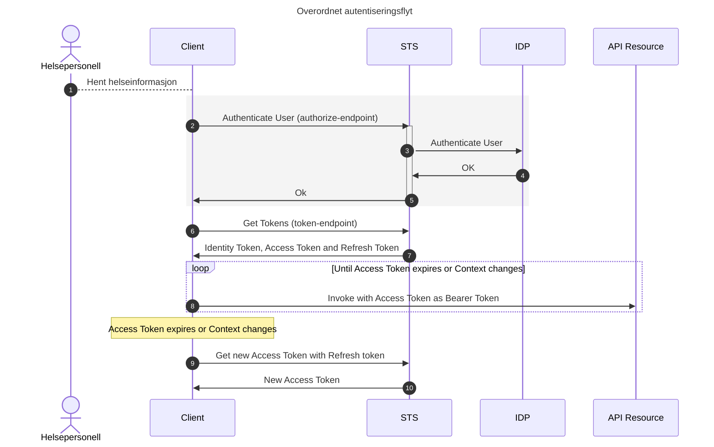
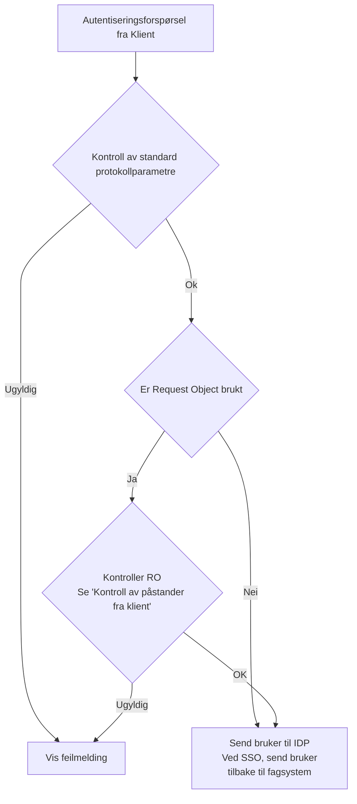
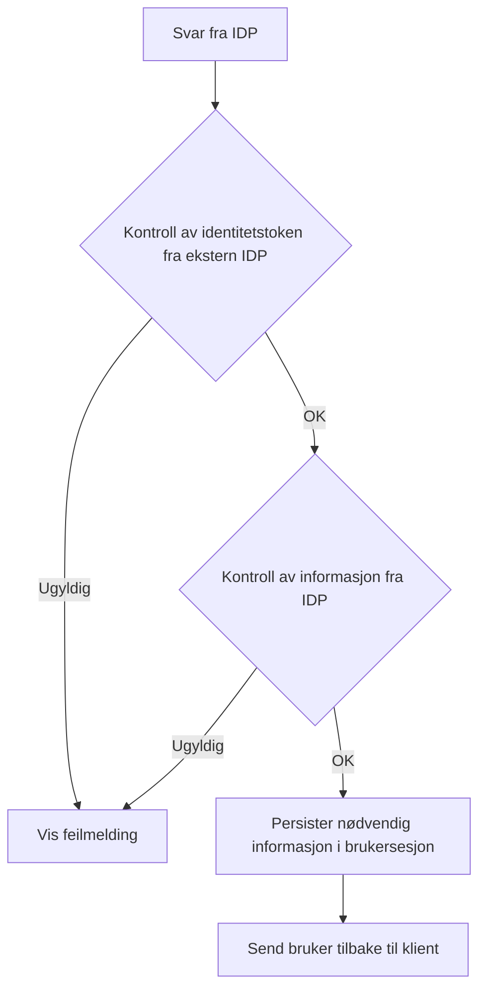
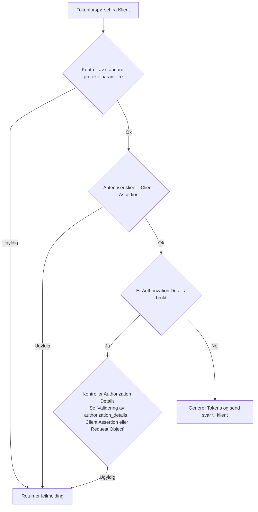

Bruk av HelseID for deling av helseopplysninger via API

Versjon: 0.1

Dato: 14.02.2023

Innholdsfortegnelse
- [1. Definisjon av begrep og forkortelser](#1-definisjon-av-begrep-og-forkortelser)
- [2. Introduksjon](#2-introduksjon)
- [3. Forutsetninger og underliggende krav](#3-forutsetninger-og-underliggende-krav)
  - [3.1. Underliggende spesifikasjoner og profiler](#31-underliggende-spesifikasjoner-og-profiler)
    - [3.1.1. Fremtidige krav](#311-fremtidige-krav)
  - [3.2. Tillitsrammeverk for deling av helseopplysninger](#32-tillitsrammeverk-for-deling-av-helseopplysninger)
  - [3.3. Oppsummering av krav knyttet til bruk av HelseID](#33-oppsummering-av-krav-knyttet-til-bruk-av-helseid)
    - [3.3.1. Krav til RP/Klient](#331-krav-til-rpklient)
    - [3.3.2. Krav til API/Tjeneste](#332-krav-til-apitjeneste)
    - [3.3.3. Krav til HelseID](#333-krav-til-helseid)
    - [3.3.4. Krav til IDP](#334-krav-til-idp)
- [4. Bruk av HelseID ved deling av helseopplysninger](#4-bruk-av-helseid-ved-deling-av-helseopplysninger)
  - [4.1. Kall fra klient for brukerautentisering (steg 1-2)](#41-kall-fra-klient-for-brukerautentisering-steg-1-2)
    - [4.1.1. Overføre informasjon om grunnlaget for tilgang fra klient](#411-overføre-informasjon-om-grunnlaget-for-tilgang-fra-klient)
    - [4.1.2. Forspørsel om tilgang til flere API-er](#412-forspørsel-om-tilgang-til-flere-api-er)
  - [4.2. Kontroller i HelseID av forespørsler om brukerautentisering (mellom steg 2-3)](#42-kontroller-i-helseid-av-forespørsler-om-brukerautentisering-mellom-steg-2-3)
    - [4.2.1. Kontroll av standard protokollparametre i HelseID](#421-kontroll-av-standard-protokollparametre-i-helseid)
    - [4.2.2. Kontroll av Request Object i HelseID](#422-kontroll-av-request-object-i-helseid)
    - [4.2.3. Kall til IDP fra HelseID](#423-kall-til-idp-fra-helseid)
  - [4.3. Kontroller av svar fra ekstern IDP til HelseID (mellom steg 4-5)](#43-kontroller-av-svar-fra-ekstern-idp-til-helseid-mellom-steg-4-5)
    - [4.3.1. Kontroll av Identity Token sendt fra ekstern IDP til HelseID](#431-kontroll-av-identity-token-sendt-fra-ekstern-idp-til-helseid)
    - [4.3.2. Kontroll av informasjon sendt fra ekstern IDP til HelseID](#432-kontroll-av-informasjon-sendt-fra-ekstern-idp-til-helseid)
  - [4.4. Håndtering av resultat av brukerautentisering i klient (mellom steg 5 og 6)](#44-håndtering-av-resultat-av-brukerautentisering-i-klient-mellom-steg-5-og-6)
  - [4.5. Kall fra klient for å hente tokens (steg 6)](#45-kall-fra-klient-for-å-hente-tokens-steg-6)
    - [4.5.1. Bruk av PKCE](#451-bruk-av-pkce)
    - [4.5.2. Bruk av Client Assertion](#452-bruk-av-client-assertion)
    - [4.5.3. Bruk av Resource Indicators](#453-bruk-av-resource-indicators)
    - [4.5.4. Bruk av RAR ("authorization\_details")](#454-bruk-av-rar-authorization_details)
  - [4.6. Kontroller i HelseID av forespørsel om tokens (mellom steg 6 og 7)](#46-kontroller-i-helseid-av-forespørsel-om-tokens-mellom-steg-6-og-7)
    - [4.6.1. Kontroll av standard protokollparametre](#461-kontroll-av-standard-protokollparametre)
    - [4.6.2. Kontroll av informasjon om grunnlaget for tilgang til helseopplysninger](#462-kontroll-av-informasjon-om-grunnlaget-for-tilgang-til-helseopplysninger)
  - [4.7. Generering av Identity Token og Access Token](#47-generering-av-identity-token-og-access-token)
  - [4.8. Bruk av RAR](#48-bruk-av-rar)
  - [4.9. Kontroller i klient av Identity Token](#49-kontroller-i-klient-av-identity-token)
  - [4.10. Kontroller i klient av Access Token](#410-kontroller-i-klient-av-access-token)
  - [4.11. Kontroller av Access Token i API](#411-kontroller-av-access-token-i-api)
  - [4.12. Bruk av Refresh Token](#412-bruk-av-refresh-token)
- [5. Sikkerhetsvurderinger **_TODO_**](#5-sikkerhetsvurderinger-todo)

# Datamodell for detaljert autorisasjonsinformasjon

| Attributt | Beskrivelse | Informasjonskilde | Påkrevd | Status | Formål |
| --- | --- | --- | --- | --- | --- |
| "legal-entity" | Den dataansvarlige virksomhetens org.nr og navn. | - §9 samarbeid og multi-tenancy system: Konsumentens EPJ - Single-tenancy/on-premise system: HelseID  | **Ja** | Inkluderes | Loggkontroll og sporbarhet og informasjon til pasienten |
| "point-of-care" | Behandlingsstedets org.nr. og navn. Kan være lik verdi som i "legal-entity" | Konsumentens EPJ | **Ja** | Inkluderes | Loggkontroll, sporbarhet og informasjon til pasienten |
| "department" | Avdeling/org.enhet hvor helsepersonellet yter helsehjelp | Konsumentens EPJ | **Nei** |Inkluderes | Informasjon til pasienten |
| "healthcare-service" | Helsetjenestetyper som leveres ved virksomheten | Konsumentens EPJ | **Ja** | Inkluderes | Tilgangsstyring og informasjon til pasienten? |
| "purpose-of-use" | Helsepersonellets formål med helseopplysningene (til hva de skal brukes) | Kjernejournal, eller Konsumentens EPJ | **Ja** | Inkluderes | Tilgangsstyring |
| "purpose-of-use-details" | Detaljert beskrivelse av helsepersonellets formål med helseopplysningene (til hva de skal brukes) | Konsumentens EPJ | **Nei** | Inkluderes | Loggkontroll |
| "decision-ref" | Referanse til lokal tilgangsbeslutning | Konsumentens EPJ | **Nei** | Inkluderes | Loggkontroll |
| "patient_id" | Unik identifikator for pasienten | Konsumentens EPJ | **Ja** | Under behandling | Tilgangsstyring |

# 1. Definisjon av begrep og forkortelser
Dette dokumentet benytter begreper og terminologi som er definert i følgende spesifikasjoner: [@!RFC6749], [@!RFC6750], [@!RFC7636], [@!OIDC] og ISO29100.

| Begrep | Definisjon |
| --- | --- |
| API | Application Programming Interface |
| HTTP | Hyper Text Transfer Protocol |
| REST | Representational State Transfer |
| OIDC | [OpenID Connect  Core](https://openid.net/specs/openid-connect-core-1_0.html) |
| OAuth 2.0 | [The OAuth 2.0 Authorization Framework](https://www.ietf.org/rfc/rfc6749.txt) |
| RP | OpenID Connect Relying Party.  Som "client" i OAuth. |
| Klient | Som i "client" i OAuth 2. Se også "RP" |
| RAR | [Rich Authorization Requests](https://datatracker.ietf.org/doc/html/draft-ietf-oauth-rar) |
| SSO | Single Sign-On |

# 2. Introduksjon
Dette dokumentet er en beskrivelse av hvordan OpenID Connect og OAuth 2.0 skal benyttes ved deling av helseopplysninger innad i Helsenettet. Dokumentet er ment for utviklere og tekniske arkitekter som skal konsumere API hvor det er et krav at helsepersonellet er autentisert. Det bygger på ett sett med spesifikasjoner [beskrevet under](#forutsetninger-og-underliggende-krav).

OpenID Connect er en protokoll som lar utvikleren selv velge en del sikkerhetsmessige egenskaper ved protokollen. Når man deler helseopplysninger er det forventet at sikkerheten blir ivaretatt på god nok måte. Denne spesifikasjonen er ikke en generell beskrivelse av hvordan OpenID Connect skal benyttes, men en spesifikk beskrivelse av hvordan HelseID skal brukes ved deling av helseopplysninger. 

HelseID gjør det mulig å gjenbruke en autentisering mellom to eller flere applikasjoner, såkalt Single Sign-On (SSO).  HelseID gjør det også mulig for applikasjonen som ber om autentisering, også kalt Relying Party (RP), å gjenbruke en pålogget brukersesjon når RP også er en OAuth klient som skal be om tilgang til et API. 

Merk at begrepene RP og klient brukes synonymt i dette dokument.

> **_TODO:_** [Legg inn en tegning her]

# 3. Forutsetninger og underliggende krav
- Underliggende spesifikasjoner og profiler
- Tillitsrammeverk for deling av helseopplysninger

## 3.1. Underliggende spesifikasjoner og profiler

- [OpenID Connect](https://openid.net/specs/openid-connect-core-1_0.html)
- [OAuth 2.0](https://www.rfc-editor.org/rfc/rfc6749)
- [FAPI 2.0](https://openid.bitbucket.io/fapi/fapi-2_0-security-profile.html) Ikke normativ, men underlag for HelseID sin sikkerhetsprofil
- [OAuth 2.0 Security Best Current Practice](https://datatracker.ietf.org/doc/html/draft-ietf-oauth-security-topics)
- [JSON Web Token (JWT) Profile for OAuth 2.0 Access Tokens](https://datatracker.ietf.org/doc/html/rfc9068)
- [Proof Key for Code Exchange](https://www.rfc-editor.org/rfc/rfc7636)
- [JSON Web Token (JWT) Profile for OAuth 2.0 Client Authentication](https://www.rfc-editor.org/rfc/rfc7523)
- [OAuth 2.0 Demonstrating Proof-of-Possession at the Application Layer](https://datatracker.ietf.org/doc/html/draft-ietf-oauth-dpop) 

### 3.1.1. Fremtidige krav
- [OAuth 2.1](https://www.ietf.org/archive/id/draft-ietf-oauth-v2-1-09.html)
- [OAuth 2.0 Pushed Authorization Requests](https://datatracker.ietf.org/doc/html/rfc9126)

## 3.2. Tillitsrammeverk for deling av helseopplysninger
Tillitsrammeverk for deling av helseopplysninger i norsk helsesektor er beskrevet i egne dokumenter.

- [JWT spesifikasjon for tillitsrammeverk](jwt_access_token_format.md)
- [RAR spesifikasjon for tillitsrammeverk](profil_for_authorization_details.md)
- [Informasjons- og datamodell for tillitsrammeverk](informasjons_og_datamodell.md )
- [Medlemskap i Helsenettet](https://www.nhn.no/medlemskap-og-tilknytning/avtaler-vilkar-og-priser)
- [Norm for informasjonssikkerhet og personvern i helse- og omsorgssektoren](https://www.ehelse.no/normen/normen-for-informasjonssikkerhet-og-personvern-i-helse-og-omsorgssektoren)
- eID i tillitsrammeverket **_TODO_**
- Avtaleverk **_TODO_**

## 3.3. Oppsummering av krav knyttet til bruk av HelseID
### 3.3.1. Krav til RP/Klient

Krav | Beskrivelse 
| --- | --- 
SKAL | Følge HelseID sikkerhetsprofil for klienter
SKAL | Benytte PKCE
SKAL | Benytte Resource Indicators ved forespørsel om tilgang til flere API-er
KAN | Benytte asymmetrisk signerte Request Objects for å overføre informasjon om grunnlaget for tilgang
SKAL | FREMTIDIG KRAV. Benytte DPoP for å binde Access Token til klient.
SKAL | FREMTIDIG KRAV. Benytte PAR for å sende parametre for brukerautentisering.

### 3.3.2. Krav til API/Tjeneste
Krav | Beskrivelse 
| --- | --- 
SKAL | Følge HelseID sikkhetsprofil for API-er
**_TODO_**  | **_TODO_**

### 3.3.3. Krav til HelseID
Krav | Beskrivelse 
| --- | --- 

### 3.3.4. Krav til IDP
Krav | Beskrivelse 
| --- | --- 
SKAL | Følge HelseID sikkerhetsprofil for IDP-er
**_TODO_**  | **_TODO_**

# 4. Bruk av HelseID ved deling av helseopplysninger
Dette avsnittet beskriver i større detalj bruksmønsteret for å dele helseopplysninger mellom fagsystemer og API-er.

Klient ber om autentisering av den fysiske personen ved bruk av normal flyt iht. protokoll, men med følgende presiseringer: 
* Klient skal enten
  * Overføre informasjon som beskriver bakgrunnen for tilgangsforespørselen ved bruk av mekanismen Rich Authorization Requests, som beskrevet [her](#overføre-informasjon-om-grunnlaget-for-tilgang-fra-klient) med mekanismen Request Objects 
* Eller
  * Overføre informasjon som beskriver bakgrunnen for tilgangsforespørselen ved bruk av token-endepunktet med mekanismen `client_assertion`

* Request Object skal overføres til HelseID som et FORM parameter.

* Det er et krav at et token ikke skal kunne stjeles eller misbrukes. For å forhindre dette **skal** klienten bruke DPoP for å binde seg krypografisk til Access Tokens.

* Informasjon som beskriver bakgrunn for tilgangsforespørselen skal følge standarden som er angitt i… (autentiseringsforespørsler) 

* Klient skal bruke Pushed Authorization Requests som beskrevet i [rfc9126](https://datatracker.ietf.org/doc/html/rfc9126) (fremtidig krav) 

* Klient skal autentisere brukeren iht. regler i tillitsrammeverket **_TODO:_** [Lenke her]
   * Dette inkluderer å verifisere at lokal brukeridentitet (om noen) i klient er lik brukeridentiteten returnert fra HelseID.

Hvert enkelt steg i flyten over er beskrevet i detalj under.

**_TODO_** [Legg inn sekvensdiagram som viser målbilde med PAR og DPoP]

## 4.1. Kall fra klient for brukerautentisering (steg 1-2)
Når et helsepersonell ønsker å få tilgang til helseopplysninger i andre virksomheter SKAL helsepersonellet autentiseres i HelseID.

Brukeren SKAL åpne endepunktet [/authorize] i nettleser (https://openid.net/specs/openid-connect-core-1_0.html#AuthorizationEndpoint). Endepunktet er dokumentert [her](https://helseid.atlassian.net/wiki/spaces/HELSEID/pages/5571605/Authorize+Endpoint).

Utover normal protokollflyt er det følgende tilpasninger
* PKCE SKAL benyttes
* Request Objects med asymmetrisk signering SKAL benyttes
* Indikering av ønsket sikkerhetsnivå og identitetstilbyder med acr_values KAN benyttes
* Resource Indicators SKAL benyttes dersom klient skal ha tilgang til flere API-er
  

### 4.1.1. Overføre informasjon om grunnlaget for tilgang fra klient
Ved deling av helseopplysninger på tvers av virksomheter i helsesektoren krever tillitsrammeverket at konsumentens EPJ-system overfører informasjon som beskriver hvorfor helsepersonellet har fått tilgang til pasientens helseopplysninger.
Datamodellen er [beskrevet i en egen spesifikasjon](https://github.com/NorskHelsenett/Tillitsrammeverk/blob/main/specs/informasjons_og_datamodell.md).

HelseID krever at denne informasjonen struktureres og formatteres i henhold til spesifikasjonen [profil for authorization_details" struktur](https://github.com/NorskHelsenett/Tillitsrammeverk/blob/main/specs/profil_for_authorization_details.md).

Strukturen som inneholder informasjon om grunnlaget for at helsepersonellet har fått tilgang til pasientens helseopplysninger skal sendes til HelseID i autentiseringsforespørselen ved å benytte parameteret "request" i henhold til [OpenID Connect - Request Object](https://openid.net/specs/openid-connect-core-1_0.html#RequestObject)

**_TODO:_** [Lenke til konkret eksempel + eksempelkode].

Et Request Object SKAL overføres som et form parameter i en POST request.

### 4.1.2. Forspørsel om tilgang til flere API-er
Tjenester som inngår i tillitsmodellen krever at Access Tokens ment for dem ikke skal kunne brukes for å få tilgang andre API-er. I praksis innebærer dette at claimet "aud" (audience) ikke kan ha mer enn en verdi og at denne verdien peker til det aktuelle API-et. *Audience* er navnet som identifiserer API-et i HelseID

[//]: # (Link til https://helseid.atlassian.net/wiki/spaces/HELSEID/pages/481755152/Requesting+multiple+access+tokens+with+single+audiences krever innlogging og er ikke åpen: )
HelseID gjør det enkelt for klienter å hente ett Access Token per tjeneste ved å tilby mekanismen [Resource Indicators](https://www.rfc-editor.org/rfc/rfc8707). Bruk av Resource indikators [er beskrevet her](https://helseid.atlassian.net/wiki/spaces/HELSEID/pages/481755152/Requesting+multiple+access+tokens+with+single+audiences).

## 4.2. Kontroller i HelseID av forespørsler om brukerautentisering (mellom steg 2-3)
Figuren under viser hvilke kontroller HelseID gjør når en klient forespør brukerautentisering.

### 4.2.1. Kontroll av standard protokollparametre i HelseID
Når en forespørsel om brukerautentisering mottas av HelseID, gjøres det først en kontroll av protokollparametre i henhold til OpenID Connect og sikkerhetsprofilen til HelseID. Dette inkluderer, men er ikke begrenset til:

  * Sjekk av at klienten er registrert og aktivert i HelseID
  * Sjekk av at klienten bare forspør API-er og annen informasjon som den har tilgang til
  * Sjekk av at klienten sender en preregistrert redirect_uri
  * Sjekk av at klienten bruker PKCE
  * (Fremtidig) Sjekk av systemidentitet

Dersom noen av disse kontrollene feiler, vil sluttbrukeren se en feilmelding i sin nettleser.

Merk at protokollparametre KAN sendes som GET eller POST parametre, eller som en del av et Request Object. 

### 4.2.2. Kontroll av Request Object i HelseID
Klienten skal inkludere et Request Object for å overføre kontekstuell informasjon til HelseID (f.eks virksomhet eller brukerkontekst). Kontroll av dette skje på samme måte som for client assertions i Token-endepunktet. Se [Validering av authorization_details i Client Assertion eller Request Object](validering-av-authorizationdetails-i-client-assertion-eller-request-object).

Dersom noen av disse kontrollene feiler, vil sluttbrukeren se en feilmelding i sin nettleser.

Et Request Object SKAL overføres som et POST parameter.

Kodeeksempel på bruk av Request Objects ligger [her](https://github.com/NorskHelsenett/HelseID.Samples/tree/master/NativeClients/SimpleRequestObjectsDemo).

### 4.2.3. Kall til IDP fra HelseID
Dersom alle kontroller er ok, sjekker HelseID om brukeren allerede har en sesjon i HelseID. Dersom dette er tilfelle, og klienten ikke har deaktivert Single sign-on, sendes brukeren tilbake til klienten.

I andre tilfeller sendes brukeren til ekstern IDP for autentisering.

## 4.3. Kontroller av svar fra ekstern IDP til HelseID (mellom steg 4-5)
Etter at en bruker har autentisert seg hos en ekstern IDP sendes resultatet til HelseID. Alle integrasjoner mellom HelseID og eksterner IDP-er er basert på OpenID Connect, og følger sikkerhetsprofilen.

HelseID kontrollerer resultatet fra IDP som følger.

### 4.3.1. Kontroll av Identity Token sendt fra ekstern IDP til HelseID
Etter at brukeren har autentisert seg i ekstern IDP, sendes informasjon om dette tilbake til HelseID. Dette vil alltid være et Identity Token. HelseID validerer først gyldigheten på dette tokenet i henhold til protokollspesifikasjon og egen sikkerhetsprofil. 

Dersom noen av disse kontrollene feiler, vil sluttbrukeren se en feilmelding i sin nettleser.

### 4.3.2. Kontroll av informasjon sendt fra ekstern IDP til HelseID
HelseID forventer å få informasjon fra IDP om identitet til bruker, sikkerhetsnivå, påloggingsmekanisme mm. HelseID kontroller at denne informasjon er tilstede og gyldig.

Dersom dette feiler, vil sluttbrukeren se en feilmelding i sin nettleser.

Dersom kontrollene er ok, vil HelseID persistere informasjonen fra IDP for bruk ved generering av tokens.

## 4.4. Håndtering av resultat av brukerautentisering i klient (mellom steg 5 og 6)
Når klienten mottar resultatet fra brukerautentiseringen fra HelseID, skal dette benyttes for å hente Identity-, Refresh- og Access Tokens. Dette gjøres i henhold i OpenID Connect og HelseID sin sikkerhetsprofil.

## 4.5. Kall fra klient for å hente tokens (steg 6)
Etter vellykket brukesautentisering skal klient kalle token-endepunktet til HelseID for å hente Identity Token, Access Token og Refresh Token. Det skal benyttes POST, kallet skal alltid gjøres fra systemets tjenestelag.

Dette gjøres i henhold til spesifikasjon og sikkerhetsprofil og inkluderer:
- Bruk av PKCE
- Bruk av Client Assertion (privat_key_jwt) for klientautentisering
- Bruk av Resource Indicators for å hente ut API-spesifikke Access Token. 
- Bruk av DPoP

### 4.5.1. Bruk av PKCE
Klienten skal bruke PKCE som beskrevet i [rfc7636](https://www.rfc-editor.org/rfc/rfc7636).

### 4.5.2. Bruk av Client Assertion
For klientautentisering skal klienten brukes en client assertion som beskrevet i [rfc7523](https://www.rfc-editor.org/rfc/rfc7523.html#section-2.2) og i [her](https://helseid.atlassian.net/wiki/spaces/HELSEID/pages/45973505/How+to+submit+organizational+information+to+HelseID+machine-to-machine) i dokumentasjonen til HelseID.

Klient skal bruke den private nøkkelen som tilsvarer offentlig nøkkel registrert hos HelseID.

Kodeeksempel for bygging av Client Assertion [er tilgjengelig her](https://github.com/NorskHelsenett/HelseID.Samples/tree/master/ClientCredentials).
 
### 4.5.3. Bruk av Resource Indicators
Uthenting av API-spesifikke Access Tokens skal gjøres [som beskrevet her](https://helseid.atlassian.net/wiki/spaces/HELSEID/pages/481755152/Requesting+multiple+access+tokens+with+single+audiences).

## 4.6. Kontroller i HelseID av forespørsel om tokens (mellom steg 6 og 7)
Figuren under viser hvilke kontroller HelseID gjør når en klient forespør tokens i forbindelse med en brukerautentisering.

### 4.6.1. Kontroll av standard protokollparametre
I forbindelse med forspørsel om token etter brukerautentisering utføres kontroll av følgende parameter:
* grant_type (authorization_code eller refresh_token)
* client_id. Klienten må være godkjent for tillitsrammeverket.
* code_verifier (pkce, valideres opp i mot verdi som ble sendt til authorization-endepunktet)
* code (gyldig og ikke utgått på tid) 
ELLER
* refresh_token (gyldig refresh token, ikke utgått på tid)
* client_assertion (signert med gyldig privat nøkkel, gyldige claims, ikke utgått på tid)
* redirect_uri (lik verdi som ble sendt til authorize-endepunktet)
* resource (dersom Resource Indicators ble brukt, må denne være lik en av ressursene som ble oppgitt mot authorize-endepunktet)

## 4.7. Generering av Identity Token og Access Token
Etter at forspørsel om token er godkjent, returner HelseID tokens med de informasjonselementer (claims) som klient og API-er har forspurt. Merk at dataminimering settes opp for både klient.
* Identity Tokenet innholder claims ment for klienten. 
* Access Token innholder claims ment for det forespurte API-et. 

I forbindelse med deling av helseopplysninger, vil informasjon om helsepersonellet og tilhørende virksomhet bli oversendt som spesifisert i [JWT Access Token Format](jwt_access_token_format.md).

Andre claims er i henhold til [dette](https://helseid.atlassian.net/wiki/spaces/HELSEID/pages/5570914/Claims) dokumentet.

I tillegg til informasjon fra IDP og klient, kan tokene innholder informasjon fra autoritative registre i NHN som Helsepersonellregisteret og Persontjenesten.

## 4.8. Bruk av RAR 

Klienten kan sende inn utvidet informasjon til HelseID ved bruk av "authorization_details"-claimet som definert i RAR-spesifikasjonen.

Verdien til dette claimet er en json-struktur. HelseID støtter flere typer informasjonselementer:
* Informasjon om organisasjonsnummer
* Informasjon om behandlingskonteksten
* Annen informasjon.

For å sende denne informasjonen til authorization-endepunktet, må "authorization_details" inkluderes i JWT-en som POSTes som et Request Object. 

For å sende denne informasjonen til token-endepunktet, må "authorization_details" inkluderes i JWT-en som POSTes som en Client Assertion. 

Se egen profil i [Profil for bruk av Rich Authorization Requests](profil_for_authorization_details.md)

## 4.9. Kontroller i klient av Identity Token
Når klienten mottar svar fra token-endepunktet, skal den kontrollere Identity Tokens. Dette skal gjøres som beskrevet **_TODO:_** [Lenke til eget dokument for validering av ID-tokens]. Utover standard JWT-validering, inkluderer dette:
* Sjekke at sikkerhetnivå på brukerautentisering er korrekt (4 / High)
* Dersom klient også har lokal brukerinnlogging, SKAL det kontrolleres at lokalt innlogget helsepersonell er det samme som logget seg inn med HelseID. Dette er normalt en sjekk på fødselsnummer eller helsepersonellnummer.

## 4.10. Kontroller i klient av Access Token
Klienten skal ikke kontrollere Access Token, men sende dette videre til API-et som et Bearer Token som beskrevet i [rfc6750](https://www.rfc-editor.org/rfc/rfc6750). 
Sammen med Access Token returnerer HelseID et parameter expires_in som forteller hvor mange sekunder tokenet er gyldig. Denne verdien skal brukes at klienten for å vurdere når den må be om et nytt Access Token via mekanismen Refresh Tokens.

## 4.11. Kontroller av Access Token i API
Et API skal kontrollere ett innkommende Access Token i henhold til [rfc9068] med følgende unntak:
- Claimet "typ" kan være "jwt", i tillegg til til "at+jwt" og "application/at+jwt".
- DPoP 

Se også [Guidelines for using JSON Web Tokens](https://helseid.atlassian.net/wiki/spaces/HELSEID/pages/284229708/Guidelines+for+using+JSON+Web+Tokens+JWTs) i HelseID sin dokumentasjon for kontroll av claims spesifikke for HelseID.

Et fremtidig krav vil være å også kontrollere at tokenet er sendt av korrekt klient, se **_TODO:_**
  - Validering og bruk av informasjon i token 
  - Revisjonslogging 

## 4.12. Bruk av Refresh Token
Klienten skal bruke Refresh Tokens i følgende tilfeller:
* Dersom at Access Tokens ikke er varig lengre.
* Dersom det er behov for et Access Tokens for et spesifikt API

Refresh Tokens brukes som spesifisert i [rfc6749](https://www.rfc-editor.org/rfc/rfc6749#section-1.5), og i sikkerhetsprofilen til HelseID.

# 5. Sikkerhetsvurderinger
<!--- todo-->
HelseID krever sikkerhetsprofilen FAPI 2.0 (lenke til vår versjon av profilen)
Pek til Security BCP og Trusselmodell

Beskriv konkrete sikkerhetstiltak på klienten:
- XSS (for nettlesere)
- Sjekk av parametre som sendes til HelseID 
- Kontroll av tokens 
- Riktig URL til HelseID

Sikkerhet i API:
- Kreve DPoP eller mTLS

Sikkerhet i OP:
- Nøkkelmateriale 
- Sikkerhet i registre brukt til berikelse av informasjon 

 