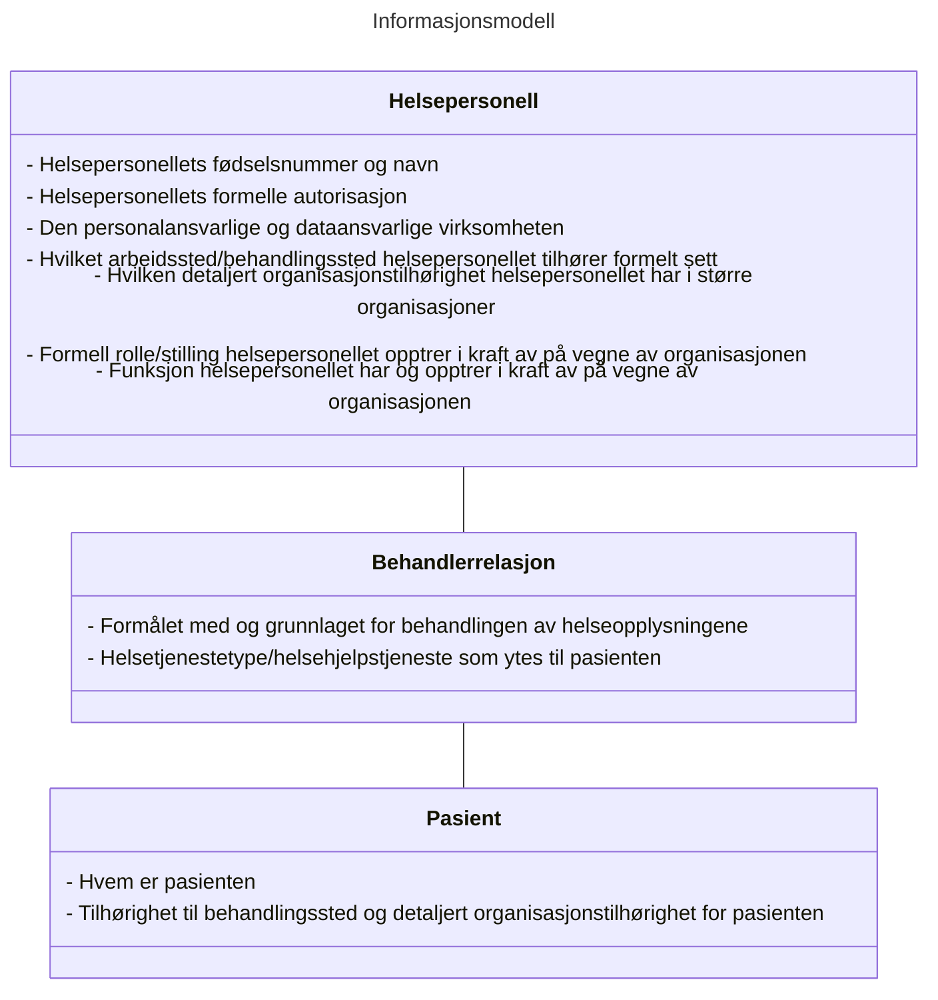
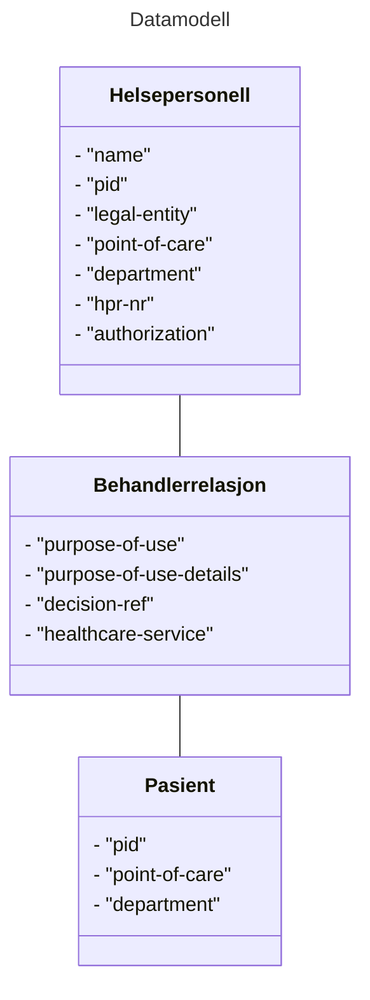
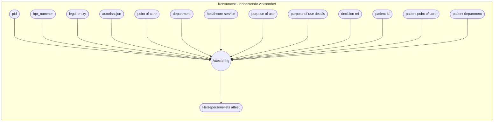

# Informasjons- og datamodell for attestering av grunnlag for tilgang ved deling av helseopplysninger

## Sammendrag
Denne spesifikasjonen definerer en informasjons- og datamodell som skal brukes for å attestere et helsepersonells grunnlag for tilgang til helseopplysninger ved deling av helseopplysninger på tvers av helsevirksomheter i helse- og omsorgssektoren i Norge.

## Omfang
Spesifikasjonen skal benyttes for attestering av et helsepersonells grunnlag for tilgang til sin pasients helseopplysninger hos andre virksomheter ved deling av journaldokumenter i prosjektet Pasientens journaldokumenter (PJD) i Kjernejournal.
Dette dokumentet er et utkast som er ment for utviklere av programvare som skal delta i første utprøving i PJD. Det er forventet at erfaringer fra implementasjon og bruk av denne spesifikasjonen vil føre til behov for tilpassinger av spesifikasjonen. 

## Dokumentets status

| Versjon | Dokumentets status | dato |
| --- | --- | --- |
| -0 | Utkast | 17.02.2023 |
| -1 | Utkast | 10.03.2023 |
| -2 | Utkast | 25.09.2023 |
| -3 | Utkast | 18.10.2023 |

Dette dokumentet utgjør ikke en formell standard, men inngår som en del av et kravsett knyttet til tillitsrammeverk for deling av helseopplysninger i helse- og omsorgssektoren.
Spesifikasjonen bør ikke benyttes uten føringene som ligger til grunn i tillitsrammeverket.

Spesifikasjonen skal versjoneres for å støtte endringer over tid.


## Innholdsfortegnelse
1. [Innledning](#1-innledning)<br/>
2. [Ordliste](#2-ordliste)
3. [Bakgrunn for spesifikasjonen](#3-bakgrunn-for-spesifikasjonen)
4. [Spesifikasjon](#4-spesifikasjon)<br/>
	4.1 [Informasjonsmodell](#41-informasjonsmodell)<br/>
	4.2 [Datamodell](#42-datamodell)<br/>
	4.3 [Beskrivelse av helsepersonellet: "practitioner"](#43-beskrivelse-av-helsepersonellet-practitioner)<br/>
	4.4 [Beskrivelse av behandlerrelasjon: "care-relation"](#44-care-relation-behandlerrelasjon)<br/>
	4.5 [Beskrivelse av pasienten: "patient"](#45-kategori-pasient---pasienten)<br/>
5. [Sikkerhets- og personvernshensyn](#5-sikkerhets--og-personvernshensyn)<br/>
	5.1 [Cybersikkerhet](#51-cybersikkerhet)<br/>
	5.2 [Personvern](#52-personvern) 
6. [Vedlegg A: relasjon til andre standarder og spesifikasjoner](#6-vedlegg-a-relasjon-til-andre-standarder-og-spesifikasjoner)<br/>
	6.1 [Relasjon til EHDSi datamodell og avvik fra EHDSI sine spesifikasjoner](#61-relasjon-til-ehsdi-datamodell-og-avvik-fra-ehdsi-sine-spesifikasjoner)<br/>
	6.2 [Relasjon til HL7 FHIR datamodell](#62-relasjon-til-hl7-fhir-datamodell)<br/>
7. [Vedlegg B: JSON profil for datamodell](#7-vedlegg-b-json-profil-for-datamodell)
8. [Vedlegg C: Eksempel på bruk av datamodell](#8-vedlegg-c-eksempler-på-bruk-av-datamodell)<br/>
	8.1 [Eksempel #1 - Fastlege ber om tilgang til dokument](#81-eksempel-1---fastlege-ber-om-tilgang-til-dokument)<br/>
	8.2 [Eksempel #2 - Ansatt i kommune ber om tilgang til dokument](#82-eksempel-2---ansatt-i-kommune-ber-om-tilgang-til-dokument)<br/>
	8.3 [Eksempel #3 - Helsepersonell i foretak ber om tilgang til dokument](#83-eksempel-3---helsepersonell-i-foretak-ber-om-tilgang-til-dokument)<br/>
	8.4 [Eksempel #4 - Legesekretær ber om tilgang til dokument på vegne av lege](#84-eksempel-4---legesekretær-ber-om-tilgang-til-dokument-på-vegne-av-lege)<br/>
9. [Normative referanser](#9-normative-referanser)
10. [Anerkjennelse av bidragsytere til spesifikasjonen](#10-anerkjennelse-av-bidragsytere-til-spesifikasjonen)


## 1. Innledning 
Denne spesifikasjonen definerer et felles språk og metode som skal benyttes til å attestere helsepersonells grunnlag for tilgang til helseopplysninger ved deling av helseopplysninger via tekniske grensesnitt.
Spesifikasjonen definerer en informasjonsmodell, datamodell og kodeverk som skal implementeres i programvare som benyttes av helsepersonell når de yter helsehjelp til sin pasient.

På grunn av at tilgangsstyring er implementert på forskjellig måte i forskjellige systemer og virksomheter må sektoren samle seg om et felles språk og metode for å uttrykke en attestering av grunnlag for tilgang, slik at aktørene kan forstå hverandre. En felles metode vil også bidra til å kommunisere på en konsistent måte til innbygger.

For å gi riktig helsehjelp til riktig tid må helsepersonell ha tilgang til helseopplysninger som ligger lagret hos andre virksomheter enn den virksomheten hvor de yter helsehjelp. Lovverket vårt sier at helsevirksomheter er pliktig til å dele helseopplysninger med alt helsepersonell så fremt de har et tjenstlig behov og at opplysningene er relevante og nødvendige i helsepersonellets behandling av pasienten. 

De lovpålagte kravene knyttet til tjenstlig behov og opplysningenes relvans og nødvendighet i behandlingen av pasienten medfører at virksomhetene som har dataansvar for helseopplysningene må styre tilgang på en tilfredsstillende måte for å unngå at de deles med uvedkommende.

Tillitsrammeverket definererer hvordan oppgaver knyttet til tilgangsstyring skal fordeles mellom partene. Kort oppsummert skal den konsumerende virksomheten utføre en generell tilgangsstyring av helsepersonellets tilgang til pasientens helseopplysninger, mens virksomheten som skal dele helseopplysningene utfører tilgangsstyring til de spesifikke opplysningene som eventuelt deles.

Både virksomheten som er kilden til dokumentene og den konsumerende virksomheten må alltid kontrollere og dokumentere at helsepersonellet har en gyldig grunn til å få tilgang til helseopplysninger til pasientens helseopplysninger. 
For å få tilgang på tvers av virksomheter må den konsumerende virksomheten attestere at helsepersonell har gyldig grunnlag for tilgangen til helseopplysningene. Attesten må overføres fra konsumenten til dokumentkilden, og kan benyttes til flere formål:
* å utføre spesifikk tilgangskontroll til opplysningene som deles
* a dokumentere at tilgang er gitt til helsepersonellet, hvilket grunnlag som ble fremsatt for å oppnå tilgangen og hvilke opplysninger det er gitt tilgang til
* lovpålagt etterfølgende kontroll av tilgangen for å avdekke eventuelle urettmessige tilegnelser av helseopplysninger
* å støtte opp under innbyggers rettigheter i henhold til ulike lovkrav (pasient- og brukerrettighetsloven, personopplysningsloven og personvernforordningen mm)

## 2. Ordliste
 
|  Begrep | Definisjon  |
| --- | --- |
|  |  |

## 3. Bakgrunn for spesifikasjonen
Aktørene i helse- og omsorgssektoren har samlet seg rundt en felles tillitsmodell som skisserer tillitsgrunnlaget for å dele helseopplysninger mellom helsepersonell på tvers av virksomhetene i sektoren. Les mer om felles tillitsmodell her: [https://www.ehelse.no/standardisering/standarder/anbefaling-av-tillitsmodell-for-data-og-dokumentdeling/](https://www.ehelse.no/standardisering/standarder/anbefaling-av-tillitsmodell-for-data-og-dokumentdeling/_/attachment/inline/4b78b44e-dbfe-4f13-9527-4b47e19a5585:a1003d97d50492bed6eb8064a936354b88a5abf0/Anbefaling%20av%20tillitsmodell%20for%20data-%20og%20dokumentdeling.pdf).

Tillitsmodellen konkretiseres i et tillitsrammeverk som består av vilkår knyttet til bruken av tillitstjenestene (_*Lenke mangler*_). Et grunnleggende vilkår i tillitsrammeverket er kravet til medlemmene av Helsenettet om å etterleve [Norm for informasjonssikkerhet og personvern i helse- og omsorgssektoren](https://www.ehelse.no/normen/normen-for-informasjonssikkerhet-og-personvern-i-helse-og-omsorgssektoren). 

Denne spesifikasjonen er utarbeidet for Pasientens Journaldokumenter (PJD), som er den første anvendelsen av tillitsrammeverket.


## 4. Spesifikasjon

Spesifikasjonen definerer en informasjonsmodell som beskriver informasjonen som skal inngå i attestering av helsepersonellets grunnlag for tilgang til helseopplysninger samt overføres mellom aktørene. Spesifikasjonen definerer hva denne informasjonen beskriver, og hvorfor den skal overføres.

Spesifikasjonen beskriver en datamodell som angir hvilke konkrete attributter som skal brukes i attesten, og hvilke kodeverk og verdier som er gyldige for hvert attributt.

Spesifikasjonen skal anvendes av programvare- og systemleverandører ved implementasjon av programvare som brukes ved deling av helseopplysninger på tvers av virksomheter i sektoren. 

### 4.1 Informasjonsmodell
Informasjonen som skal overføres fra konsument til datakilde kan deles inn i tre hovedkategorier:
1. Informasjon om helsepersonellets identitet
2. Informasjon om helsepersonellets behandlerrelasjon ovenfor pasienten
3. Informasjon om pasienten


#### 4.1.1 Helsepersonellets Identitet
Helsepersonellets grunnleggende identitet består av informasjon som sjelden endres, slik som personens navn og fødselsnummer. I yrkessammenheng består også helsepersonellets identitet i tillegg av tilhørighet til organisasjon, hvilket arbeidsforhold de opptrer i kraft av, samt eventuelle offentlige godkjenninger og rettigheter personellet har. Avhengig av organisasjonens størrelse og antall arbeidsforhold et gitt personell kan ha innenfor organisasjonen, kan det være nødvendig at både fysisk arbeidssted, detaljert organisasjonstilhørighet og angivelse av roller (stilling og/eller funksjon) som reflekterer hvilket ansvar og hvilke oppgaver personellet har i det aktuelle arbeidsforholdet, kreves for å sikre entydighet om hvilket arbeidsforhold personellet opptrer i kraft av under sin tilgang til personopplysninger i andre virksomheter.

Helsepersonellets identitet er nødvendig å overføre fordi vi må kunne knytte en tilgang til helseopplysninger til en gitt person og hvem som er personalansvarlig og/eller eventuelt faglig ansvarlig for personellets tilgang til personopplysninger. Identiteten vil benyttes i forbindelse med tilgangskontroll, slik som kontroll av hvorvidt pasienten har sperret for utlevering av helseopplysninger til helsepersonellet, logging og avklaring av uvanlige mønster funnet ved systematisk logganalyse, samt for informasjon til pasienten om de tilganger som er gitt. Uten at ansvarslinjer for personellets tilganger er entydig dokumentert vil det være risiko for ansvarspulverisering og tidkrevende avklaringer av ansvarslinjer i ettertid, der pasienten i verste fall også er prisgitt samarbeidsvilje fra den oppsøkende virksomheten for å kunne stille rett person til ansvar for eventuelt misbruk av personopplysningene.

Henvendelser fra virksomheter som deler opplysninger til helsepersonellets virksomhet for oppfølging av uvanlige mønster avdekket ved systematisk logganalyse vil presumtivt skje mest effektivt dersom medisinsk-faglig ansvarlig enhet eller personalansvarlig enhet er kjent for virksomheten som deler opplysninger, slik at dette kan oppgis ved henvendelsen eller brukes for å adressere henvendelsen mest mulig presist. Informasjon om roller og så detaljert organisasjonstilhørighet som mulig vil også tilrettelegge for at systematisk logganalyse kan sammenlikne tilgangsmønster mellom helsepersonell som har tilsvarende oppgaver og ansvar fra samme enhet og organisasjon. Det er ikke nødvendig at det benyttes felles kodeverk eller identifikatorer mellom ulike organisasjoner for å oppnå dette, men der dette er felles vil tilføre ytterligere forbedringer for den systematiske logganalysen.

På sikt vil roller som uttrykker funksjonen et helsepersonell utøver (som igjen uttrykker mer spesifikke ansvar og oppgaver personellet har enn stilling ofte gjør) også gi et langt bedre grunnlag under forhåndsvurderingen av hvilke helseopplysninger som kan være relevante og nødvendige for ulike grupper av eksternt og internt personell. Dette forutsetter at det er etablert og tatt i bruk et harmonisert og standardisert kodeverk for å beskrive helsepersonells ulike funksjoner i de ulike organisasjonene.

For pasienter som ønsker å begrense deling av sine opplysninger kan de ulike rollebegrepene være aktuelle kriterier som forvaltningen kan benytte for å begrense tilgang mest mulig presist, for eksempel å kun dele med alle som er autorisert som lege, eller kun dele med personell som har stillingen eller funksjonen overlege, gjerne i kombinasjon med andre informasjonselementer som sikre ytterligere presisjon på begrensningen i tråd med pasientens ønsker.  

Oppsumert trengs følgende informasjon for å beskrive helsepersonellets identitet:
* Identifikator for helsepersonellet (fødselsnummer/D-nummer/ansattidentifikator)
* Helsevirksomheten helsepersonellet representerer som er juridisk ansvarlig for personellets aktivitet
* Helsepersonellets arbeidssted (behandlingsstedet personellet formelt sett tilhører)
* Eventuelt helsepersonellets detaljerte organisasjonstilhørighet dersom virksomheten er stor nok til at dette er nødvendig
* Eventuelt formell rolle/stilling helsepersonellet opptrer i kraft av, og som entydig avklarer personalansvarslinjen innenfor organisasjonen
* Eventuelt hvilken funksjon helsepersonellet utøver, og som kan avklare hvilket ansvar og oppgaver personellet har, samt hvem som er medisinsk-faglig ansvarlig for personellets tilgang til helseopplysninger innenfor organisasjonen 

#### 4.1.2 Helsepersonellets behandlerrelasjon til sin pasient
I delingssammenheng består helsepersonellets digitale adgangskort også av informasjon som beskriver hvorfor helsepersonellet har behov for tilgang til pasientens helseopplysninger. Disse informasjonselementene forteller noe om helsepersonellets mer spesifikke behandlerrelasjon til pasienten.

Norsk lov og ytterligere konkretisering i Norm for informasjonssikkerhet sier at helsepersonell bare skal gis tilgang til helseopplysninger dersom det foreligger et tjenstlig behov, og forutsatt at opplysningene er relevante og nødvendige i behandlingen av pasienten. Det er helsepersonellet og virksomheten de opptrer i kraft av sitt ansvar å sørge for at tilgangen til helseopplysningene er i henhold til loven, men den utleverende part har likevel behov for overført informasjon som beskriver bakgrunnen for forespørselen om helseopplysninger for å tilfredsstille lovkrav knyttet til dokumentasjon og å utføre tilgangskontroll på sin side. 

Informasjonen som beskriver helsepersonellets behandlerrelasjon til sin pasient består av følgende informasjon:
* Formålet med behandlingen av helseopplysninger i form av en overordnet angivelse av grunnlaget for tilgangen og hvilken aktivitet/hendelse som utløser dette spesifikke tilgangsbehovet
* Eventuell helsetjenestetype/helsehjelpstjeneste som ytes til pasienten i forbindelse med tilgangen

#### 4.1.3 Pasienteninformasjon
Pasienten må identifiseres ved deling av helseopplysninger for å kunne knytte den dokumenterte behandlerrlasjonen til både pasient og helsepersonell. Dette vil også hindre at helsepersonellet kan få tilgang til opplysninger fra andre pasienter enn den aktuelle uten at det utstedes et nytt digitalt adgangskort. Det er ikke nødvendig å overføre annen informasjon om pasienten enn en unik identifikator, siden navnet og annen folkeregisterinformasjon vil være kjent der det er registrert helseopplysninger som kan deles.

* Identifikator som angir pasientens identitet (fødselsnummer/D-nummer)
* Eventuelt pasientens behandlingssted og mer detaljert organisasjonstilhørighet for pasienten når størrelsen på virksomheten gjør dette nødvendig


#### 4.1.4 Oppsummert informasjonsmodell



### 4.2 Datamodell 
Informasjonsmodellen skal overføres fra konsument til datakilde i form av attributter formattert som nøkkelverdipar. Disse attributtene danner datamodellen, og er en detaljert beskrivelse av hvordan informasjonen skal uttrykkes.

#### 4.2.1 Prinsipper for datamodellen 
Datamodellen skal legge til rette for at helsevirksomhetene lettere kan samhandle med hverandre ved at man benytter samme språk for å uttrykke informasjonen som beskriver helsepersonellet og konteksten som helsepersonellet befinner seg i når han ber om tilgang til helseopplysningene. Den skisserte datamodellen legger til rette for en viss grad av dynamikk ved å angi hvilket kodeverk eller lister over gyldige verdier som er benyttet i datasettet.

Datamodellen skal overføres til og behandles av mange aktører og i mange systemer. Mottakeren av informasjonen må ha høy tillit til at informasjonen er korrekt og trygg.

#### 4.2.2 Serialisering av datamodell for attest
I denne spesifikasjonen er eksempler på datamodellen serialisert til JSON format på grunn av lesbarhet, men den kan serialiseres til mange forskjellige format.
Valg av format er normalt knyttet til teknisk plattform eller praktiske hensyn, noen eksempler på aktuelle format for datamodell er XML, JSON og CBOR.
Et felles behov for alle serialiserte format er at de bør kunne ivareta attestens dataintegritet og sporbarhet, f.eks. ved bruk av digital signatur. 


#### 4.2.3 Oversikt over attributter i datamodellen 



#### 4.2.4 Oppsummering av informasjonselementer

| Kategori      | Attributt                | Beskrivelse                                                                                       | 
|---------------|--------------------------|---------------------------------------------------------------------------------------------------| 
| practitioner  | "identifier"                | Helsepersonellets fødselsnummer og navn fra folkeregisteret                                       | 
| practitioner  | "hpr-nr"                 | Helsepersonellets HPR-nummer, dersom det finnes                                                   | 
| practitioner  | "authorization"     	   | Helsepersonellets autorisasjon, dersom den finnes                                                 | 
| practitioner  | "legal-entity"           | Den juridisk ansvarlige virksomheten hvor helsepersonellet jobber sitt org.nr og navn.            | 
| practitioner  | "point-of-care"          | Behandlingsstedets org.nr. og navn.<br>Kan være lik verdi som i "legal-entity"                    | 
| practitioner  | "department"             | Avdeling/org.enhet hvor helsepersonellet yter helsehjelp                                          | 
| care-relation | "healthcare-service"     | Helsetjenestetyper som leveres ved virksomheten                                                   | 
| care-relation | "purpose-of-use"         | Helsepersonellets formål med helseopplysningene (til hva de skal brukes)                          | 
| care-relation | "purpose-of-use-details" | Detaljert beskrivelse av helsepersonellets formål med helseopplysningene (til hva de skal brukes) | 
| care-relation | "decision-ref"           | Referanse til lokal tilgangsbeslutning                                                            | 
| patient       | "identifier"             | Unik identifikator for pasienten                                                                  | 
| patient       | "point-of-care"  	       | Virksomheten hvor pasienten mottar behandling <br>Kan være lik verdi som i "legal-entity"         | 
| patient       | "department"             | Avdeling/org.enhet hvor pasienten mottar helsehjelp                                        	   | 


#### 4.2.5 Konsumenten som informasjonskilde for attestering
En attest består av informasjon som beskriver helsepersonellets grunnlag for tilgang, og skal attesteres av en helsevirksomhet som er medlem av helsenettet.



### 4.3 Kategori: "practitioner" - beskrivelse av helsepersonellet
Helsepersonellets identitet angis ved bruk av identifikator fra folkeregisteret, navn, og identifkator fra HPR.
Helsepersonellets identitet beskrives ved bruk av en struktur som består av identifikatorer og verdier fra folkeregisteret og helsepersonellregisteret, samt informasjon som indikerer hvorvidt dette er et helsepersonell (med/uten lisens) eller administrativt personell.

Strukturen som beskriver helsepersonellet består av seks attributter:
* _identifier_, som identifiserer den fysiske  personen som ber om innsyn i journaldokumenter
* _hpr-nr_, som identifiserer et helsepersonell som har fått autorisasjon til å praktisere som et helsepersonell i Norge
* _authorization_, angir den aktuelle autorisasjonen som gjelder for helsepersonellet ved forespørsel om helseopplysninger hos en annen virksomhet
* _legal-entity_, som identifiserer hovedenheten for virksomheten hvor helsepersonellet er ansatt
* _point-of-care_, som identifiserer behandlingsstedet hvor helsepersonellet formelt sett har sin tilhørighet
* _department_, som angir avdelingen eller helsepersonellets mest detaljerte organisasjonstilhørighet

I JSON format er strukturen representert på følgende måte:

```JSON
"practitioner": {
	"identifier": {
		8<...>8
	},
	"hpr-nr": {
		8<..>8
	},
	"authorization": {
		8<...>8
	},
	"legal-entity": {
		8<..>8
	},
	"point-of-care": {
		8<...>8
	},
	"department": {
		8<...>8
	}
}
```
Disse attributtene er beskrevet i større detalj videre i spesifikasjonen.

#### 4.3.1 "identifier": Helsepersonellet som "fysisk person" 
Attributtet "identifier" i entitet practitioner består av verdier som beskriver den fysiske  personen som ber om innsyn i journaldokumenter. 

|   |   |
| ---| ---|
| Attributt: | "identifier" |
| Informasjonselement | Unik identifikator og navn på helsepersonellet |
| Avtalemessig påkrevd | **Ja** |
| Data type: | Object |
| Autoritativ kilde: | www.skatteetaten.no |
| Kodeverk: | 2.16.578.1.12.4.1.4.1 (F-nummer),<br/>2.16.578.1.12.4.1.4.2 (D-nummer)|
| Gyldige verdier: | N/A |

##### "identifier" - JSON format

````JSON
"identifier":{
	"id": "xxxxxx34794",
	"name": "Lege Legesen",
	"system": "2.16.578.1.12.4.1.4.1",
	"authority": "www.skatteetaten.no" 
}
````


#### 4.3.2 "legal-entity": Personalansvarlig og dataansvarlig virksomhet for personopplysninger som behandles av helsepersonellet
Attributtet "legal-entity" identifiserer hovedenheten for virksomheten hvor helsepersonellet er ansatt. Hovedenheten er juridisk ansvarlig for helseopplysningene som behandles av helsepersonellet som forespør tilgang til helseopplysninger i en annen virksomhet.

Det er hovedenheten som eier medlemsskapet i Helsenettet. Attributtet benyttes til tilgangsstyring i forbindelse med signerte bruksvilkår (medlemsskap i helsenett, avtale om tilgang til tjenester som HelseID, kjernejournal og aksept av tilhørende bruksvilkår)
Formål med attributtet er også sporbarhet (det juridiske ansvaret - "notoritet"), kan vurderes vist til pasienten i innsynslogg.

Informasjonskilden til dette attributtet er avhengig av systemarkitektur eller hvorvidt systemet brukes i §9-samarbeid.

- For multi-tenancy løsninger og §9-samarbeid må journalsystemet hos konsumenten angi "legal-entity".
- For single-tenancy/on-premise løsninger kan tillitsankeret utlede helsevirksomhet.

|   |   |
| ---| ---|
| Attributt: | "legal-entity" |
| Informasjonselement | Virksomheten (hovedenhet) som har dataansvaret der hvor helsepersonellet yter helsehjelp |
| Avtalemessig påkrevd | **Ja, hvis forekommer** |
| Data type: | String |
| Autoritativ kilde: | www.brreg.no |
| Kodeverk: | 2.16.578.1.12.4.1.4.101 |
| Gyldige verdier: | N/A |

##### Den personalansvarlige og dataansvarlige virksomheten - Attributter JSON format

````JSON
"legal-entity": {
	"id": "921592761",
	"name": "Lege Leif Lagesen ENK",
	"system": "urn:oid:2.16.578.1.12.4.1.4.101",
	"authority": "www.brreg.no"
}
```` 

#### 4.3.3 "point-of-care": Arbeidssted (behandlingssted som helsepersonellet tilhører)

Attributtet "point-of-care" identifiserer behandlingsstedet hvor helsepersonellet formelt sett har sin tilhørighet,
og skal peke på en virksomhet i enhetsregisteret.
<br>
Attributtet er obligatorisk, men verdiene for "legal-entity" og "point-of-care" kan være like der virksomheten kun drives på et geografisk sted og ikke har undervirksomheter.

Attributtet "point-of-care" skal brukes til loggkontroll, sporbarhet og informasjon til pasient.

Eksempler på gyldige sammensetninger av "legal-entity" og "point-of-care: 

**Spesialisthelsetjenesten**
* legal_enitity: "Nordlandssykehuset HF" 
* point-of-care: "Nordlandssykehuset HF Somatikk - Gravdal"

**Kommune**
* legal-entity: "Oslo kommune helseetaten"
* point-of-care: "Oslo kommune helseetaten legevakten Storgata"


|   |   |
| ---| ---|
| Attributt: | "point-of-care" |
| Informasjonselement | Virksomheten (underenhet) hvor helsepersonellet yter helsehjelp |
| Avtalemessig påkrevd | **Ja** |
| Data type: | String |
| Autoritativ kilde: | Enhetsregisteret - SSB |
| Kodeverk: | 2.16.578.1.12.4.1.4.101 |
| Gyldige verdier: | N/A |

##### Arbeidssted/behandlingssted - Attributter JSON format

````JSON
"point-of-care": {
	"id": "123456789",
	"name": "Det beste legekontoret i byen AS",
	"system": "2.16.578.1.12.4.1.4.101",
	"authority": "www.brreg.no"
}
````

#### 4.3.4 "department": Avdeling eller detaljert organisasjonsenhet
Attributtet "department" angir avdelingen eller helsepersonellets mest detaljerte organisasjonstilhørighet.
Attributtet benyttes ved loggkontroll, samt for å gi mest mulig forståelig informasjon om bakgrunnen for tilgangen til innbygger.

|   |   |
| ---| ---|
| Attributt: | "department" |
| Informasjonselement | Fysisk sted/avdeling/organisasjonsenhet som helsepersonellet tilhører |
| Avtalemessig påkrevd | **Ja, hvis forekommer** |
| Data type: | Object |
| Autoritativ kilde: | Konsument    |
| Kodeverk: | RESH/Enhetsregisteret |
| Gyldige verdier: | N/A |


##### "department" - Attributter JSON format

````JSON
"department": {
	"id": "705592",
	"name": "Anestesiologi Seksjon RH",
	"system": "urn:oid:2.16.578.1.12.4.1.4.102",
	"authority": "https://www.nhn.no"
}
````

#### 4.3.5 "hpr-nr": Helsepersonellnummer
Attributtet "hpr-nr" er en forkortelse for "Helsepersonellnummer" hvor verdien identifiserer et helsepersonell som har fått autorisasjon og/eller lisens til å praktisere som et helsepersonell i Norge.


Er nødvendig for å slå opp i helsepersonellregisteret, og for å undersøke hvorvidt det foreligger sperringer hos kilden og Kjernejournal.

 
|   |   |
| ---| ---|
| Attributt: | "hpr-nr" |
| Informasjonselement | Unik identifikator for helsepersonellet knyttet opp til formelle autorisasjoner eller lisenser |
| Avtalemessig påkrevd | **Ja, hvis forekommer** |
| Data type: | Object |
| Autoritativ kilde: | Helsepersonellregisteret - Helsedirektoratet |
| Kodeverk: | 2.16.578.1.12.4.1.4.4 |
| Gyldige verdier: | N/A |

###### "hpr-nr": Helsepersonellnummer - JSON format
````JSON
"hpr-nr": {
	"id": "9144900",
	"system": "urn:oid:2.16.578.1.12.4.1.4.4",
	"authority": "https://www.helsedirektoratet.no/"
},
````

#### 4.3.6 "authorization": Helsepersonellets gjeldende autorisasjon
Attributtet "authorization" angir den aktuelle autorisasjonen som gjelder for helsepersonellet ved forespørsel om helseopplysninger hos en annen virksomhet.

Noe helsepersonell har ikke autorisasjoner, men trenger likevel tilgang på helseopplysninger. Attributtet kan derfor ikke være påkrevd, men skal inkluderes i datamodellen dersom den fysiske personen har en eller flere gyldige autorisasjoner.

Formålet med attributtet er loggkontroll og eventuell tilgangsstyring. Dersom noen dokumenter krever en autorisasjon vil dette attributtet måtte benyttes til dette. Ved at dette attributtet er tilgjengelig legger vi til rette for at tilgangsstyring kan utføres.

I dag benyttes autorisasjonen som gir størst grad av tilgang av KJ, men det er ønskelig at det er den autorisasjonen som "benyttes" i tilgangsforespørselen som formidles.
 
|   |   |
| ---| ---|
| Attributt: | "authorization" |
| Informasjonselement | Den gjeldende autorisasjonen for helsepersonellet i behandlingen av pasienten  |
| Avtalemessig påkrevd | **Ja, hvis forekommer** |
| Data type: | Objekt |
| Autoritativ kilde: | Helsepersonellregisteret - Helsedirektoratet |
| Kodeverk: | [Kategori Helsepersonell (OID=2.16.578.1.12.4.1.1.9060)](https://volven.no/produkt.asp?id=506875&catID=3&subID=8)  |
| Gyldige verdier: | N/A |

##### "authorization": Helsepersonellets gjeldende autorisasjon - JSON format
````JSON
"authorization": {
	"code": "LE",
	"text": "Lege",
	"system": "urn:oid:2.16.578.1.12.4.1.1.9060",
	"assigner": "https://www.helsedirektoratet.no/"
}
````

### 4.4 Kategori: "care-relation" - behandlerrelasjon
Helsepersonellets behandlerrelasjon til pasientent angis av en beskrivelse av formålet med og bakgrunnen for behandlingen av helseopplysningene og eventuelt en helsetjenestetype som ytes til pasienten.

Strukturen som beskriver behandlerrelasjonen består av fire attributter:
* _healthcare-service_, som identifiserer typen helsetjenester som leveres ved virksomheten
* _purpose-of-use_, som beskriver det overordnede formålet som helsepersonellet har med behandlingen av personopplysninger
* _purpose-of-use-details_, som er en oppsummering av tilgangsbeslutningen i helsepersonellets lokale journalsystem
* _decision-ref_, som er en referanse til den lokale tilgangsbeslutningen hos konsumenten

I JSON format er strukturen representert på følgende måte:

```JSON
"care-relationship": {
	"healthcare-service": {
		8<...>
	},
	"purpose-of-use": {
		8<...>8
	},
	"purpose-of-use-details": {
		8<...>
	},
	"decision-ref" : {
		8<...>8
	}
},
```
Disse attributtene er beskrevet i større detalj videre i spesifikasjonen.

#### 4.4.1 "healthcare-service": Helsetjenestetype
Attributtet "healthcare-service" angir hvilken type helsetjenester som leveres/ytes ved virksomheten som helsepersonellet jobber for.

Attributtet _kan_ benyttes til tilgangsstyring hos datakilden (som erstatning for eller i kombinasjon med rolle), men også i forbindelse med loggkontroll/analyse og ved innsyn til innbygger.

|   |   |
| ---| ---|
| Attributt: | "healthcare-service" |
| Informasjonselement | Hvilken type helsetjenester som leveres ved virksomheten hvor helsepersonellet yter helsehjelp |
| Avtalemessig påkrevd | **Ja, hvis forekommer** |
| Data type: | string |
| Autoritativ kilde: | Konsument |
| Kodeverk: | [Tjenestetyper innen spesialisthelsetjenesten (OID=2.16.578.1.12.4.1.1.8655)](https://volven.no/produkt.asp?open_f=true&id=495806&catID=3&subID=8&subCat=163&oid=8655)<br/>[UTGÅTT Tjenestetyper innen spesialisthelsetjenesten (OID=2.16.578.1.12.4.1.1.8627)](https://volven.no/produkt.asp?id=507406&catID=3&subID=8)<br/>[Fagområde (OID=2.16.578.1.12.4.1.1.8451)](https://volven.no/produkt.asp?id=507306&catID=3&subID=8)<br/>[Tjenestetyper for spesialisthelsetjenesten (OID=2.16.578.1.12.4.1.1.8668)](https://volven.no/produkt.asp?open_f=true&id=496329&catID=3&subID=8&subCat=163&oid=8668)<br/>[Tjenestetyper for kommunal helse- og omsorgstjeneste mv (OID=2.16.578.1.12.4.1.1.8663)](https://volven.no/produkt.asp?open_f=true&id=496326&catID=3&subID=8&subCat=163&oid=8663)<br/>[Fylkeskommunale tjenestetyper (OID=2.16.578.1.12.4.1.1.8662)](https://volven.no/produkt.asp?open_f=true&id=496298&catID=3&subID=8&subCat=163&oid=8662)<br/>[Tjenestetyper for apotek og bandasjister (OID=2.16.578.1.12.4.1.1.8664)](https://volven.no/produkt.asp?open_f=true&id=496327&catID=3&subID=8&subCat=163&oid=8664)<br/>[Felles tjenestetyper (OID=2.16.578.1.12.4.1.1.8666)](https://volven.no/produkt.asp?open_f=true&id=496328&catID=3&subID=8&subCat=163&oid=8666) |
| Gyldige verdier:| N/A |


##### "healthcare-service" - Attributter JSON format

````JSON
"healthcare-service":{
	"code": "KP02",
	"text": "Sykepleietjeneste",
	"system": "urn:oid:2.16.578.1.12.4.1.1.8663",
	"assigner": "www.helsedirektoratet.no"
}
````

#### 4.4.2 "purpose-of-use": formålet med behandlingen av personopplysninger
Attributtet "purpose-of-use" beskriver det overordnede formålet som helsepersonellet har med behandlingen av personopplysninger, og benyttes til å begrunne _hvorfor_ helsepersonellet trenger tilgang til pasientens helseopplysninger.
I denne spesifikasjonen er gyldige verdier begrenset fordi andre og mer spesialiserte formål ikke ansees som relevante eller nødvendige for omfanget til Pasientens Journaldokumenter.

|   |   |
| ---| ---|
| Attributt: | "purpose-of-use" |
| Informasjonselement | Kodifisert beskrivelse av hva helsepersonellet skal benytte helseopplysningene til  |
| Avtalemessig påkrevd | **Ja** |
| Autoritativ kilde: | Konsument |
| Data type: | Object |
| Kodeverk: | urn:oid:2.16.840.1.113883.1.11.20448 - [HL7](https://terminology.hl7.org/ValueSet-v3-PurposeOfUse.html) |
| Gyldige verdier:| TREAT, <br/>ETREAT,<br/>COC,<br/>BTG |


###### "purpose-of-use" - JSON format

````JSON
"purpose-of-use": {
	"code": "TREAT",
	"text": "Behandling",
	"system": "urn:oid:2.16.840.1.113883.1.11.20448",
	"assigner": "http://www.hl7.org/"
}
````

#### 4.4.3 "purpose-of-use-details": type tjeneste som pasienten skal motta hos virksomheten
Formålet med dette attributtet er å gi kilden dokumentasjon av grunnlaget for tilgjengeliggjøringen for bruk i loggkontroll samt som informasjon til innbygger.

Attributtet "purpose-of-use-details" er en oppsummering av tilgangsbeslutningen i helsepersonellets lokale journalsystem. Informasjonen i attributtet skal beskrive hvorfor helsepersonellet er gitt tilgang til pasientens helseopplysninger. Beslutningen skal gis etter en vurdering av tilgangsreglene som gjelder for dette helsepersonellet.

Attributtet knytter helsepersonellet til pasienten ved å gi en forklaring på hvorfor helsepersonellet trenger helseopplysningene.


|   |   |
| ---| ---|
| Attributt: | "purpose-of-use-details" |
| Informasjonselement | Kodifisert beskrivelse av tjenesten som virksomheten yter til pasienten  |
| Avtalemessig påkrevd | **Ja, hvis forekommer** |
| Autoritativ kilde: | Konsument |
| Data type: | Object |
| Kodeverk: | Kommune: urn:oid:x.x.x.x.x.9151 - [volven](https://volven.no/produkt.asp?open_f=true&id=494341&catID=3&subID=8&subCat=140&oid=9151)<br/>Spesialisthelsetjenesten:[HL7 Norway](https://hl7norway.github.io/AuditEvent/currentbuild/CodeSystem-carerelation.html) |
| Gyldige verdier:| N/A |

##### "purpose-of-use-details" - JSON format

````JSON
"purpose-of-use-details": {
	"code": "15",
	"text": "Helsetjenester i hjemmet",
	"system": "urn:oid:x.x.x.x.x.9151",
	"assigner": "https://www.volven.no/"
},
````


#### 4.4.4 "decision-ref": ekstern referanse til lokal tilgangsbeslutning
Attributtet er en referanse til den lokale tilgangsbeslutningen hos konsumenten. Formålet med dette attributtet er at kilden skal være i stand til å referere til en lokal beslutning hos konsumenten ved behov for oppfølging etter en logganalyse.

Helsepersonellet må bli informert om at denne informasjonen vil vises til pasienten.

Verdien "user_reason" skal kun inneholde alfanumeriske tegn, samt utvalgte spesialtegn.
Eksempel på regex: "([0-9a-åA-Å]+)|([0-9a-åA-Å][0-9a-zA-Z\\s]+[0-9a-åA-Å]+)"

Verdien "user_selected" skal være av type _boolean_. Verdien angir om helsepersonellet har gitt seg selv tilgang til pasientens helseopplysninger. Dersom helsepersonellet har gitt seg selv tilgang skal verdien være _true_. Dersom tilgangen er systemutledet, dvs basert på informasjon om helsepersonellet og pasienten som er registeret i PAS/EPJ (eventuelt i annet fagsystem), skal verdien være _false_.   


|   |   |
| ---| ---|
| Attributt: | "decision-ref" |
| Informasjonselement | Ekstern referanse til lokal tilgangsbeslutning  |
| Avtalemessig påkrevd | **Ja** |
| Autoritativ kilde: | Konsument |
| Data type: | Object |
| Kodeverk: | N/A |
| Gyldige verdier:|  |


##### "decision-ref" - Attributter JSON format

````JSON
    "decision-ref" : {
		"id":  "8<.. id til lokal tilgangsbeslutning, unik for konsument og autogenerert i EPJ ..>8" , 
		"description": "Legekonsultasjon",
		"user_selected": false,
		"user_reason": "Tekst lagt inn av bruker.."
    }
````

### 4.5 Kategori: "patient" - pasienten

Strukturen som beskriver pasienten, består av tre attributter:
* _identifier_, som identifiserer pasienten som fysisk person
* _point-of-care_, som identifiserer behandlingsstedet som pasienten er tilknyttet
* _department_, som identifiserer organisasjonsenhet som pasienten tilhører

I JSON format er strukturen representert på følgende måte:
```JSON
"patient": {
	"identifier": {
		8<...>8
	},
	"point-of-care": {
		8<...>8
	},
	"department": {
		8<...>8
	}
}
```

Disse attributtene er beskrevet i større detalj videre i spesifikasjonen.

#### 4.5.1 "identifier": Unik identifikator for pasienten

| Attributt | |
| --- | --- |
| Attributt: | "identifier" |
| Informasjonselement | Unik identifikator og navn for pasienten som helsepersonellet ber om helseopplysninger for |
| Avtalemessig påkrevd | **Ja** |
| Autoritativ kilde: | Folkeregisteret - Skattedirektoratet |
| Data type: | String |
| Kodeverk: | 2.16.578.1.12.4.1.4.1 (F-nummer),<br/>2.16.578.1.12.4.1.4.2 (D-nummer),<br/>2.16.578.1.12.4.1.4.3 (H-nummer)|
| Gyldige verdier: |  |


##### "identifier" - Attributter JSON format

````JSON
"identifier": {
	"id": "05076600324",
	"name": "Kognar Maman",
	"system": "urn:oid:2.16.578.1.12.4.1.4.1",
	"authority": "https://www.skatteetaten.no"
}
````

#### 4.5.2 "point-of-care": Behandlingssted som pasienten mottar behandling fra

Attributtet "point-of-care" identifiserer behandlingsstedet hvor pasienten mottar behandlingen som er grunnlaget for tilgangen fra,
og skal peke på en virksomhet i enhetsregisteret.
<br>
Attributtet er ikke relevant dersom pasienten behandles utenfor helsepersonellets virksomhet, og det er derfor ikke obligatorisk. Verdien for "point-of-care" kan være lik helsepersonellets "legal-entity" der virksomheten kun drives på et geografisk sted og ikke har undervirksomheter.


Attributtet "point-of-care" skal brukes til loggkontroll, sporbarhet og informasjon til pasient.


|   |   |
| ---| ---|
| Attributt: | "point-of-care" |
| Informasjonselement | Virksomheten (underenhet) hvor pasienten behandles |
| Avtalemessig påkrevd | **Ja, hvis forekommer** |
| Data type: | Object |
| Autoritativ kilde: | Enhetsregisteret - SSB |
| Kodeverk: | 2.16.578.1.12.4.1.4.101 |
| Gyldige verdier: |  |

##### Behandlingssted for pasient - Attributter JSON format

````JSON
"point-of-care": {
	"id": "123456789",
	"name": "Det beste legekontoret i byen AS",
	"system": "urn:oid:2.16.578.1.12.4.1.4.101",
	"authority": "www.brreg.no"
}
````

#### 4.5.3 "department": Avdeling eller detaljert organisasjonsenhet
Attributtet "department" angir avdelingen eller den mest detaljerte organisasjonstilhørigheten pasienten har i forbindelse med helsehjelpen som krever tilgang til helseopplysningene i helsepersonellets virksomhet.
Attributtet benyttes ved loggkontroll, samt for å gi mest mulig forståelig informasjon om bakgrunnen for tilgangen til innbygger.


|   |   |
| ---| ---|
| Attributt: | "department" |
| Informasjonselement | Detaljert organisasjonsenhet som pasienten tilhører |
| Avtalemessig påkrevd | **Ja, hvis forekommer** |
| Data type: | Object |
| Autoritativ kilde: | Enhetsregisteret - SSB eller Norsk Helsenett SF |
| Kodeverk: | RESH/Enhetsregisteret |
| Gyldige verdier: | N/A |


##### "department" - Attributter JSON format

````JSON
"department": {
	"id": "109765",
	"name": "Øye dagkir/pol 1. etasje",
	"system": "urn:oid:2.16.578.1.12.4.1.4.102",
	"authority": "https://www.nhn.no"
}
````


## 5. Sikkerhets- og personvernshensyn
### 5.1 Cybersikkerhet
Både egenprodusert og tredjeparts programvarekomponenter som brukes til datalagring samt behandling og presentasjon av informasjonen i datamodellen kan inneholde svakheter som lar en angriper utnytte data som overføres mellom partene til å utføre forskjellige typer angrep på innsiden av en organisasjon.

Informasjonen i datamodellen flyter mellom flere aktører hvor den lagres og behandles av forskjellige typer programvare. Sikkerhetsangrep som utføres i forbindelse med datalagring er svært vanlig, og utgjør en generell sikkerhetsrisiko som kan begrenses ved at verdier som overføres kan valideres og kontrolleres.

Informasjonen i datamodellen vil blant annet benyttes til å utføre analyse av logger, og vil kunne bli vist til sluttbrukere i forskjellige applikasjoner. Dette åpner for angrep mot sårbarheter i programvare, som f.eks. misbruk av makroer eller XSS angrep i nettlesere. Sannsynligheten for denne typen sikkerhetsangrep bør begrenses ved at verdier som overføres kan valideres og kontrolleres.


### 5.2 Personvern

Datamodellen legger til rette for en utlevering av personopplysninger, herunder helseopplysninger, som en behandling av en særlig kategori av personopplysninger, gjennom å sammenstille opplysninger om helsepersonellet, pasientens identifikasjonsnummer, opplysninger om virksomheten der helsehjelpen utføres, formålet med tilgangen til helseopplysninger og relasjonen mellom helsepersonellet og pasienten, for å autentisere tilgang til gitte helseopplysninger.

#### 5.2.1 Tap av personopplysninger
Ved å utnytte svakheter og sårbarheter i programvare kan kan en angriper observere personopplysninger som utleveres mellom tekniske tjenester som benyttes av virksomheter ved deling av helseopplysninger.
Tap av personopplysninger kan oppstå mellom flere parter i verdikjeden:

- mellom konsument og autorisasjonsserver/IdP
- mellom konsument og informasjonstjeneste
- mellom informasjonstjeneste og datagrensesnitt

For å sikre mot potensielt tap av personopplysninger bør det vurderes å etablere tiltak for å ivareta konfidensialiteten.

#### 5.2.2 Overvåkning av ansatte i andre virksomheter
Datamodellen innebærer en utlevering av opplysninger om helsepersonellets arbeidsforhold. Disse opplysningene utleveres til andre virksomheter enn den virksomheten helsepersonellet er ansatt hos eller yter helsehjelp på vegne av. Det legges derfor til rette for at opplysninger kan benyttes til å monitorere helsepersonell i andre virksomheter. Dataansvarlige må følgelig være bevisste begrensningene i formålet med behandlingen av personopplysninger og eventuelt vurdere risiko knyttet til behandling av personopplysninger utover dette formålet.

#### 5.2.3 Vurdering av personvernkonsevenser
For å ivareta rettighetene og frihetene til pasienten og helsepersonellet som registrerte, bør dataansvarlig virksomhet vurdere hvorvidt behandlingen av personopplysninger medfører høy risiko for at de registrertes rettigheter og friheter ikke ivaretas.

#### 5.2.4 Forutsetninger for behandling av personopplysninger med utgangspunkt i datamodellen
Med utgangspunkt i at datamodellen legger til rette for en utlevering av personopplysninger, herunder helseopplysninger, som en behandling av en særlig kategori av personopplysninger, vil det forutsettes at behandlingen skjer i tråd med prinsipper for behandling av personopplysninger. Personvernkonsekvensene ved tap av personopplysninger eller utilsiktet tilgang vil være store, og behandlingen vil følgelig måtte innebære et særlig fokus på misbruk gjennom behandling av opplysningene til andre formål og helsepersonellets dokumenterte tjenstlige behov for tilgang til gitte helseopplysninger
 
## 6. Vedlegg A: Relasjon til andre standarder og spesifikasjoner

### 6.1 Relasjon til EHSDI datamodell og avvik fra EHDSI sine spesifikasjoner

I forbindelse med realiseringen av EU regulativet EHDS er det definert en datamodell for utveksling av helseopplysninger på tvers av landegrenser innad i EU. 

EHDSI definerer tre SAML Assertions, som holder på forskjellige kategorier av informasjon:
* SAML Assertion for identitetsattributter som beskriver helsepersonellet
* SAML Assertion for identitetsattributter som beskriver pårørende
* SAML Assertion for identitetsattributter som beskriver pasienten

Vi har valgt å ikke tilnærme oss datamodellen hos EHDSI når vi har beskrevet informasjons- og datamodellen som skal benyttes ved deling av helseopplysninger innad i Helsenettet. 
Grunnen til at vi har valgt en annen retning er en antagelse om at programvaren som skal benyttes for å konsumere helseopplysninger ikke har informasjonen som benyttes i EHDSI sin datamodell lett tilgjengelig.

Noen attributter som er definert i denne spesifikasjonen har et visst overlapp med datamodellen i EHDSI. Dette er angitt i venstre kolonne i tabellen under. EHDSI definerer et minstekrav til attributtene som skal overføres, men tillater flere attributter som ikke er definert av spesifikasjonene.


#### 6.1.1 Attributter i tokens i EHDSI

| | Attributt | Beskrivelse |
| --- | --- |--- |
|   | "homeCommunityId" | ID of the Home Community |
|   | "npi" | National Provider Identifier |
| <span style="color: green; font-weight: bold;">X</span> | "subject-id" | Helsepersonellets fulle navn |
|   | "role" | Helsepersonellets "strukturelle rolle" |
|   | "functional-role" | Helsepersonellets "funksjonelle rolle" |
|   | "clinical-speciality" | Helsepersonellets kliniske spesialitet |
| <span style="color: green; font-weight: bold;">X</span> | "permission" | Helsepersonellets formelle rettigheter |
|   | "on-behalf-of" | Delegert tilgang (for fysiske personer uten autorisasjoner) |
| <span style="color: green; font-weight: bold;">X</span> | "organization" | Helsevirksomhetens navn |
| <span style="color: green; font-weight: bold;">X</span> | "organization-id" | Helsevirksomhetens unike identifikator |
|   | "healthcare-facility-type" | Type helsevirksomhet |
| <span style="color: green; font-weight: bold;">X</span> | "purposeofuse" | Formålet med behandlingen av helseopplysninger |
| <span style="color: green; font-weight: bold;">X</span> | "locality" | Behandlingsstedets navn | 
| <span style="color: green; font-weight: bold;">X</span> | "resource-id" | Pasientens fødelsenummer | 

### 6.2 Relasjon til HL7 FHIR datamodell

#### 6.2.1 Attributter koblet mot [HL7 FHIR AuditEvent](http://hl7.org/fhir/auditevent.html) (med knytning til [no-basis profiler](https://simplifier.net/hl7norwayno-basis/~resources?category=Profile))

| Attributt | HL7 FHIR ressurs | HL7 FHIR element | HL7 FHIR kriterium/betingelse | Beskrivelse |
| --- | --- |--- |--- |--- |
| practitioner:pid:id | AuditEvent.agent.who:PractitionerRole.practitioner | identifier | identifier:FNR OR identifier:DNR | Helsepersonellets identitet |
| practitioner:pid:name  | AuditEvent.agent.who:PractitionerRole.practitioner | name |  | Helsepersonellets navn |
| practitioner:legal-entity:id  | AuditEvent.agent.who:PractitionerRole.organization | identifier:ENH.value | type:organisatoriskNiva.coding.code=2 (HF) OR type:organisatoriskNiva.coding.code=3 (Institusjon) OR partOf isNullOrEmpty | Helsevirksomhetens unike identifikator (organisasjonsnummer) |
| practitioner:legal-entity:name | AuditEvent.agent.who:PractitionerRole.organization | name | type:organisatoriskNiva.coding.code=2 (HF) OR type:organisatoriskNiva.coding.code=3 (Institusjon)  OR partOf isNullOrEmpty | Helsevirksomhetens navn |
| practitioner:point-of-care:id | AuditEvent.agent.who:PractitionerRole.location | managingOrganization:identifier:ENH.value |  | Identifikasjon av helsepersonellets arbeidssted (behandlingsstedet de formelt sett opptrer på vegne av) |
| practitioner:point-of-care:name  | AuditEvent.agent.who:PractitionerRole.location | managingOrganization:name |  | Navn på helsepersonellets arbeidssted  |
| practitioner:department:id | AuditEvent.agent.who:PractitionerRole.organization | identifier:RSH.value |  | Identifikasjon av enhet som ugjør helsepersonellets detaljerte organisasjonstilhørighet  |
| practitioner:department:name | AuditEvent.agent.who:PractitionerRole.organization | name |  | Navn på enhet som utgjør helsepersonellets detaljerte organisasjonstilhørighet | 
| care-relationship:healthcare-service:code | AuditEvent.encounter.serviceType:healthcare-service | specialty.coding |  | Identifikasjon av helsehjelpstjeneste eller fagområde som ytes til pasienten |
| care-relationship:healthcare-service:text | AuditEvent.encounter.serviceType:healthcare-service | specialty.text |  | Navn på helsehjelpstjeneste eller fagområde som ytes til pasienten |
| care-relationship:purpose-of-use:code | AuditEvent | authorization.coding.code |  | Identifikasjon av overordnet formål med tilgangen |
| care-relationship:purpose-of-use:text | AuditEvent | authorization.coding.display |  | Navn på overordnet formål med tilgangen |
| care-relationship:purpose-of-use-details:code | AuditEvent | agent.authorization.coding.code |  | Identifikasjon av aktivitet/hendelse som utløste behov for tilgang til pasienten |
| care-relationship:purpose-of-use-details:text | AuditEvent | agent.authorization.coding.display |  | Navn på aktivitet/hendelse som utløste behov for tilgang til pasienten |
| care-relationship:decision-ref:id | AuditEvent | agent.policy |  | Identifikasjon av den spesifikke tilgangen til pasienten som helsepersonellet har fått i lokalt EPJ |
| patient:id | AuditEvent.patient | identifier | identifier:FNR OR identifier.DNR | Identifikasjon av pasienten tilgangen gjelder |
| patient:name | AuditEvent.patient | name |  | Navn på pasienten tilgangen gjelder |
| patient:point-of-care:id | AuditEvent.encounter:Location | managingOrganization:identifier:ENH.value |  | Identifikasjon av behandlingsstedet som pasienten behandles ved |
| patient:point-of-care:name | AuditEvent.encounter:Location | managingOrganization:name |  | Navn på behandlingsstedet som pasienten behandles ved |
| patient:department:id | AuditEvent.encounter:serviceProvider | identifier:RSH.value |  | Identifikasjon av detaljert organisasjonstilhørighet for pasienten |
| patient:department:name | AuditEvent.encounter:serviceProvider | name |  | Navn på detaljert organisasjonstilhørighet for pasienten |

### 6.3 Relasjon til IHE XDS og XUA SAML profil for kjernejournal

#### 6.3.1 Attributter koblet mot [IHE XDS og XUA SAML profil for kjernejournal](https://www.ehelse.no/standardisering/standarder/iImplementation%20guide%20for%20Norwegian%20usage%20of%20IHE%20XDS,%20XCA%20and%20XUA)

| Attributt | SAML Token | Beskrivelse |
| --- |--- |--- |
| practitioner:pid:id | subject/NameID | Helsepersonellets identitet |
| practitioner:pid:name | subject:subject-id | Helsepersonellets navn |
| practitioner:legal-entity:id  | subject:organization-id extension | Helsevirksomhetens unike identifikator (organisasjonsnummer) |
| practitioner:legal-entity:name | subject:organization | Helsevirksomhetens navn |
| practitioner:point-of-care:id | subject:child-organization extension | Identifikasjon av helsepersonellets arbeidssted (behandlingsstedet de formelt sett opptrer på vegne av) |
| practitioner:point-of-care:name  | subject:child-organization | Navn på helsepersonellets arbeidssted |
| practitioner:department:id | subject:facility-id extension | Identifikasjon av enhet som ugjør helsepersonellets detaljerte organisasjonstilhørighet |
| practitioner:department:name | subject:facility | Navn på enhet som utgjør helsepersonellets detaljerte organisasjonstilhørighet | 
| care-relationship:healthcare-service:code | care-relationship:healthcare-service:code | Identifikasjon av helsehjelpstjeneste eller fagområde som ytes til pasienten |
| care-relationship:healthcare-service:text | care-relationship:healthcare-service:text | Navn på helsehjelpstjeneste eller fagområde som ytes til pasienten |
| care-relationship:purpose-of-use:code | subject:purposeOfUse code | Identifikasjon av overordnet formål med tilgangen |
| care-relationship:purpose-of-use:text | subject:purposeOfUse displayName | Navn på overordnet formål med tilgangen |
| care-relationship:purpose-of-use-details:code | care-relationship:purpose-of-use-details:code | Identifikasjon av aktivitet/hendelse som utløste behov for tilgang til pasienten |
| care-relationship:purpose-of-use-details:text | care-relationship:purpose-of-use-details:text | Navn på aktivitet/hendelse som utløste behov for tilgang til pasienten |
| care-relationship:decision-ref:id | care-relationship:decision-ref:id | Identifikasjon av den spesifikke tilgangen til pasienten som helsepersonellet har fått i lokalt EPJ |
| patient:id | resource:resource-id | Identifikasjon av pasienten tilgangen gjelder |
| patient:name | - | Navn på pasienten tilgangen gjelder |
| patient:point-of-care:id | resource:child-organization-id extension | Identifikasjon av behandlingsstedet som pasienten behandles ved |
| patient:point-of-care:name | resource:child-organization | Navn på behandlingsstedet som pasienten behandles ved |
| patient:department:id | resource:facility-id extension | Identifikasjon av detaljert organisasjonstilhørighet for pasienten |
| patient:department:name | resource:facility | Navn på detaljert organisasjonstilhørighet for pasienten |


## 7. Vedlegg B: JSON profil for datamodell
Full modell - valgfrie elementer er tatt med

````JSON
{
	"practitioner": {
		"identifier": {
			"id": "04056600324",
			"name": "Magnar Koman",
			"system": "urn:oid:2.16.578.1.12.4.1.4.1",
			"authority": "https://www.skatteetaten.no"
		},
		"hpr-nr": {
			"id": "9144900",
			"system": "urn:oid:2.16.578.1.12.4.1.4.4",
			"assigner": "https://www.helsedirektoratet.no/"
		},
		"authorization": {
			"code": "LE",
			"text": "Lege",
			"system": "urn:oid:2.16.578.1.12.4.1.1.9060",
			"assigner": "https://www.helsedirektoratet.no/"
		},
		"legal-entity": {
			"id": "993467049",
			"name": "OSLO UNIVERSITETSSYKEHUS HF",
			"system": "urn:oid:2.16.578.1.12.4.1.4.101",
			"authority": "https://www.skatteetaten.no"
		},
		"point-of-care": {
			"id": "874716782",
			"name": "OSLO UNIVERSITETSSYKEHUS HF RIKSHOSPITALET - SOMATIKK",
			"system": "urn:oid:2.16.578.1.12.4.1.4.101",
			"authority": "https://www.brreg.no"
		},
		"department": {
			"id": "705592",
			"name": "Anestesiologi Seksjon RH",
			"system": "urn:oid:2.16.578.1.12.4.1.4.102",
			"authority": "https://www.nhn.no"
		}
	},
	"care-relationship": {
		"healthcare-service": {
			"code": "S03",
			"text": "Indremedisin",
			"system": "urn:oid:2.16.578.1.12.4.1.1.8655",
			"assigner": "https://www.volven.no/"
		},
		"purpose-of-use": {
			"code": "TREAT",
			"text": "Behandling",
			"system": "urn:oid:2.16.840.1.113883.1.11.20448",
			"assigner": "http://www..hl7.org/"
		},
		"purpose-of-use-details": {
			"code": "15",
			"text": "Helsetjenester i hjemmet",
			"system": "urn:oid:x.x.x.x.x.9151",
			"assigner": "https://www.volven.no/"
		},
		"decision-ref": {
			"id": {
				"8<..autogenerert i EPJ..>8"
			},
			"user_selected": true,
			"description": "[id til lokal tilgangsbeslutning som ekstern referanse for kilden]",
			"user_reason": "Tekst lagt inn av bruker.."
		}
	},
	"patient": {
		"identifier": {
			"id": "05076600324",
			"name": "Kognar Maman",
			"system": "urn:oid:2.16.578.1.12.4.1.4.1",
			"authority": "https://www.skatteetaten.no"
		},
		"point-of-care": {
			"id": "974589095",
			"name": "OSLO UNIVERSITETSSYKEHUS HF ULLEVÅL - SOMATIKK",
			"system": "urn:oid:2.16.578.1.12.4.1.4.101",
			"authority": "https://www.brreg.no"
		},
		"department": {
			"id": "109765",
			"name": "Øye dagkir/pol 1. etasje",
			"system": "urn:oid:2.16.578.1.12.4.1.4.102",
			"authority": "https://www.nhn.no"
		}
	}
}
````

## 8. Vedlegg C: Eksempler på bruk av datamodell

### 8.1 Eksempel #1 - Fastlege ber om tilgang til dokument
Eksempelet hvor en fastlege er konsument


##### JSON

```JSON
{
	"practitioner": {
		"identifier": {
			"id": "20086600138",
			"name": "August September",
			"system": "urn:oid:2.16.578.1.12.4.1.4.1",
			"authority": "https://www.skatteetaten.no"
		},
		"hpr-nr": {
			"id": "9144897",
			"system": "urn:oid:2.16.578.1.12.4.1.4.4",
			"authority": "https://www.helsedirektoratet.no/"
		},
		"authorization": {
			"code": "LE",
			"text": "Lege",
			"system": "urn:oid:2.16.578.1.12.4.1.1.9060",
			"assigner": "https://www.helsedirektoratet.no/"
		},
		"legal-entity": {
			"id": "100100673",
			"name": "Norsk Helsenett SF Fagersta Testlegekontor",
			"system": "urn:oid:2.16.578.1.12.4.1.4.101",
			"authority": "https://www.brreg.no"
		},
		"point-of-care": {
			"id": "100100673",
			"name": "Norsk Helsenett SF Fagersta Testlegekontor",
			"system": "urn:oid:2.16.578.1.12.4.1.4.101",
			"authority": "https://www.brreg.no"
		}
	},
	"care-relationship": {
		"healthcare-service": {
			"code": "KX17",
			"text": "Fastlege, liste uten fast lege",
			"system": "urn:oid:2.16.578.1.12.4.1.1.8655",
			"assigner": "https://www.volven.no/"
		}
	},
	"patient": {
		"identifier": {
			"id": "05076600324",
			"name": "Kognar Maman",
			"system": "urn:oid:2.16.578.1.12.4.1.4.1",
			"authority": "https://www.skatteetaten.no"
		}
	}
}
```

### 8.2 Eksempel #2 - Ansatt i kommune ber om tilgang til dokument

I dette eksempelet har en sykehjemslege ved Madserudhjemmet behov for tilgang til et dokument i en annen virksomhet for å planlegge videre oppfølging av en pasient som mottar hjemmehjelpstjenester fra kommunen

##### JSON

```JSON
{
	"practitioner": {
		"identifier": {
			"id": "03117000205",
			"name": "Rita Lin",
			"system": "urn:oid:2.16.578.1.12.4.1.4.1",
			"authority": "https://www.skatteetaten.no"
		},
		"hpr-nr": {
			"id": "9144900",
			"system": "urn:oid:2.16.578.1.12.4.1.4.4",
			"authority": "https://www.helsedirektoratet.no/"
		},
		"authorization": {
			"code": "LE",
			"text": "Lege",
			"system": "urn:oid:2.16.578.1.12.4.1.1.9060",
			"assigner": "https://www.helsedirektoratet.no/"
		},
		"legal-entity": {
			"id": "997506499",
			"name": "OSLO KOMMUNE HELSEETATEN",
			"system": "urn:oid:2.16.578.1.12.4.1.4.101",
			"authority": "https://www.brreg.no"
		},
		"point-of-care": {
			"id": "875300342",
			"name": "MADSERUDHJEMMET",
			"system": "urn:oid:2.16.578.1.12.4.1.4.101",
			"authority": "https://www.brreg.no"
		}
	},
	"care-relationship": {
		"healthcare-service": {
			"code": "KP01",
			"text": "Legetjeneste ved sykehjem",
			"system": "urn:oid:2.16.578.1.12.4.1.1.8663",
			"assigner": "https://www.helsedirektoratet.no/",   
		},
		"purpose-of-use": {
			"code": "COC",
			"text": "",
			"system": "urn:oid:2.16.840.1.113883.1.11.20448",
			"assigner": "https://www.hl7.com/"
		},
		"purpose-of-use-details": {
			"code": "15",
			"text": "Helsetjenester i hjemmet",
			"system": "urn:oid:2.16.578.1.12.4.1.1.9151",
			"assigner": "https://www.volven.no"
		}
	},
	"patient": {
		"identifier": {
			"id": "05076600324",
			"name": "Kognar Maman",
			"system": "urn:oid:2.16.578.1.12.4.1.4.1",
			"authority": "https://www.skatteetaten.no"
		}
	}
}
```


### 8.3 Eksempel #3 - Helsepersonell i foretak ber om tilgang til dokument

I dette eksempelet skal en anestesilege som formelt tilhører Rikshospitalet forberede seg på å gi anestesi til en pasient som er inne for en øyeoperasjon ved Ullevål sykehus, og anestesilegen trenger derfor tilgang til å lese dokumenter fra tidligere behandlere i andre virksomheter for å finne ut hvilke virkestoffer som ble brukt under tidligere anestesi som pasienten rapporterer medførte allergiske reaksjoner 

##### JSON

```JSON
{
	"practitioner": {
		"identifier": {
			"id": "05086900124",
			"name": "Ben Reddik",
			"system": "urn:oid:2.16.578.1.12.4.1.4.1",
			"authority": "https://www.skatteetaten.no"
		},
		"hpr-nr": {
			"id": "222200068",
			"system": "urn:oid:2.16.578.1.12.4.1.4.4",
			"authority": "https://www.helsedirektoratet.no/"
		},
		"authorization": {
			"code": "LE",
			"text": "Lege",
			"system": "urn:oid:2.16.578.1.12.4.1.1.9060",
			"assigner": "https://www.helsedirektoratet.no/"
		},
		"legal-entity": {
			"id": "993467049",
			"name": "Oslo universitetssykehus HF",
			"system": "urn:oid:2.16.578.1.12.4.1.4.101",
			"authority": "https://www.brreg.no"
		},
		"point-of-care": {
			"id": "874716782",
			"name": "OSLO UNIVERSITETSSYKEHUS HF RIKSHOSPITALET - SOMATIKK",
			"system": "urn:oid:2.16.578.1.12.4.1.4.101",
			"authority": "https://www.brreg.no"
		},
		"department": {
			"id": "705592",
			"name": "Anestesiologi Seksjon RH",
			"system": "urn:oid:2.16.578.1.12.4.1.4.102",
			"authority": "https://www.nhn.no"
		}
	},
	"care-relationship": {
		"healthcare-service": {
			"code": "300",
			"text": "Øyesykdommer",
			"system": "urn:oid:2.16.578.1.12.4.1.1.8451",
			"assigner": "https://www.helsedirektoratet.no/",   
		},
		"purpose-of-use": {
			"code": "TREAT",
			"text": "treatment",
			"system": "urn:oid:2.16.840.1.113883.1.11.20448",
			"assigner": "https://www.hl7.org"
		},
		"purpose-of-use-details": {
			"code": "POLBESOK",
			"text": "Poliklinisk besøk",
			"system": "urn:AuditEventHL7Norway/CodeSystem/carerelation",
			"assigner": "https://www.hl7.no"
		}
	},
	"patient": {
		"identifier": {
			"id": "05076600324",
			"name": "Kognar Maman",
			"system": "urn:oid:2.16.578.1.12.4.1.4.1",
			"authority": "https://www.skatteetaten.no"
		},
		"point-of-care": {
			"id": "974589095",
			"name": "OSLO UNIVERSITETSSYKEHUS HF ULLEVÅL - SOMATIKK",
			"system": "urn:oid:2.16.578.1.12.4.1.4.101",
			"authority": "https://www.brreg.no"
		},
		"department": {
			"id": "109765",
			"name": "Øye dagkir/pol 1. etasje",
			"system": "urn:oid:2.16.578.1.12.4.1.4.102",
			"authority": "https://www.nhn.no"
		}
	}
}
```


### 8.4 Eksempel #4 - Legesekretær ber om tilgang til dokument på vegne av lege
##### JSON


## 9. Referanser 

Informative og normative referanser spesifiserer dokumenter som må leses for å forstå eller implementere datamodellen, eller teknologi som må være på plass for å kunne implementere teknologien. 

| | |
| --- | --- |
| Direktoratet for eHelse | Anbefaling av tillitsmodell for data- og dokumentdeling<br/>https://www.ehelse.no/standardisering/standarder/anbefaling-av-tillitsmodell-for-data-og-dokumentdeling/_/attachment/inline/4b78b44e-dbfe-4f13-9527-4b47e19a5585:a1003d97d50492bed6eb8064a936354b88a5abf0/Anbefaling%20av%20tillitsmodell%20for%20data-%20og%20dokumentdeling.pdf |
| Direktoratet for eHelse | Volven - Nasjonal database for helsetjenestens metatdatagrunnlag<br/>https://volven.no/index.asp |
| Brønnøysundsregistrene | Forretningsmodell for enhetsregisteret<br/>https://brreg.github.io/docs/informasjonsmodeller/enhetsregisteret/forretningsobjektmodeller/enhetsregisteret_sentraleopplysninger/ |
| HL7 International | Purpose Of Use<br/>https://terminology.hl7.org/ValueSet-v3-PurposeOfUse.html |
| Helsedirektoratet | Helsepersonellregisteret<br/>https://www.helsedirektoratet.no/tema/statistikk-registre-og-rapporter/helsedata-og-helseregistre/helsepersonellregisteret-hpr<br/>https://www.nhn.no/tjenester/helsepersonellregisteret |
| Skattedirektoratet | Folkeregisteret<br/> https://www.skatteetaten.no/person/folkeregister/om/om/ |


## 10. Anerkjennelse av bidragsytere til spesifikasjonen
Teamet som har hatt ansvaret for denne spesifikasjonen har bestått av Morten Stensøy (HNIKT), Richard Husevåg (HSØ), Sverre Martin Jensen (Oslo Kommune), Erik Vegler Broen (Oslo Kommune - Origo), Simone Vandeberg (NHN), Steinar Noem (NHN).

Vi ønsker å takke Michal Cermak, Trond Elde, Eva Tone Fosse, Asefeh Johnsen, Helge Bjertnæs og Øyvind Kvennås for verdifulle bidrag i utviklingen av spesifikasjonen.
