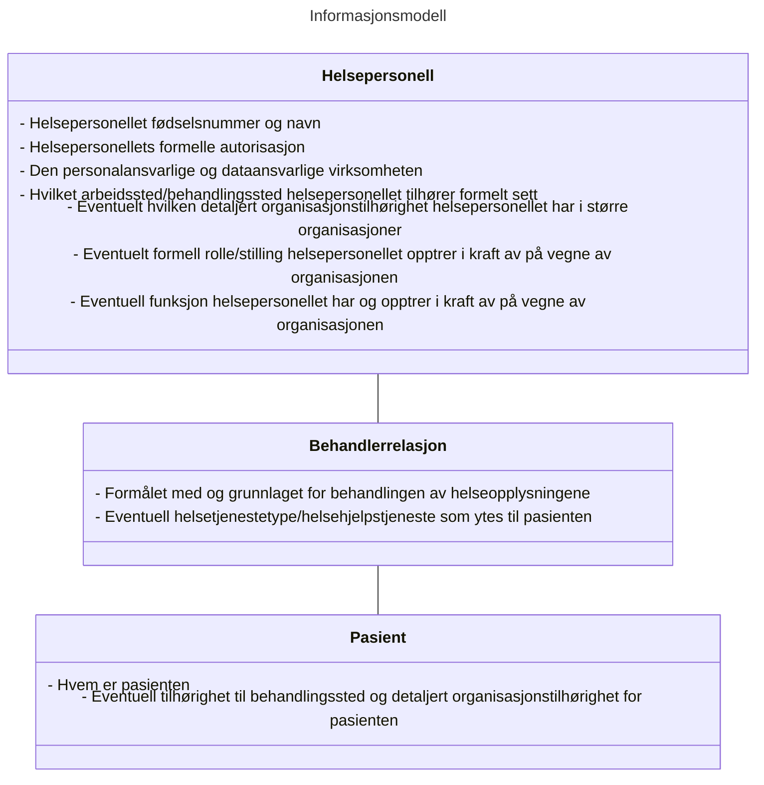
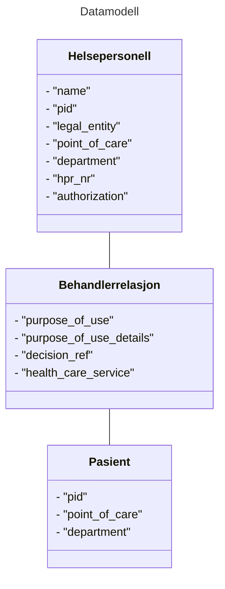

# <span style="color: red">TIL INFORMASJON! </span>
# <span style="color: red">VI OMSTRUKTURERER SPESIFIKASJONENE PÅ GITHUB</span>
For å forenkle arbeidet med spesifikasjoner knyttet til tillitsrammeverk og Pasientens Journaldokumenter har vi startet en omstruktering av spesifikasjonene.
Dette Github repository'et vil fortsette å være hjemmet til informasjonsmodellen for attestering av helsepersonellets tjenstlige behov.


# Informasjons- og datamodell for beskrivelse av tilgangssgrunnlaget ved deling av helseopplysninger

## Sammendrag
Denne spesifikasjonen definerer en informasjons- og datamodell som skal brukes for å uttrykke et helsepersonells grunnlag for tilgang til helseopplysninger ved deling av helseopplysninger på tvers av helsevirksomheter i helse- og omsorgssektoren i Norge.


## Dokumentets status

| Versjon | Dokumentets status | dato |
| --- | --- | --- |
| -0 | Utkast | 17.02.2023 |
| -1 | Utkast | 10.03.2023 |
| -2 | Utkast | 25.09.2023 |

Dette dokumentet utgjør ikke en formell standard, men inngår som en del av et kravsett knyttet til tillitsrammeverk for deling av helseopplysninger i helse- og omsorgssektoren.
Spesifikasjonen bør ikke benyttes uten føringene som ligger til grunn i tillitsrammeverket.

Spesifikasjonen skal versjoneres for å støtte endringer over tid.


## Innholdsfortegnelse
1. Innledning<br/>
2. Ordliste
3. Bakgrunn for spesifikasjonen
4. Spesifikasjon<br/>
	3.1 Informasjonsmodell<br/>
	3.2 Datamodell<br/>
5. Json profil for datamodell
6. Sikkerhets- og personvernshensyn<br/>
	4.1 Cybersikkerhet<br/>
	4.2 Personvern 
7. Anerkjennelse av bidragsytere til spesifikasjonen
8. Eksempler på bruk av datamodell<br/>
	6.1 JSON eksempel<br/>
	6.2 SAML eksempel<br/>
9. Normative referanser 


## 1. Innledning 
For å gi riktig helsehjelp til riktig tid må helsepersonell ha tilgang til helseopplysninger som ligger lagret hos andre virksomheter enn den virksomheten hvor de yter helsehjelp. Lovverket vårt sier at helsevirksomheter er pliktig til å dele helseopplysninger med alt helsepersonell så fremt de har et tjenstlig behov og at opplysningene er relevante og nødvendige i helsepersonellets behandling av pasienten. 

Kravene knyttet til tjenstlig behov og opplysningenes relvans og nødvendighet i behandlingen av pasienten medfører at virksomhetene som har dataansvar for helseopplysningene må styre tilgang på en tilfredsstillende måte.

I tillitsrammeverket legges det opp til en oppgavefordeling knyttet til tilgangsstyring, slik at den konsumerende virksomheten utfører tilgangsstyring av helseopplysninger på overordnet nivå (helsepersonellets tilgang til pasienten), mens virksomheten som skal dele helseopplysningene utfører tilgangsstyring til de spesifikke opplysningene som eventuelt deles. Til tross for at den konsumerende virksomheten er forpliktet til å dokumentere og kontrollere at deres helsepersonell har en gyldig grunn for tilgang til helseopplysninger har virksomheten som deler opplysninger også behov for å motta informasjon som beskriver grunnlaget for tilgangen. Informasjonen som beskriver grunnlaget for delingen vil av virksomheten som deler opplysninger benyttes til flere formål:
* å utføre spesifikk tilgangskontroll til opplysningene som deles
* a dokumentere at tilgang er gitt til helsepersonellet, hvilket grunnlag som ble fremsatt for å oppnå tilgangen og hvilke opplysninger det er gitt tilgang til
* lovpålagt etterfølgende konstroll av tilgangen for å avdekke eventuelle urettmessige tilegnelser av helseopplysninger
* å støtte opp under innbyggers rettigheter i henhold til ulike lovkrav (pasient- og brukerrettighetsloven, personopplysningsloven og personvernforordningen mm)

På grunn av at tilgangsstyring er implementert på forskjellig måte i forskjellige systemer og virksomheter er det nødvendig at sektoren samler seg om en felles metode for å uttrykke grunnlaget for tilgang, slik at aktørene kan forstå hverandre. En felles metode vil også bidra til å kommunisere på en konsistent måte til innbygger.

Denne spesifikasjonen definerer en felles metode som skal benyttes til å uttrykke helsepersonells grunnlag for tilgang til helseopplysninger ved deling av helseopplysninger via tekniske grensesnitt.
Spesifikasjonen definerer en informasjonsmodell, datamodell og kodeverk som skal implementeres i programvare som benyttes av helsepersonell når de yter helsehjelp til sin pasient.

## 2. Ordliste
 
|  Begrep | Definisjon  |
| --- | --- |
|  |  |

## 3. Bakgrunn for spesifikasjonen
Aktørene i helse- og omsorgssektoren har samlet seg rundt en felles tillitsmodell som skisserer tillitsgrunnlaget for å dele helseopplysninger mellom helsepersonell på tvers av virksomhetene i sektoren. Les mer om felles tillitsmodell her: <I>Lenke mangler</I>

Tillitsmodellen konkretiseres i et tillitsrammeverk som består av vilkår knyttet til bruken av tillitstjenestene (<I>Lenke mangler</I>). Den første anvendelsen av tillitsrammeverket, og denne spesifikasjonen, er utarbeidet for prosjektet som skal etablere nasjonal dokumentdeling via kjernejournal.


## 4. Spesifikasjon

Spesifikasjonen inneholder en informasjonsmodell som beskriver hvilken informasjon som skal overføres mellom aktørene, hva denne informasjonen beskriver, og hvorfor den skal overføres.

Spesifikasjonen beskriver hvilke konkrete attributter som skal brukes for å beskrive informasjonsmodellen i form av en datamodell, og hvilke kodeverk og verdier som er gyldige for attributtene.

Spesifikasjonen skal benyttes av programvare- og systemleverandører ved implementasjon av programvare som skal brukes ved deling av helseopplysninger på tvers av virksomheter i sektoren. Datamodellen vil implementeres i relevante nasjonale e-helseløsninger og tillitstjenester.

Datamodellen skal benyttes til flere formål:
* for tilgangsstyring og tilgangskontroll i e-helseløsninger, dokumentkilder og i API
* til dokumentasjon/logging for sporbarhet/etterprøvbarhet og som grunnlag for en etterfølgende kontroll av tilganger
* for å tilfredsstille innbyggeres rettigheter

### 4.1 Informasjonsmodell
Informasjonen som skal overføres fra konsument til datakilde kan deles inn i tre hovedkategorier:
1. Informasjon om helsepersonellets identitet
2. Informasjon om helsepersonellets behandlerrelasjon ovenfor pasienten
3. Informasjon om pasienten


#### 4.1.1 Helsepersonellets Identitet
Helsepersonellets grunnleggende identitet består av informasjon som sjelden endres, slik som personens navn og fødselsnummer. I yrkessammenheng består også helsepersonellets identitet i tillegg av tilhørighet til organisasjon, hvilket arbeidsforhold de opptrer i kraft av, samt eventuelle offentlige godkjenninger og rettigheter personellet har. Avhengig av organisasjonens størrelse og antall arbeidsforhold et gitt personell kan ha innenfor organisasjonen, kan det være nødvendig at både fysisk arbeidssted, detaljert organisasjonstilhørighet og angivelse av roller (stilling og/eller funksjon) som reflekterer hvilket ansvar og hvilke oppgaver personellet har i det aktuelle arbeidsforholdet, kreves for å sikre entydighet om hvilket arbeidsforhold personellet opptrer i kraft av under sin tilgang til personopplysninger i andre virksomheter.

Helsepersonellets identitet er nødvendig å overføre fordi vi må kunne knytte en tilgang til helseopplysninger til en gitt person og hvem som er personalansvarlig og/eller eventuelt faglig ansvarlig for personellets tilgang til personopplysninger. Identiteten vil benyttes i forbindelse med tilgangskontroll, slik som kontroll av hvorvidt pasienten har sperret for utlevering av helseopplysninger til helsepersonellet, logging og avklaring av uvanlige mønster funnet ved systematisk logganalyse, samt for informasjon til pasienten om de tilganger som er gitt. Uten at ansvarslinjer for personellets tilganger er entydig dokumentert vil det være risiko for ansvarspulverisering og tidkrevende avklaringer av ansvarslinjer i ettertid, der pasienten i verste fall også er prisgitt samarbeidsvilje fra den oppsøkende virksomheten for å kunne stille rett person til ansvar for eventuelt misbruk av personopplysningene.

Henvendelser fra virksomheter som deler opplysninger til helsepersonellets virksomhet for oppfølging av uvanlige mønster avdekket ved systematisk logganalyse vil presumtivt skje mest effektivt dersom medisinsk-faglig ansvarlig enhet eller personalansvarlig enhet er kjent for virksomheten som deler opplysninger, slik at dette kan oppgis ved henvendelsen eller brukes for å adressere henvendelsen mest mulig presist. Informasjon om roller og så detaljert organisasjonstilhørighet som mulig vil også tilrettelegge for at systematisk logganalyse kan sammenlikne tilgangsmønster mellom helsepersonell som har tilsvarende oppgaver og ansvar fra samme enhet og organisasjon. Det er ikke nødvendig at det benyttes felles kodeverk eller identifikatorer mellom ulike organisasjoner for å oppnå dette, men der dette er felles vil tilføre ytterligere forbedringer for den systematiske logganalysen.

På sikt vil roller som uttrykker funksjonen et helsepersonell utøver (som igjen uttrykker mer spesifikke ansvar og oppgaver personellet har enn stilling ofte gjør) også gi et langt bedre grunnlag under forhåndsvurderingen av hvilke helseopplysninger som kan være relevante og nødvendige for ulike grupper av eksternt og internt personell. Dette forutsetter at det er etablert og tatt i bruk et harmonisert og standardisert kodeverk for å beskrive helsepersonells ulike funksjoner i de ulike organisasjonene.

For pasienter som ønsker å begrense deling av sine opplysninger kan de ulike rollebegrepene være aktuelle kriterier som forvaltningen kan benytte for å begrense tilgang mest mulig presist, for eksempel å kun dele med alle som er autorisert som lege, eller kun dele med personell som har stillingen eller funksjonen overlege, gjerne i kombinasjon med andre informasjonselementer som sikre ytterligere presisjon på begrensningen i tråd med pasientens ønsker.  

Oppsumert trengs følgende informasjon for å beskrive helsepersonellets identitet:
* Identifikator for helsepersonellet (fødselsnummer/D-nummer/ansattidentifikator)
* Helsevirksomheten helsepersonellet representerer som er juridisk ansvarlig for personellets aktivitet
* Helsepersonellets arbeidssted (behandlingsstedet personellet formelt sett tilhører)
* Eventuelt helsepersonellets detaljerte organisasjonstilhørighet dersom virksomheten er stor nok til at dette er nødvendig
* Eventuelt formell rolle/stilling helsepersonellet opptrer i kraft av, og som entydig avklarer personalansvarslinjen innenfor organisasjonen
* Eventuelt hvilken funksjon helsepersonellet utøver, og som kan avklare hvilket ansvar og oppgaver personellet har, samt hvem som er medisinsk-faglig ansvarlig for personellets tilgang til helseopplysninger innenfor organisasjonen 

#### 4.1.2 Helsepersonellets behandlerrelasjon til sin pasient
I delingssammenheng består helsepersonellets digitale adgangskort også av informasjon som beskriver hvorfor helsepersonellet har behov for tilgang til pasientens helseopplysninger. Disse informasjonselementene forteller noe om helsepersonellets mer spesifikke behandlerrelasjon til pasienten.

Norsk lov og ytterligere konkretisering i Norm for informasjonssikkerhet sier at helsepersonell bare skal gis tilgang til helseopplysninger dersom det foreligger et tjenstlig behov, og forutsatt at opplysningene er relevante og nødvendige i behandlingen av pasienten. Det er helsepersonellet og virksomheten de opptrer i kraft av sitt ansvar å sørge for at tilgangen til helseopplysningene er i henhold til loven, men den utleverende part har likevel behov for overført informasjon som beskriver bakgrunnen for forespørselen om helseopplysninger for å tilfredsstille lovkrav knyttet til dokumentasjon og å utføre tilgangskontroll på sin side. 

Informasjonen som beskriver helsepersonellets behandlerrelasjon til sin pasient består av følgende informasjon:
* Formålet med behandlingen av helseopplysninger i form av en overordnet angivelse av grunnlaget for tilgangen og hvilken aktivitet/hendelse som utløser dette spesifikke tilgangsbehovet
* Eventuell helsetjenestetype/helsehjelpstjeneste som ytes til pasienten i forbindelse med tilgangen

#### 4.1.3 Pasienteninformasjon
Pasienten må identifiseres ved deling av helseopplysninger for å kunne knytte den dokumenterte behandlerrlasjonen til både pasient og helsepersonell. Dette vil også hindre at helseperonsellet kan få tilgang til opplysninger fra andre pasienter enn den aktuelle uten at det utstedes et nytt digitalt adgangskort. Det er ikke nødvendig å overføre annen informasjon om pasienten enn en unik identifikator, siden navnet og annen folkeregisterinformasjon vil være kjent der det er registrert helseopplysninger som kan deles.

* Identifikator som angir pasientens identitet (fødselsnummer/D-nummer)
* Eventuelt pasientens behandlingssted og mer detaljert organisasjonstilhørighet for pasienten når størrelsen på virksomheten gjør dette nødvendig


#### 4.1.4 Oppsummert informasjonsmodell



### 4.2 Datamodell 
Informasjonsmodellen skal overføres fra konsument til datakilde i form av attributter formattert som nøkkelverdipar. Disse attributtene danner datamodellen, og er en detaljert beskrivelse av hvordan informasjonen skal uttrykkes.

#### 4.2.1 Prinsipper for datamodellen 
Datamodellen skal legge til rette for at helsevirksomhetene lettere kan samhandle med hverandre ved at man benytter samme språk for å uttrykke informasjonen som beskriver helsepersonellet og konteksten som helsepersonellet befinner seg i når han ber om tilgang til helseopplysningene. Den skisserte datamodellen legger til rette for en viss grad av dynamikk ved å angi hvilket kodeverk eller lister over gyldige verdier som er benyttet i datasettet.

Datamodellen skal overføres til og behandles av mange aktører og i mange systemer. Mottakeren av informasjonen må ha høy tillit til at informasjonen er korrekt og trygg.


#### 4.2.2 Oversikt over attributter i datamodellen 



#### 4.2.3 Oppsummering av påkrevd eller valgfri informasjon
Ikke all informasjon i datamodellen er relevant, noen informasjonselementer er valgfrie.

Vi har lagt vekt på å ivareta sporbarheten i delingssammenheng, derfor har vi angitt at alle identifikatorer er påkrevd, dette gjelder både fysiske og juridiske personer.

| Attributt                              | Beskrivelse                                                                                       | Informasjonskilde | Påkrevd | Status | Formål |
|----------------------------------------|---------------------------------------------------------------------------------------------------| --- | --- | --- | --- |
| "practitioner:subject"                 | Helsepersonellets fødselsnummer og navn fra folkeregisteret                                       | HelseID | **Ja** | <span style="color: green; font-weight: bold;">Inkluderes</span> | Loggkontroll og sporbarhet |
| "practitioner:hpr_nr"                  | Helsepersonellets HPR-nummer, dersom det finnes                                                   | HelseID | **Nei** | <span style="color: green; font-weight: bold;">Inkluderes</span> | Loggkontroll, sporbarhet og informasjon til pasienten |
| "practitioner:authorization"           | Helsepersonellets autorisasjon, dersom den finnes                                                 | HelseID<br/>Kjernerjournal | **Nei** | <span style="color: green; font-weight: bold;">Inkluderes</span> | Tilgangsstyring |
| "care_relation:legal_entity"           | Den dataansvarlige virksomhetens org.nr og navn.                                                  | - §9 samarbeid og multi-tenancy system: Konsumentens EPJ<br>- Single-tenancy/on-premise system: HelseID  | **Ja** | <span style="color: green; font-weight: bold;">Inkluderes</span> | Loggkontroll og sporbarhet og informasjon til pasienten |
| "care_relation:point_of_care"          | Behandlingsstedets org.nr. og navn.<br>Kan være lik verdi som i "legal_entity"                    | Konsumentens EPJ | **Ja** | <span style="color: green; font-weight: bold;">Inkluderes</span> | Loggkontroll, sporbarhet og informasjon til pasienten |
| "care_relation:department"             | Avdeling/org.enhet hvor helsepersonellet yter helsehjelp                                          | Konsumentens EPJ | **Nei** |<span style="color: green; font-weight: bold;">Inkluderes</span> | Informasjon til pasienten |
| "care_relation:healthcare_service"     | Helsetjenestetyper som leveres ved virksomheten                                                   | Konsumentens EPJ | **Ja** | <span style="color: green; font-weight: bold;">Inkluderes</span> | Tilgangsstyring og informasjon til pasienten? |
| "care_relation:purpose_of_use"         | Helsepersonellets formål med helseopplysningene (til hva de skal brukes)                          | Kjernejournal, eller<br>Konsumentens EPJ | **Ja** | <span style="color: green; font-weight: bold;">Inkluderes</span> | Tilgangsstyring |
| "care_relation:purpose_of_use_details" | Detaljert beskrivelse av helsepersonellets formål med helseopplysningene (til hva de skal brukes) | Konsumentens EPJ | **Nei** | <span style="color: green; font-weight: bold;">Inkluderes</span> | Loggkontroll |
| "care_relation:decision_ref"           | Referanse til lokal tilgangsbeslutning                                                            | Konsumentens EPJ | **Nei** | <span style="color: green; font-weight: bold;">Inkluderes</span> | Loggkontroll |
| "patient:patient_id"                   | Unik identifikator for pasienten                                                                  | Konsumentens EPJ | **Ja** | <span style="color: red; font-weight: bold;">Under behandling</span> | Tilgangsstyring |

#### 4.2.4 Relasjon til EHSDI datamodell og avvik fra EHDSI sine spesifikasjoner

I forbindelse med realiseringen av EU regulativet EHDS er det definert en datamodell for utveksling av helseopplysninger på tvers av landegrenser innad i EU. 

EHDSI definerer tre SAML Assertions, som holder på forskjellige kategorier av informasjon:
* SAML Assertion for identitetsattributter som beskriver helsepersonellet
* SAML Assertion for identitetsattributter som beskriver pårørende
* SAML Assertion for identitetsattributter som beskriver pasienten

Vi har valgt å ikke tilnærme oss datamodellen hos EHDSI når vi har beskrevet informasjons- og datamodellen som skal benyttes ved deling av helseopplysninger innad i Helsenettet. Grunnen til at vi har valgt en annen retning er en antagelse om at programvaren som skal benyttes for å konsumere helseopplysninger ikke har informasjonen som benyttes i EHDSI sin datamodell lett tilgjengelig.

Noen attributter som er definert i denne spesifikasjonen har et visst overlapp med datamodellen i EHDSI. Dette er angitt i venstre kolonne i tabellen under. EHDSI definerer et minstekrav til attributtene som skal overføres, men tillater flere attributter som ikke er definert av spesifikasjonene.


#### 4.2.4.1 Attributter i tokens i EHDSI

| | Attributt | Beskrivelse |
| --- | --- |--- |
|   | "homeCommunityId" | ID of the Home Community |
|   | "npi" | National Provider Identifier |
| <span style="color: green; font-weight: bold;">X</span> | "subject-id" | Helsepersonellets fulle navn |
|   | "role" | Helsepersonellets "strukturelle rolle" |
|   | "functional-role" | Helsepersonellets "funksjonelle rolle" |
|   | "clinical-speciality" | Helsepersonellets kliniske spesialitet |
| <span style="color: green; font-weight: bold;">X</span> | "permission" | Helsepersonellets formelle rettigheter |
|   | "on-behalf-of" | Delegert tilgang (for fysiske personer uten autorisasjoner) |
| <span style="color: green; font-weight: bold;">X</span> | "organization" | Helsevirksomhetens navn |
| <span style="color: green; font-weight: bold;">X</span> | "organization-id" | Helsevirksomhetens unike identifikator |
|   | "healthcare-facility-type" | Type helsevirksomhet |
| <span style="color: green; font-weight: bold;">X</span> | "purposeofuse" | Formålet med behandlingen av helseopplysninger |
| <span style="color: green; font-weight: bold;">X</span> | "locality" | Behandlingsstedets navn | 
| <span style="color: green; font-weight: bold;">X</span> | "resource-id" | Pasientens fødelsenummer | 

#### 4.2.5 Relasjon til HL7 FHIR datamodell

#### 4.2.5.1 Attributter koblet mot [HL7 FHIR AuditEvent](http://hl7.org/fhir/auditevent.html) (med knytning til [no-basis profiler](https://simplifier.net/hl7norwayno-basis/~resources?category=Profile))

| Attributt | HL7 FHIR ressurs | HL7 FHIR element | HL7 FHIR kriterium/betingelse | Beskrivelse |
| --- | --- |--- |--- |--- |
| practitioner:pid:id | AuditEvent.agent.who:PractitionerRole.practitioner | identifier | identifier:FNR OR identifier:DNR | Helsepersonellets identitet |
| practitioner:pid:name  | AuditEvent.agent.who:PractitionerRole.practitioner | name |  | Helsepersonellets navn |
| practitioner:professional_licence:hpr_nr:id  | AuditEvent.agent.who:PractitionerRole.practitioner | identifier | identifier:HPR | Helsepersonellets autorisasjonsnummer i helsepersonellregisteret |
| practitioner:professional_licence:authorization:code  | AuditEvent.agent.who:PractitionerRole.practitioner | qualification.code.coding:healthPersonellCategory |  | Helsepersonellets formelle autorisasjon (kodeverdi) |
| practitioner:professional_licence:authorization:text | AuditEvent.agent.who:PractitionerRole.practitioner | qualification.code.text |  | Helsepersonellets formelle autorisasjon (navn) |
| practitioner:legal_entity:id  | AuditEvent.agent.who:PractitionerRole.organization | identifier:ENH.value | type:organisatoriskNiva.coding.code=2 (HF) OR type:organisatoriskNiva.coding.code=3 (Institusjon) OR partOf isNullOrEmpty | Helsevirksomhetens unike identifikator (organisasjonsnummer) |
| practitioner:legal_entity:name | AuditEvent.agent.who:PractitionerRole.organization | name | type:organisatoriskNiva.coding.code=2 (HF) OR type:organisatoriskNiva.coding.code=3 (Institusjon)  OR partOf isNullOrEmpty | Helsevirksomhetens navn |
| practitioner:point_of_care:id | AuditEvent.agent.who:PractitionerRole.location | managingOrganization:identifier:ENH.value |  | Identifikasjon av helsepersonellets arbeidssted (behandlingsstedet de formelt sett opptrer på vegne av) |
| practitioner:point_of_care:name  | AuditEvent.agent.who:PractitionerRole.location | managingOrganization:name |  | Navn på helsepersonellets arbeidssted  |
| practitioner:department:id | AuditEvent.agent.who:PractitionerRole.organization | identifier:RSH.value |  | Identifikasjon av enhet som ugjør helsepersonellets detaljerte organisasjonstilhørighet  |
| practitioner:department:name | AuditEvent.agent.who:PractitionerRole.organization | name |  | Navn på enhet som utgjør helsepersonellets detaljerte organisasjonstilhørighet | 
| care_relationship:healthcareservice:code | AuditEvent.encounter.serviceType:Healthcareservice | specialty.coding |  | Identifikasjon av helsehjelpstjeneste eller fagområde som ytes til pasienten |
| care_relationship:healthcareservice:text | AuditEvent.encounter.serviceType:Healthcareservice | specialty.text |  | Navn på helsehjelpstjeneste eller fagområde som ytes til pasienten |
| care_relationship:purpose_of_use:code | AuditEvent | authorization.coding.code |  | Identifikasjon av overordnet formål med tilgangen |
| care_relationship:purpose_of_use:text | AuditEvent | authorization.coding.display |  | Navn på overordnet formål med tilgangen |
| care_relationship:purpose_of_use_details:code | AuditEvent | agent.authorization.coding.code |  | Identifikasjon av aktivitet/hendelse som utløste behov for tilgang til pasienten |
| care_relationship:purpose_of_use_details:text | AuditEvent | agent.authorization.coding.display |  | Navn på aktivitet/hendelse som utløste behov for tilgang til pasienten |
| care_relationship:decision_ref:id | AuditEvent | agent.policy |  | Identifikasjon av den spesifikke tilgangen til pasienten som helsepersonellet har fått i lokalt EPJ |
| patient:id | AuditEvent.patient | identifier | identifier:FNR OR identifier.DNR | Identifikasjon av pasienten tilgangen gjelder |
| patient:name | AuditEvent.patient | name |  | Navn på pasienten tilgangen gjelder |
| patient:point_of_care:id | AuditEvent.encounter:Location | managingOrganization:identifier:ENH.value |  | Identifikasjon av behandlingsstedet som pasienten behandles ved |
| patient:point_of_care:id | AuditEvent.encounter:Location | managingOrganization:name |  | Navn på behandlingsstedet som pasienten behandles ved |
| patient:department:id | AuditEvent.encounter:serviceProvider | identifier:RSH.value |  | Identifikasjon av detaljert organisasjonstilhørighet for pasienten |
| patient:department:name | AuditEvent.encounter:serviceProvider | name |  | Navn på detaljert organisasjonstilhørighet for pasienten |

#### 4.2.6 "practitioner": Helsepersonellet
Helsepersonellets identitet angis ved bruk av identifikator fra folkeregisteret, navn, og identifkator fra HPR.
Består av identifikatorer fra folkeregisteret og helsepersonellregisteret, samt informasjon som indikerer hvorvidt dette er et helsepersonell (med/uten lisens) eller administrativt personell.


##### 4.2.6.1 "subject": Identifikator for helsepersonellet som "fysisk person"
Attributtet "subject" i entitet Helsepersonell er en forkortelse for "personal identifier", hvor verdien identifiserer en fysisk  person. 
Denne er nødvendig for loggkontroll, sporbarhet og innsyn til innbygger. 
Det er bare navn som skal vises til innbygger.

|   |   |
| ---| ---|
| Attributt: | "subject" |
| Status: | <span style="color: green; font-weight: bold;">Inkluderes</span> |
| Informasjonselement | Unik identifikator og navn på helsepersonellet |
| Attributt EHDSI: | "urn:oasis:names:tc:xacml:1.0:subject:subject-id" |
| Obligatorisk: | **Ja** |
| Data type: | String |
| Autoritativ kilde: | Folkeregisteret - Skattedirektoratet |
| Informasjonskilde: | HelseID, basert på innlogging via eID ordning |
| Kodeverk: | 2.16.578.1.12.4.1.4.1 (F-nummer),<br/>2.16.578.1.12.4.1.4.2 (D-nummer),<br/>2.16.578.1.12.4.1.4.3 (H-nummer)|


###### "subject" - Attributt JSON format

````JSON
"subject":{
	"value": "xxxxxx34794",
	"name": "Lege Legesen",
	"system": "2.16.578.1.12.4.1.4.1",
	"authority": "www.skatteetaten.no" /* forvalter folkeregisteret - står i SAML token i dag */
}
````


##### "legal_entity": Personalansvarlig og dataansvarlig virksomhet for personopplysninger som behandles av helsepersonellet
Attributtet "legal_entity" identifiserer den dataansvarlige virksomheten for helseopplysningene som behandles av helsepersonellet som forespør tilgang til helseopplysninger i en annen virksomhet.

Den juridiske enheten er eier medlemsskapet i Helsenettet, og benyttes til tilgangsstyring i forbindelse med signerte bruksvilkår (medlemsskap i helsenett, avtale om tilgang til tjenester som helseid, kjernejournal og aksept av tilhørende bruksvilkår)
Formål med attributtet er også sporbarhet (det juridiske ansvaret - "notoritet"), kan vurderes vist til pasienten i innsynslogg.

Informasjonskilden til dette attributtet er avhengig av systemarkitektur eller hvorvidt systemet brukes i §9-samarbeid.

- For multi-tenancy løsninger og §9-samarbeid må journalsystemet hos konsumenten angi "legal_entity". HelseID kontrollerer at databehandler har rett til å opptre på vegne av helsevirksomheten ved å gjøre oppslag i delegeringer som er utført i Altinn.
- For single-tenancy/on-premise løsninger vil HelseID utlede helsevirksomhet.

|   |   |
| ---| ---|
| Status: | <span style="color: green; font-weight: bold;">Inkluderes</span> |
| Informasjonselement | Virksomheten (hovedenhet) som har dataansvaret der hvor helsepersonellet yter helsehjelp |
| Attributt: | "legal_entity" |
| Attributt EHDSI: | "urn:oasis:names:tc:xspa:1.0:subject:organization"<br/>"urn:oasis:names:tc:xspa:1.0:subject:organization-id" |
| Obligatorisk: | **Ja** |
| Data type: | String |
| Autoritativ kilde: | Enhetsregisteret - SSB |
| Informasjonskilde: | - §9/multi tenancy: Konsumentens journalsystem<br>- Single-tenancy: Utledes av HelseID  |
| Kodeverk: | 2.16.578.1.12.4.1.4.101 |


###### Den personalansvarlige og dataansvarlige virksomheten - Attributter JSON format

````JSON
"legal_entity": {
	"id": "921592761",
	"name": "Lege Leif Lagesen ENK",
	"system": "urn:oid:2.16.578.1.12.4.1.4.101",
	"authority": "www.brreg.no"
}
```` 

##### "point_of_care": Arbeidssted (behandlingssted som helsepersonellet tilhører)

Attributtet "point_of_care" identifiserer behandlingsstedet hvor helsepersonellet formelt sett har sin tilhørighet,
og skal peke på en virksomhet i enhetsregisteret.
<br>
Attributtet er obligatorisk, men verdiene for "legal_entity" og "point_of_care" kan være like der virksomheten kun drives på et geografisk sted og ikke har undervirksomheter.

Attributtet "point_of_care" skal brukes til loggkontroll, sporbarhet og informasjon til pasient.

Eksempler på gyldige sammensetninger av "legal_entity" og "point_of_care: 

**Spesialisthelsetjenesten**
* legal_enitity: "Nordlandssykehuset HF" 
* point_of_care: "Nordlandssykehuset HF Somatikk - Gravdal"

**Kommune**
* legal_entity: "Oslo kommune helseetaten"
* point_of_care: "Oslo kommune helseetaten legevakten Storgata"


|   |   |
| ---| ---|
| Status: | <span style="color: green; font-weight: bold;">Inkluderes</span> |
| Informasjonselement | Virksomheten (underenhet) hvor helsepersonellet yter helsehjelp |
| Attributt: | "point_of_care" |
| Attributt EHDSI: | N/A |
| Obligatorisk: | **JA** |
| Data type: | String |
| Autoritativ kilde: | Enhetsregisteret - SSB |
| Informasjonskilde: | Konsumentens journalsystem |
| Kodeverk: | 2.16.578.1.12.4.1.4.101 |

###### Arbeidssted/behandlingssted - Attributter JSON format

````JSON
"point_of_care": {
	"id": "123456789",
	"name": "Det beste legekontoret i byen AS",
	"system": "2.16.578.1.12.4.1.4.101",
	"authority": "www.brreg.no"
}
````

##### "department": Avdeling eller detaljert organisasjonsenhet
Attributtet "department" angir avdelingen eller helsepersonellets mest detaljerte organisasjonstilhørighet.
Helsepersonellets virksomhet må selv vurdere hvilket nivå som vil være tilstrekkelig og hensiktsmessig for å beskrive tilhørigheten ovenfor andre virksomheter og sine pasienter.

Attributtet er ikke relevant for virksomheter av mindre størrelse som ikke har et organiasjonshierarki. Det er derfor ikke obligatorisk å legge det ved. 

I kommunal sektor vil det være relevant å bruke attributtet "department" for å angi aktuell skole i skolehelsetjenestenm mens det i sykehjemskontekst kanskje ikke er relevant å angi avdeling eller annen mer spesifikk enhet.

Dersom konsumenten har lokale identifikatorer som brukes for å beskrive avdeling/organisasjonsenhet må de fremdeles angi system og assigner. I slike tilfeller vil den juridiske enheten være "assigner" og en globalt unik identifikator av "system" må være etablert for å sikre at veridene som oppgis alltid vil være entydige når de opptrer sammen med "system".

Attributtet blir benyttet ved loggkontroll, samt for å gi mest mulig forståelig informasjon om bakgrunnen for tilgangen til innbygger.


|   |   |
| ---| ---|
| Status: | <span style="color: green; font-weight: bold;">Inkluderes</span> |
| Informasjonselement | Fysisk sted/avdeling/organisasjonsenhet som helsepersonellet tilhører |
| Attributt: | "department" |
| Attributt EHDSI: | N/A |
| Avtalemessig påkrevd | **Ja, hvis forekommer** |
| Obligatorisk:| **Nei** |
| Data type: | Object |
| Autoritativ kilde: | Konsument |
| Informasjonskilde: | Konsumentens EPJ |
| Kodeverk: | RESH/Enhetsregisteret |
| Gyldige verdier: | N/A |


###### "department" - Attributter JSON format

````JSON
"department": {
        "id": "resh:121313", 
        "system": "resh:x.x.x.x.x.x.x",
        "name": "UNN ....",
        "authority": "",
    },
````


##### 4.2.6.2 "hpr_nr" og "authorization" - Informasjon om helsepersonellet fra Helsepersonellregisteret

###### "hpr_nr": Helsepersonellnummer
Attributtet "hpr_nr" er en forkortelse for "Helsepersonellnummer" hvor verdien identifiserer et helsepersonell som har fått autorisasjon og/eller lisens til å praktisere som et helsepersonell i Norge.

Noe helsepersonell har ikke autorisasjon, men trenger likevel tilgang på helseopplysninger. Derfor kan ikke attributtet være påkrevd, men skal inkluderes i datamodellen dersom den fysiske personen har et innslag i HPR.

Er nødvendig for å slå opp i helsepersonellregisteret, og for å undersøke hvorvidt det foreligger sperringer hos kilden og Kjernejournal.
HelseID beriker brukersesjonen med hpr_nr basert på hp sitt fødselsnummer etter vellykket pålogging.
 
|   |   |
| ---| ---|
| Attributt: | "hpr_nr" |
| Status: | <span style="color: green; font-weight: bold;">Inkluderes</span> |
| Informasjonselement | Unik identifikator for helsepersonellet knyttet opp til formelle autorisasjoner eller lisenser |
| Attributt EHDSI: | N/A (?) |
| Obligatorisk: | **Nei** |
| Data type: | Objekt |
| Autoritativ kilde: | Helsepersonellregisteret - Helsedirektoratet |
| Informasjonskilde: | Helsepersonellregisteret |
| Kodeverk: | 2.16.578.1.12.4.1.4.4 |

###### "hpr_nr": Helsepersonellets gjeldende autorisasjon - JSON format
````JSON
"hpr_nr": {
	"id": "9144900",
	"system": "urn:oid:2.16.578.1.12.4.1.4.4",
	"authority": "https://www.helsedirektoratet.no/"
},
````

###### "authorization": Helsepersonellets gjeldende autorisasjon
Attributtet "authorization" angir den aktuelle autorisasjonen som gjelder for helsepersonellet ved forespørsel om helseopplysninger hos en annen virksomhet.

Noe helsepersonell har ikke autorisasjoner, men trenger likevel tilgang på helseopplysninger. Attributtet kan derfor ikke være påkrevd, men skal inkluderes i datamodellen dersom den fysiske personen har en eller flere gyldige autorisasjoner.

Formålet med attributtet er loggkontroll og eventuell tilgangsstyring. Dersom noen dokumenter krever en autorisasjon vil dette attributtet måtte benyttes til dette. Ved at dette attributtet er tilgjengelig legger vi til rette for at tilgangsstyring kan utføres.

I dag benyttes autorisasjonen som gir størst grad av tilgang av KJ, men det er ønskelig at det er den autorisasjonen som "benyttes" i tilgangsforespørselen som formidles.
 
|   |   |
| ---| ---|
| Attributt: | "authorization" |
| Status: | <span style="color: green; font-weight: bold;">Inkluderes</span> |
| Informasjonselement | Den gjeldende autorisasjonen for helsepersonellet i behandlingen av pasienten  |
| Attributt EHDSI: | N/A (?) |
| Obligatorisk: | **Nei** |
| Data type: | Objekt |
| Autoritativ kilde: | Helsepersonellregisteret - Helsedirektoratet |
| Informasjonskilde: | Kjernejournal |
| Kodeverk: | 2.16.578.1.12.4.1.1.9060 |


###### "authorization": Helsepersonellets gjeldende autorisasjon - JSON format
````JSON
"authorization": {
	"code": "LE",
	"text": "Lege",
	"system": "urn:oid:2.16.578.1.12.4.1.1.9060",
	"assigner": "https://www.helsedirektoratet.no/"
}
````

#### 4.2.7 "care_relation": Behandlerrelasjon
Helsepersonellets behandlerrelasjon til pasientent angis av en beskrivelse av formålet med og bakgrunnen for behandlingen av helseopplysningene og eventuelt en helsetjenestetype som ytes til pasienten.

##### "healthcare_service": Helsetjenestetype
Attributtet "healthcare_service" angir hvilken type helsetjenester som leveres/ytes ved virksomheten som helsepersonellet jobber for.

Attributtet _kan_ benyttes til tilgangsstyring hos datakilden (som erstatning for eller i kombinasjon med rolle), men også i forbindelse med loggkontroll/analyse og ved innsyn til innbygger.

|   |   |
| ---| ---|
| Status: | <span style="color: green; font-weight: bold;">Inkluderes</span> |
| Informasjonselement | Hvilken type helsetjenester som leveres ved virksomheten hvor helsepersonellet yter helsehjelp |
| Attributt: | "healthcare_service" |
| Attributt EHDSI: | N/A |
| Obligatorisk: | **Ja** |
| Data type: | string |
| Autoritativ kilde: | Konsument |
| Informasjonskilde: | Konsumentens EPJ |
| Kodeverk: | [Tjenestetyper innen spesialisthelsetjenesten](https://volven.no/produkt.asp?open_f=true&id=495806&catID=3&subID=8&subCat=163&oid=8627)<br/>[Tjenestetyper for spesialisthelsetjenesten](https://volven.no/produkt.asp?open_f=true&id=496329&catID=3&subID=8&subCat=163&oid=8668)<br/>[Tjenestetyper for kommunal helse- og omsorgstjeneste mv](https://volven.no/produkt.asp?open_f=true&id=496326&catID=3&subID=8&subCat=163&oid=8663)<br/>[Fylkeskommunale tjenestetyper](https://volven.no/produkt.asp?open_f=true&id=496298&catID=3&subID=8&subCat=163&oid=8662)<br/>[Tjenestetyper for apotek og bandasjister](https://volven.no/produkt.asp?open_f=true&id=496327&catID=3&subID=8&subCat=163&oid=8664)<br/>[Felles tjenestetyper](https://volven.no/produkt.asp?open_f=true&id=496328&catID=3&subID=8&subCat=163&oid=8666) |
| Gyldige verdier:| N/A |


###### "healthcare_service" - Attributter JSON format

````JSON
"healthcare_service":{
	"text": "Sykepleietjeneste",
	"code": "KP02",
	"system": "urn:oid:2.16.578.1.12.4.1.1.8663",
	"assigner": "www.helsedirektoratet.no"
}
````

##### "purpose_of_use": formålet med behandlingen av personopplysninger
Attributtet "purpose_of_use" beskriver det overordnede formålet som helsepersonellet har med behandlingen av personopplysninger.

|   |   |
| ---| ---|
| Status: | <span style="color: green; font-weight: bold;">Inkluderes</span> |
| Informasjonselement | Kodifisert beskrivelse av hva helsepersonellet skal benytte helseopplysningene til  |
| Attributt: | "purpose_of_use" |
| Attributt EHDSI: | "urn:oasis:names:tc:xspa:1.0:subject:purposeofuse" |
| Obligatorisk: | **Ja** |
| Autoritativ kilde: | Konsument |
| Informasjonskilde: | Konsumentens EPJ |
| Data type: | Object |
| Kodeverk: | urn:oid:2.16.840.1.113883.1.11.20448 - [HL7](https://terminology.hl7.org/ValueSet-v3-PurposeOfUse.html) |
| Gyldige verdier:| TREAT, <br/>ETREAT,<br/>COC<br/>++ |


###### "purpose_of_use" - JSON format

````JSON
"purpose_of_use": {
	"code": "TREAT",
	"text": "Behandling",
	"system": "urn:oid:2.16.840.1.113883.1.11.20448",
	"assigner": "http://terminology.hl7.org/ValueSet/v3-PurposeOfUse"
}
````

##### "purpose_of_use_details": type tjeneste som pasienten skal motta hos virksomheten
Attributtet "purpose_of_use_details" beskriver konklusjonen av tilgangangsreglene som ligger til grunn for at helsepersonellet er blitt gitt tilgang til pasientens helseopplysninger i hens journalsystem. Altså, en oppsummering av tilgangsbeslutningen i lokalt system.

Attributtet knytter helsepersonellet til pasienten ved å gi en forklaring på hvorfor helsepersonellet trenger helseopplysningene.

Informasjonen i attributtet kan beskrives ved bruk av forskjellige kodeverk avhengig av hvilke helsetjenester pasienten mottar.

Formålet med dette attributtet er å gi kilden dokumentasjon av grunnlaget for tilgjengeliggjøringen for bruk i loggkontroll samt som informasjon til innbygger.

For kommune vil denne være gitt av: .....
I spesialist vil denne være gitt av beslutningsmal.


|   |   |
| ---| ---|
| Status: | <span style="color: green; font-weight: bold;">Inkluderes</span> |
| Informasjonselement | Kodifisert beskrivelse av tjenesten som virksomheten yter til pasienten  |
| Attributt: | "purpose_of_use_details" |
| Attributt EHDSI: | N/A |
| Obligatorisk: | **Ja** |
| Autoritativ kilde: | Konsument |
| Informasjonskilde: | Konsumentens EPJ |
| Data type: | Object |
| Kodeverk: | Kommune: urn:oid:x.x.x.x.x.9151 - [volven](https://volven.no/produkt.asp?open_f=true&id=494341&catID=3&subID=8&subCat=140&oid=9151)<br/>Spesialisthelsetjenesten:[HL7 Norway](https://hl7norway.github.io/AuditEvent/currentbuild/CodeSystem-carerelation.html) |
| Gyldige verdier:| N/A |

###### "purpose_of_use_details" - JSON format

````JSON
"purpose_of_use_details": {
	"code": "15",
	"text": "Helsetjenester i hjemmet",
	"system": "urn:oid:x.x.x.x.x.9151",
	"assigner": "https://www.helsedirektoratet.no/"
},
````


##### "decision_ref": ekstern referanse til lokal tilgangsbeslutning
Attributtet er en referanse til den lokale tilgangsbeslutningen hos konsumenten. Formålet med dette attributtet er at kilden skal være i stand til å referere til en lokal beslutning hos konsumenten ved behov for oppfølging etter en logganalyse.

Helsepersonellet må bli informert om at denne informasjonen vil vises til pasienten.

Verdien "user_reason" skal kun inneholde alfanumeriske tegn, samt utvalgte spesialtegn.
Eksempel på regex: "([0-9a-åA-Å]+)|([0-9a-åA-Å][0-9a-zA-Z\\s]+[0-9a-åA-Å]+)"


|   |   |
| ---| ---|
| Status: | <span style="color: green; font-weight: bold;">Inkluderes</span> |
| Informasjonselement | Ekstern referanse til lokal tilgangsbeslutning  |
| Attributt: | "decision_ref" |
| Attributt EHDSI: | N/A |
| Obligatorisk: | **Nei** |
| Autoritativ kilde: | Konsument |
| Informasjonskilde: | Konsumentens EPJ |
| Data type: | Object |
| Kodeverk: | N/A |
| Gyldige verdier:|  |


###### "decision_ref" - Attributter JSON format

````JSON
    "decision_ref" : {
		"ref_id" :  8<...>8 }, /*"id til lokal tilgangsbeslutning", unik for konsument og autogenerert i EPJ */,
		"description": "Legekonsultasjon",
		"user_reason": "Tekst lagt inn av bruker.."
    }
````

#### 4.2.8 Kategori: Pasient - Pasienten

##### "patient_id": Unik identifikator for pasienten

Attributtet er til behandling av NHN - ROS/DIPA

| Attributt | |
| --- | --- |
| Status: | <span style="color: red; font-weight: bold;">Under behandling</span> |
| Informasjonselement | Unik identifikator for pasienten som helsepersonellet ber om helseopplysninger for |
| Attributt: | "patient" |
| Attributt EHDSI: | |
| Fødselsnummer | Pasientens fødelsenummer fra folkeregisteret |

###### "patient_id" - Attributter JSON format

````JSON
"patient_id": {
	"id": "05076600324",
	"name": "Kognar Maman",
	"system": "urn:oid:2.16.578.1.12.4.1.4.1",
	"authority": "https://www.skatteetaten.no"
}
````

##### "point_of_care": Behandlingssted som pasienten mottar behandling fra)

Attributtet "point_of_care" identifiserer behandlingsstedet hvor pasienten mottar behandlingen som er grunnlaget for tilgangen fra,
og skal peke på en virksomhet i enhetsregisteret.
<br>
Attributtet er ikke relevant dersom pasienten behandles utenfor helsepersonellets virksomhet, og det er derfor ikke obligatorisk. Verdien for "point_of_care" kan være lik helsepersonellets "legal_entity" der virksomheten kun drives på et geografisk sted og ikke har undervirksomheter.


Attributtet "point_of_care" skal brukes til loggkontroll, sporbarhet og informasjon til pasient.


|   |   |
| ---| ---|
| Status: | <span style="color: green; font-weight: bold;">Inkluderes</span> |
| Informasjonselement | Virksomheten (underenhet) hvor pasienten behandles |
| Attributt: | "point_of_care" |
| Attributt EHDSI: | N/A |
| Avtalemessig påkrevd | **Ja, hvis forekommer** |
| Obligatorisk: | **Nei** |
| Data type: | String |
| Autoritativ kilde: | Enhetsregisteret - SSB |
| Informasjonskilde: | Konsumentens journalsystem |
| Kodeverk: | 2.16.578.1.12.4.1.4.101 |

###### Behandlingssted for pasient - Attributter JSON format

````JSON
"point_of_care": {
	"id": "123456789",
	"name": "Det beste legekontoret i byen AS",
	"system": "2.16.578.1.12.4.1.4.101",
	"authority": "www.brreg.no"
}
````

##### "department": Avdeling eller detaljert organisasjonsenhet
Attributtet "department" angir avdelingen eller den mest detaljerte organisasjonstilhørigheten pasienten har i forbindelse med helsehjelpen som krever tilgang til helseopplysningene i helsepersonellets virksomhet.
Helsepersonellets virksomhet må selv vurdere hvilket nivå som vil være tilstrekkelig og hensiktsmessig for å beskrive tilhørigheten ovenfor andre virksomheter og sine pasienter.

Attributtet er ikke relevant for virksomheter av mindre størrelse som ikke har et organiasjonshierarki. Det er heller ikke relevant dersom pasienten behandles utenfor helsepersonellets virksomhet. Det er derfor ikke obligatorisk å legge det ved. 

I kommunal sektor vil det være relevant å bruke attributtet "department" for å angi aktuell skole i skolehelsetjenestenm mens det i sykehjemskontekst kanskje ikke er relevant å angi avdeling eller annen mer spesifikk enhet.

Dersom konsumenten har lokale identifikatorer som brukes for å beskrive avdeling/organisasjonsenhet må de fremdeles angi system og assigner. I slike tilfeller vil den juridiske enheten være "assigner" og en globalt unik identifikator av "system" må være etablert for å sikre at veridene som oppgis alltid vil være entydige når de opptrer sammen med "system".

Attributtet blir benyttet ved loggkontroll, samt for å gi mest mulig forståelig informasjon om bakgrunnen for tilgangen til innbygger.


|   |   |
| ---| ---|
| Status: | <span style="color: green; font-weight: bold;">Inkluderes</span> |
| Informasjonselement | Detaljert organisasjonsenhet som pasienten tilhører |
| Attributt: | "department" |
| Attributt EHDSI: | N/A |
| Avtalemessig påkrevd | **Ja, hvis forekommer** |
| Obligatorisk:| **Nei** |
| Data type: | Object |
| Autoritativ kilde: | Konsument |
| Informasjonskilde: | Konsumentens EPJ |
| Kodeverk: | RESH/Enhetsregisteret |
| Gyldige verdier: | N/A |


###### "department" - Attributter JSON format

````JSON
"department": {
        "id": "resh:121313", 
        "system": "resh:x.x.x.x.x.x.x",
        "name": "UNN ....",
        "authority": "",
    },
````

## 5. JSON profil for datamodell
Full modell - valgfrie elementer er tatt med

````JSON
{
	"practitioner": {
		"pid": {
			"id": "04056600324",
			"name": "Magnar Koman",
			"system": "urn:oid:2.16.578.1.12.4.1.4.1",
			"authority": "https://www.skatteetaten.no"
		},
		"hpr_nr": {
			"id": "9144900",
			"system": "urn:oid:2.16.578.1.12.4.1.4.4",
			"assigner": "https://www.helsedirektoratet.no/"
		},
		"authorization": {
			"code": "LE",
			"text": "Lege",
			"system": "urn:oid:2.16.578.1.12.4.1.1.9060",
			"assigner": "https://www.helsedirektoratet.no/"
		},
		"legal_entity": {
			"id": "993467049",
			"name": "OSLO UNIVERSITETSSYKEHUS HF",
			"system": "urn:oid:2.16.578.1.12.4.1.4.101",
			"authority": "https://www.skatteetaten.no"
		},
		"point_of_care": {
			"id": "974589095",
			"name": "OSLO UNIVERSITETSSYKEHUS HF ULLEVÅL - SOMATIKK",
			"system": "urn:oid:2.16.578.1.12.4.1.4.101",
			"authority": "https://www.skatteetaten.no"
		},
		"department": {
			"id": "resh:121313",
			"system": "resh:x.x.x.x.x.x.x",
			"name": "Avdeling ved Sykehus",
			"authority": "RESH"
		}
	},
	"care_relationship": {
		"healthcare_service": {
			"code": "S03",
			"text": "Indremedisin",
			"system": "urn:oid:2.16.578.1.12.4.1.1.8655",
			"assigner": "https://www.helsedirektoratet.no/"
		},
		"purpose_of_use": {
			"code": "TREAT",
			"text": "Behandling",
			"system": "urn:oid:2.16.840.1.113883.1.11.20448",
			"assigner": "http://terminology.hl7.org/ValueSet/v3-PurposeOfUse"
		},
		"purpose_of_use_details": {
			"code": "15",
			"text": "Helsetjenester i hjemmet",
			"system": "urn:oid:x.x.x.x.x.9151",
			"assigner": "https://www.helsedirektoratet.no/"
		},
		"decision_ref": {
			"ref_id": {
				8<...>8
			},
			/* autogenerert i EPJ */
			"description": "[id til lokal tilgangsbeslutning som ekstern referanse for kilden]"
			"user_reason": "Tekst lagt inn av bruker.."
		}
	},
	"patient": {
		"patient_id": {
			"id": "05076600324",
			"name": "Kognar Maman",
			"system": "urn:oid:2.16.578.1.12.4.1.4.1",
			"authority": "https://www.skatteetaten.no"
		},
		"point_of_care": {
			"id": "974589095",
			"name": "OSLO UNIVERSITETSSYKEHUS HF ULLEVÅL - SOMATIKK",
			"system": "urn:oid:2.16.578.1.12.4.1.4.101",
			"authority": "https://www.skatteetaten.no"
		},
		"department": {
			"id": "resh:121313",
			"system": "resh:x.x.x.x.x.x.x",
			"name": "Avdeling ved Sykehus",
			"authority": "RESH"
		}
	}
}
````

## 6. Sikkerhets- og personvernshensyn
### 6.1 Cybersikkerhet
Både egenprodusert og tredjeparts programvarekomponenter som brukes til datalagring samt behandling og presentasjon av informasjonen i datamodellen kan inneholde svakheter som lar en angriper utnytte data som overføres mellom partene til å utføre forskjellige typer angrep på innsiden av en organisasjon.

Informasjonen i datamodellen flyter mellom flere aktører hvor den lagres og behandles av forskjellige typer programvare. Sikkerhetsangrep som utføres i forbindelse med datalagring er svært vanlig, og utgjør en generell sikkerhetsrisiko som kan begrenses ved at verdier som overføres kan valideres og kontrolleres.

Informasjonen i datamodellen vil blant annet benyttes til å utføre analyse av logger, og vil kunne bli vist til sluttbrukere i forskjellige applikasjoner. Dette åpner for angrep mot sårbarheter i programvare, som f.eks. misbruk av makroer eller XSS angrep i nettlesere. Sannsynligheten for denne typen sikkerhetsangrep bør begrenses ved at verdier som overføres kan valideres og kontrolleres.


### 6.2 Personvern

Datamodellen legger til rette for en utlevering av personopplysninger, herunder helseopplysninger, som en behandling av en særlig kategori av personopplysninger, gjennom å sammenstille opplysninger om helsepersonellet, pasientens identifikasjonsnummer, opplysninger om virksomheten der helsehjelpen utføres, formålet med tilgangen til helseopplysninger og relasjonen mellom helsepersonellet og pasienten, for å autentisere tilgang til gitte helseopplysninger.

#### 6.2.1 Tap av personopplysninger
Ved å utnytte svakheter og sårbarheter i programvare kan kan en angriper observere personopplysninger som utleveres mellom tekniske tjenester som benyttes av virksomheter ved deling av helseopplysninger.
Tap av personopplysninger kan oppstå mellom flere parter i verdikjeden:

- mellom konsument og autorisasjonsserver/IdP
- mellom konsument og informasjonstjeneste
- mellom informasjonstjeneste og datagrensesnitt

For å sikre mot potensielt tap av personopplysninger bør det vurderes å etablere tiltak for å ivareta konfidensialiteten.

#### 6.2.2 Overvåkning av ansatte i andre virksomheter
Datamodellen innebærer en utlevering av opplysninger om helsepersonellets arbeidsforhold. Disse opplysningene utleveres til andre virksomheter enn den virksomheten helsepersonellet er ansatt hos eller yter helsehjelp på vegne av. Det legges derfor til rette for at opplysninger kan benyttes til å monitorere helsepersonell i andre virksomheter. Dataansvarlige må følgelig være bevisste begrensningene i formålet med behandlingen av personopplysninger og eventuelt vurdere risiko knyttet til behandling av personopplysninger utover dette formålet.

#### 6.2.3 Vurdering av personvernkonsevenser
For å ivareta rettighetene og frihetene til pasienten og helsepersonellet som registrerte, bør dataansvarlig virksomhet vurdere hvorvidt behandlingen av personopplysninger medfører høy risiko for at de registrertes rettigheter og friheter ikke ivaretas.

#### 6.2.4 Forutsetninger for behandling av personopplysninger med utgangspunkt i datamodellen
Med utgangspunkt i at datamodellen legger til rette for en utlevering av personopplysninger, herunder helseopplysninger, som en behandling av en særlig kategori av personopplysninger, vil det forutsettes at behandlingen skjer i tråd med prinsipper for behandling av personopplysninger. Personvernkonsekvensene ved tap av personopplysninger eller utilsiktet tilgang vil være store, og behandlingen vil følgelig måtte innebære et særlig fokus på misbruk gjennom behandling av opplysningene til andre formål og helsepersonellets dokumenterte tjenstlige behov for tilgang til gitte helseopplysninger
 
## 7. Anerkjennelse av bidragsytere til spesifikasjonen
Teamet som har hatt ansvaret for denne spesifikasjonen har bestått av Morten Stensøy (HNIKT), Richard Husevåg (HSØ), Sverre Martin Jensen (Oslo Kommune), Erik Vegler Broen (Oslo Kommune - Origo), Simone Vandeberg (NHN), Steinar Noem (NHN).

Vi ønsker å takke Michal Cermak, Trond Elde, Eva Tone Fosse, Asefeh Johnsen, Helge Bjertnæs og Øyvind Kvennås for verdifulle bidrag i utviklingen av spesifikasjonen.

## 8. Eksempler på bruk av datamodell


#### 8.1 Eksempel #1 - Fastlege ber om tilgang til dokument
Eksempelet hvor en fastlege er konsument


##### JSON

```JSON
{
	"practitioner": {
		"pid": {
			"id": "20086600138",
			"name": "August September",
			"system": "urn:oid:2.16.578.1.12.4.1.4.1",
			"authority": "https://www.skatteetaten.no"
		},
		"hpr_nr": {
			"id": "9144897",
			"system": "urn:oid:2.16.578.1.12.4.1.4.4",
			"authority": "https://www.helsedirektoratet.no/"
		},
		"authorization": {
			"code": "LE",
			"text": "Lege",
			"system": "urn:oid:2.16.578.1.12.4.1.1.9060",
			"assigner": "https://www.helsedirektoratet.no/"
		},
		"legal_entity": {
			"id": "100100673",
			"name": "Norsk Helsenett SF Fagersta Testlegekontor",
			"system": "urn:oid:2.16.578.1.12.4.1.4.101",
			"authority": "https://www.brreg.no"
		},
		"point_of_care": {
			"id": "100100673",
			"name": "Norsk Helsenett SF Fagersta Testlegekontor",
			"system": "urn:oid:2.16.578.1.12.4.1.4.101",
			"authority": "https://www.brreg.no"
		}
	},
	"care_relationship": {
		"healthcare_service": {
			"code": "KX17",
			"text": "Fastlege, liste uten fast lege",
			"system": "urn:oid:2.16.578.1.12.4.1.1.8655",
			"assigner": "https://www.helsedirektoratet.no/"
		}
	},
	"patient": {
		"patient_id": {
			"id": "05076600324",
			"name": "Kognar Maman",
			"system": "urn:oid:2.16.578.1.12.4.1.4.1",
			"authority": "https://www.skatteetaten.no"
		}
	}
}
```

#### 8.2 Eksempel #2 - Ansatt i kommune ber om tilgang til dokument

I dette eksempelet har en sykehjemslege ved Madserudhjemmet behov for tilgang til et dokument i en annen virksomhet for å planlegge videre oppfølging av en pasient som mottar hjemmehjelpstjenester fra kommunen

##### JSON

```JSON
{
	"practitioner": {
		"pid": {
			"id": "03117000205",
			"name": "Rita Lin",
			"system": "urn:oid:2.16.578.1.12.4.1.4.1",
			"authority": "https://www.skatteetaten.no"
		},
		"hpr_nr": {
			"id": "9144900",
			"system": "urn:oid:2.16.578.1.12.4.1.4.4",
			"authority": "https://www.helsedirektoratet.no/"
		},
		"authorization": {
			"code": "LE",
			"text": "Lege",
			"system": "urn:oid:2.16.578.1.12.4.1.1.9060",
			"assigner": "https://www.helsedirektoratet.no/"
		},
		"legal_entity": {
			"id": "997506499",
			"name": "OSLO KOMMUNE HELSEETATEN",
			"system": "urn:oid:2.16.578.1.12.4.1.4.101",
			"authority": "https://www.brreg.no"
		},
		"point_of_care": {
			"id": "875300342",
			"name": "MADSERUDHJEMMET",
			"system": "urn:oid:2.16.578.1.12.4.1.4.101",
			"authority": "https://www.brreg.no"
		}
	},
	"care_relationship": {
		"healthcare_service": {
			"code": "KP01",
			"text": "Legetjeneste ved sykehjem",
			"system": "urn:oid:2.16.578.1.12.4.1.1.8663",
			"assigner": "https://www.helsedirektoratet.no/",   
		},
		"purpose_of_use": {
			"code": "COC",
			"text": "",
			"system": "urn:oid:2.16.840.1.113883.1.11.20448",
			"assigner": "HL7"
		},
		"purpose_of_use_details": {
			"code": "15",
			"text": "Helsetjenester i hjemmet",
			"system": "urn:oid:2.16.578.1.12.4.1.1.9151",
			"assigner": "volven.no"
		}
	},
	"patient": {
		"patient_id": {
			"id": "05076600324",
			"name": "Kognar Maman",
			"system": "urn:oid:2.16.578.1.12.4.1.4.1",
			"authority": "https://www.skatteetaten.no"
		}
	}
}
```


#### 8.3 Eksempel #3 - Helsepersonell i foretak ber om tilgang til dokument

I dette eksempelet skal en anestesilege som formelt tilhører Rikshospitalet forberede seg på å gi anestesi til en pasient som er inne for en øyeoperasjon ved Ullevål sykehus, og anestesilegen trenger derfor tilgang til å lese dokumenter fra tidligere behandlere i andre virksomheter for å finne ut hvilke virkestoffer som ble brukt under tidligere anestesi som pasienten rapporterer medførte allergiske reaksjoner 

##### JSON

```JSON
{
	"practitioner": {
		"pid": {
			"id": "05086900124",
			"name": "Ben Reddik",
			"system": "urn:oid:2.16.578.1.12.4.1.4.1",
			"authority": "https://www.skatteetaten.no"
		},
		"hpr_nr": {
			"id": "222200068",
			"system": "urn:oid:2.16.578.1.12.4.1.4.4",
			"authority": "https://www.helsedirektoratet.no/"
		},
		"authorization": {
			"code": "LE",
			"text": "Lege",
			"system": "urn:oid:2.16.578.1.12.4.1.1.9060",
			"assigner": "https://www.helsedirektoratet.no/"
		},
		"legal_entity": {
			"id": "993467049",
			"name": "Oslo universitetssykehus HF",
			"system": "urn:oid:2.16.578.1.12.4.1.4.101",
			"authority": "https://www.brreg.no"
		},
		"point_of_care": {
			"id": "874716782",
			"name": "OSLO UNIVERSITETSSYKEHUS HF RIKSHOSPITALET - SOMATIKK",
			"system": "urn:oid:2.16.578.1.12.4.1.4.101",
			"authority": "https://www.brreg.no"
		},
		"department": {
			"id": "705592",
			"name": "Anestesiologi Seksjon RH",
			"system": "urn:oid:2.16.578.1.12.4.1.4.102",
			"authority": "https://www.nhn.no"
		}
	},
	"care_relationship": {
		"healthcare_service": {
			"code": "300",
			"text": "Øyesykdommer",
			"system": "urn:oid:2.16.578.1.12.4.1.1.8451",
			"assigner": "https://www.helsedirektoratet.no/",   
		},
		"purpose_of_use": {
			"code": "TREAT",
			"text": "treatment",
			"system": "urn:oid:2.16.840.1.113883.1.11.20448",
			"assigner": "https://www.hl7.org"
		},
		"purpose_of_use_details": {
			"code": "POLBESOK",
			"text": "Poliklinisk besøk",
			"system": "urn:AuditEventHL7Norway/CodeSystem/carerelation",
			"assigner": "https://www.hl7.no"
		}
	},
	"patient": {
		"patient_id": {
			"id": "05076600324",
			"name": "Kognar Maman",
			"system": "urn:oid:2.16.578.1.12.4.1.4.1",
			"authority": "https://www.skatteetaten.no"
		},
		"point_of_care": {
			"id": "974589095",
			"name": "OSLO UNIVERSITETSSYKEHUS HF ULLEVÅL - SOMATIKK",
			"system": "urn:oid:2.16.578.1.12.4.1.4.101",
			"authority": "https://www.brreg.no"
		},
		"department": {
			"id": "109765",
			"name": "Øye dagkir/pol 1. etasje",
			"system": "urn:oid:2.16.578.1.12.4.1.4.102",
			"authority": "https://www.nhn.no"
		}
	}
}
```


#### 8.4 Eksempel #4 - Legesekretær ber om tilgang til dokument på vegne av lege
##### JSON

## 9. Normative referanser 

Normative referanser spesifiserer dokumenter som må leses for å forstå eller implementere datamodellen, eller teknologi som må være på plass for å kunne implementere teknologien. 

* SNOMED-CT
* ASTM
* Volven
* Enhetsregisteret
* Folkeregisteret
* Helsepersonellregisteret
