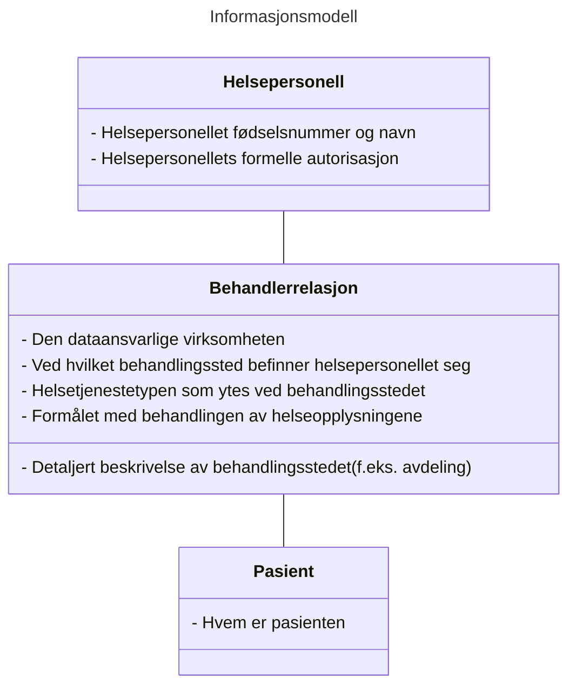
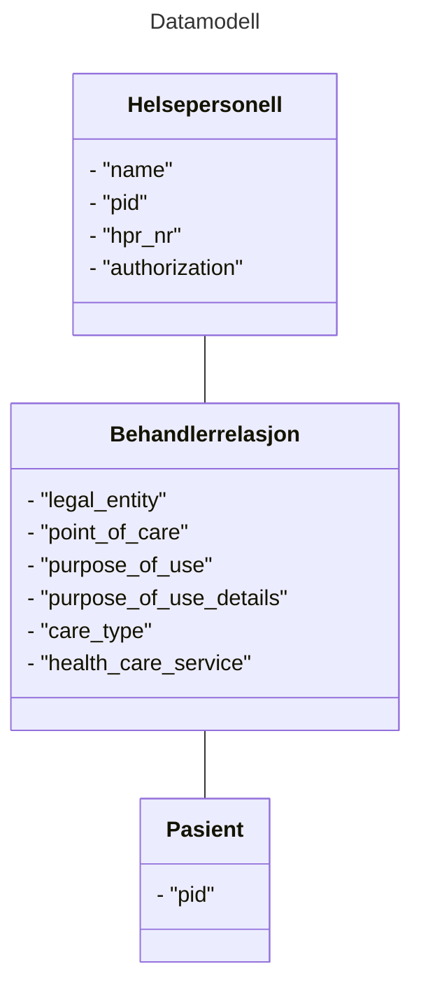

# Informasjons- og datamodell for beskrivelse av tilgangssgrunnlaget ved deling av helseopplysninger

## Sammendrag
Denne spesifikasjonen definerer en informasjons- og datamodell som skal brukes for å uttrykke et helsepersonells grunnlag for tilgang til helseopplysninger ved deling av helseopplysninger på tvers av helsevirksomheter i helse- og omsorgssektoren i Norge.


## Dokumentets status

| Versjon | Dokumentets status | dato |
| --- | --- | --- |
| -0 | Utkast | 17.02.2023 |
| -1 | Utkast | 10.03.2023 |

Dette dokumentet utgjør ikke en formell standard, men inngår som en del av et kravsett knyttet til tillitsrammeverk for deling av helseopplysninger i helse- og omsorgssektoren.
Spesifikasjonen bør ikke benyttes uten føringene som ligger til grunn i tillitsrammeverket.

Spesifikasjonen skal versjoneres for å støtte endringer over tid.


## Innholdsfortegnelse
1. Innledning<br/>
2. Ordliste
3. Bakgrunn for spesifikasjonen
4. Spesifikasjon<br/>
	3.1 Informasjonsmodell<br/>
	3.2 Datamodell<br/>
5. Json profil for datamodell
6. SAML profil for datamodell
7. Sikkerhets- og personvernshensyn<br/>
	4.1 Cybersikkerhet<br/>
	4.2 Personvern 
8. Anerkjennelse av bidragsytere til spesifikasjonen
9. Eksempler på bruk av datamodell<br/>
	6.1 JSON eksempel<br/>
	6.2 SAML eksempel<br/>
10. Normative referanser 


## 1. Innledning 
For å gi riktig helsehjelp til riktig tid må helsepersonell ha tilgang til helseopplysninger som ligger lagret hos andre virksomheter enn den virksomheten hvor de yter helsehjelp. Lovverket vårt sier at helsevirksomheter er pliktig til å dele helseopplysninger med alt helsepersonell så fremt de har et tjenstlig behov og at opplysningene er relevante og nødvendige i helsepersonellets behandling av pasienten. 

Kravene knyttet til tjenstlig behov og opplysningenes relvans og nødvendighet i behandlingen av pasienten medfører at virksomhetene som har dataansvar for helseopplysningene må styre tilgang på en tilfredsstillende måte.

I tillitsrammeverket legges det opp til en oppgavefordeling knyttet til tilgangsstyring, slik at den konsumerende virksomheten utfører tilgangsstyring til helseopplysninger på vegne av virksomheten som skal dele helseopplysningene. Til tross for at den konsumerende virksomheten er forpliktet til å kontrollere at deres helsepersonell har en gyldig grunn for tilgang til helseopplysninger har virksomheten som deler opplysninger likevel behov for å motta informasjon som beskriver grunnlaget for tilgangen. Informasjonen som beskriver grunnlaget for delingen vil benyttes til flere formål:
* å utføre ytterligere tilgangskontroll
* lovpålagt logging av tilgangen for å avdekke urettmessig tilegnelse av helseopplysninger
* å støtte opp under innbyggers rettigheter

På grunn av at tilgangsstyring er implementert på forskjellig måte i forskjellige systemer og virksomheter er det nødvendig at sektoren samler seg om et felles språk for å uttrykke grunnlaget for tilgang slik at aktørene kan forstå hverandre. Et felles språk vil også bidra til å kommunisere på en konsistent måte til innbygger.

Denne spesifikasjonen definerer et felles språk som skal benyttes til å uttrykke helsepersonells grunnlag for tilgang til helseopplysninger ved deling av helseopplysninger via tekniske grensesnitt.
Spesifikasjonen definerer en informasjonsmodell, datamodell og kodeverk som skal implementeres i programvare som benyttes av helsepersonell når de yter helsehjelp til sin pasient.

## 2. Ordliste
 
|  Begrep | Definisjon  |
| --- | --- |
|  |  |

## 3. Bakgrunn for spesifikasjonen
Aktørene i helse- og omsorgssektoren har samlet seg rundt en felles tillitsmodell som skisserer tillitsgrunnlaget for å dele helseopplysninger mellom helsepersonell på tvers av virksomhetene i sektoren.

Tillitsmodellen konkretiseres i et tillitsrammeverk som består av vilkår knyttet til bruken av tillitstjenestene. Den første anvendelsen av tillitsrammeverket, og denne spesifikasjonen, er i prosjektet som skal etablere nasjonal dokumentdeling i Kjernejournal.


## 4. Spesifikasjon

Spesifikasjonen inneholder en informasjonsmodell som beskriver hvilken informasjon som skal overføres mellom aktørene, hva denne informasjonen beskriver, og hvorfor den skal overføres.

Spesifikasjonen beskriver hvilke konkrete attributter som skal brukes for å beskrive informasjonsmodellen i form av en datamodell, og hvilke kodeverk og verdier som er gyldige for attributtene.

Spesifikasjonen skal benyttes av programvare- og systemleverandører ved implementasjon av programvare som skal brukes ved deling av helseopplysninger på tvers av virksomheter i sektoren. Datamodellen vil implementeres i relevante nasjonale ehelseløsninger og tillitstjenester.

Datamodellen skal benyttes til flere formål:
* for tilgangsstyring og tilgangskontroll i ehelseløsninger, dokumentkilder og i API
* til logging
* for å tilfredsstille pasientens rettigheter

### 4.1 Informasjonsmodell
Informasjonen som skal overføres fra konsument til datakilde kan deles inn i tre hovedkategorier:
1. Informasjon om helsepersonellets identitet
2. Informasjon om helsepersonellets behandlerrelasjon ovenfor pasienten
3. Informasjon om pasienten


#### 4.1.1 Helsepersonellets Identitet
Helsepersonellets grunnleggende identitet består av informasjon som sjelden endres, slik som personens navn og fødselsnummer, i tillegg til helsepersonellets offentlige godkjenninger.

Helsepersonellets identitet er nødvendig å overføre fordi vi må kunne knytte en tilgang til helseopplysninger til en gitt person. Identiteten vil benyttes i forbindelse med tilgangskontroll, slik som kontroll av evt. sperrer, samt logging. 

#### 4.1.2 Helsepersonellets behandlerrelasjon til sin pasient
I delingssammenheng består helsepersonellets digitale identitet også av informasjon som beskriver hvorfor helsepersonellet har behov for tilgang til pasientens helseopplysninger. Disse informasjonselementene forteller noe om helsepersonellets behandlerrelasjon til pasienten.

Norsk lov og ytterligere konkretisering i Norm for informasjonssikkerhet sier at helsepersonell bare skal gis tilgang til helseopplysninger dersom det foreligger et tjenstlig behov og at opplysningene er relevant og nødvendig i behandlingen av pasienten. Det er helsepersonellet og konsumentens ansvar å sørge for at tilgangen til helseopplysningene er i henhold til loven, men den utleverende part har likevel behov for overført informasjon som beskriver bakgrunnen for forespørselen om helseopplysninger for å tilfredsstille lovkrav knyttet til dokumentasjon og å utføre tilgangskontroll. 

Informasjonen som beskriver helsepersonellets behandlerrelasjon til sin pasient består av følgende informasjon:
* Helsevirksomhet og behandlingssted
* Helsetjenestetype ved behandlingssted
* Formålet med behandlingen av helseopplysninger

#### 4.1.3 Pasientens identitet
Pasienten må identifiseres ved deling av helseopplysninger. Det er ikke nødvendig å overføre annen informasjon om pasienten enn en unik identifikator.

#### 4.1.4 Oppsummert informasjonsmodell



### 4.2 Datamodell 
Informasjonsmodellen skal overføres fra konsument til datakilde i form av attributter formattert som nøkkelverdipar. Disse attributtene danner datamodellen, og er en detaljert beskrivelse av hvordan informasjonen skal uttrykkes.

#### 4.2.1 Prinsipper for datamodellen 
Datamodellen skal legge til rette for at helsevirksomhetene lettere kan samhandle med hverandre ved at man benytter samme språk for å uttrykke informasjonen som beskriver helsepersonellet og konteksten som helsepersonellet befinner seg i når han ber om tilgang til helseopplysningene. Den skisserte datamodellen legger til rette for en viss grad av dynamikk ved å angi hvilket kodeverk eller lister over gyldige verdier som er benyttet i datasettet.

Datamodellen skal brukes i sikkerhetsbilletter som skal behandles av mange aktører og i mange systemer. Aktørene som mottar og behandler sikkerhetsbillettene må ha svært høy tillit til at informasjonen er trygg. Det skal være usannsynlig at datamodellen kan inneholde data som kan brukes til sikkerhetsangrep via sikkerhetsbilletter.

> TODO: Informasjonen i datamodellen skal være sporbar slik at vi ivaretar prinsippet om uavviselighet… 

> TODO: mer her om tillitsnivå/sikkerhetsnivå/identiteter osv.. Hvem er den autoritative kilden til informasjonen osv..


#### 4.2.2 Oversikt over attributter i datamodellen 



#### 4.2.3 Oppsummering av påkrevd eller valgfri informasjon
Ikke all informasjon i datamodellen er relevant, noen informasjonselementer er valgfrie.

Vi har lagt vekt på å ivareta sporbarheten i delingssammenheng, derfor har vi angitt at alle identifikatorer er påkrevd, dette gjelder både fysiske og juridiske personer.

| Attributt | Beskrivelse | Informasjonskilde | Påkrevd | Status | |
| --- | --- | --- | --- | --- | --- |
| "pid" | Fødselsnummer og navn fra folkeregisteret | HelseID | **Ja** | <span style="color: green; font-weight: bold;">Inkluderes</span> | Loggkontroll og sporbarhet |
| "hpr_nr" | Helsepersonellets HPR-nummer, dersom det finnes | HelseID | **Nei** | <span style="color: green; font-weight: bold;">Inkluderes</span> | Loggkontroll, sporbarhet og informasjon til pasienten |
| "authorization" | Helsepersonellets autorisasjon, dersom den finnes | Konsumentens EPJ | **Nei** | <span style="color: green; font-weight: bold;">Inkluderes</span> | Tilgangsstyring |
| "legal_entity" | Den dataansvarlige virksomhetens org.nr og navn. | - §9 samarbeid og multi-tenancy system: Konsumentens EPJ<br>- Single-tenancy/on-premise system: HelseID  | **Ja** | <span style="color: green; font-weight: bold;">Inkluderes</span> | Loggkontroll og sporbarhet og informasjon til pasienten |
| "point_of_care" | Behandlingsstedets org.nr. og navn.<br>Kan være lik verdi som i "legal_entity" | Konsumentens EPJ | **Ja** | <span style="color: green; font-weight: bold;">Inkluderes</span> | Loggkontroll, sporbarhet og informasjon til pasienten |
| "healthcare_service" | Helsetjenestetyper som leveres ved virksomheten | Konsumentens EPJ | **Ja** | <span style="color: green; font-weight: bold;">Inkluderes</span> | Tilgangsstyring og informasjon til pasienten? |
| "care_type" | Angir hvilken tjeneste virksomheten skal levere for den aktuelle pasienten. | Konsumentens EPJ | **Nei** | <span style="color: red; font-weight: bold;">Under behandling</span> | Loggkontroll og informasjon til pasienten |
| "locality" | Avdeling/org.enhet hvor helsepersonellet yter helsehjelp | Konsumentens EPJ | **Ja** |<span style="color: red; font-weight: bold;">Under behandling</span> | Informasjon til pasienten |
| "purpose_of_use" | Helsepersonellets formål med helseopplysningene (til hva de skal brukes) | Kjernejournal, eller<br>Konsumentens EPJ | **Ja** | <span style="color: green; font-weight: bold;">Inkluderes</span> | Tilgangsstyring |
| "purpose_of_use_details" | Detaljert beskrivelse av helsepersonellets formål med helseopplysningene (til hva de skal brukes) | Konsumentens EPJ | **Nei** | <span style="color: red; font-weight: bold;">Under behandling</span> | Loggkontroll |
| "patient_id" | Unik identifikator for pasienten | Konsumentens EPJ | **Ja** | <span style="color: red; font-weight: bold;">Under behandling</span> | Tilgangsstyring |

#### 4.2.4 Relasjon til EHSDI datamodell og avvik fra EHDSI sine spesifikasjoner

I forbindelse med realiseringen av EU regulativet EHDS er det definert en datamodell for utveksling av helseopplysninger på tvers av landegrenser innad i EU. 

Vi har valgt å ikke tilnærme oss datamodellen hos EHDSI når vi har beskrevet informasjons- og datamodellen som skal benyttes ved deling av helseopplysninger innad i Helsenettet. Grunnen til at vi har valgt en annen retning er en antagelse om at programvaren som skal benyttes for å konsumere helseopplysninger ikke har informasjonen som benyttes i EHDSI sin datamodell lett tilgjengelig.

Noen attributter som er definert i denne spesifikasjonen har et visst overlapp med datamodellen i EHDSI. Dette er angitt i venstre kolonne i tabellen under.

#### 4.2.4.1 Attributter i tokens i EHDSI

| | Attributt | Beskrivelse |
| --- | --- |--- |
|   | "homeCommunityId" | ID of the Home Community |
|   | "npi" | National Provider Identifier |
| <span style="color: green; font-weight: bold;">X</span> | "subject-id" | Helsepersonellets fulle navn |
|   | "role" | Helsepersonellets "strukturelle rolle" |
|   | "functional-role" | Helsepersonellets "funksjonelle rolle" |
|   | "clinical-speciality" | Helsepersonellets kliniske spesialitet |
| <span style="color: green; font-weight: bold;">X</span> | "permission" | Helsepersonellets formelle rettigheter |
|   | "on-behalf-of" | Delegert tilgang (for fysiske personer uten autorisasjoner) |
| <span style="color: green; font-weight: bold;">X</span> | "organization" | Helsevirksomhetens navn |
| <span style="color: green; font-weight: bold;">X</span> | "organization-id" | Helsevirksomhetens unike identifikator |
|   | "healthcare-facility-type" | Type helsevirksomhet |
| <span style="color: green; font-weight: bold;">X</span> | "purposeofuse" | Formålet med behandlingen av helseopplysninger |
| <span style="color: green; font-weight: bold;">X</span> | "locality" | Behandlingsstedets navn | 


#### 4.2.5 Kategori: Helsepersonellet
Helsepersonellets identitet angis ved bruk av identifikator fra folkeregisteret, navn, og identifkator fra HPR.
Består av identifikatorer fra folkeregisteret og helsepersonellregisteret, samt informasjon som indikerer hvorvidt dette er et helsepersonell (med/uten lisens) eller administrativt personell.


##### 4.2.5.1 Identifikator for helsepersonellet som "fysisk person"
Attributtet "pid" i entitet Helsepersonell er en forkortelse for "personal identifier", hvor verdien identifiserer en fysisk  person. 

|   |   |
| ---| ---|
| Attributt: | "pid" |
| Status: | <span style="color: green; font-weight: bold;">Inkluderes</span> |
| Informasjonselement | Unik identifikator og navn på helsepersonellet |
| Attributt EHDSI: | "urn:oasis:names:tc:xacml:1.0:subject:subject-id" |
| Obligatorisk: | **Ja** |
| Data type: | String |
| Autoritativ kilde: | Folkeregisteret - Skattedirektoratet |
| Informasjonskilde: | HelseID, basert på innlogging via eID ordning |
| Kodeverk: | 2.16.578.1.12.4.1.4.1 (F-nummer),<br/>2.16.578.1.12.4.1.4.2 (D-nummer),<br/>2.16.578.1.12.4.1.4.3 (H-nummer)|

###### Identifikator for Helsepersonellet - Attributt SAML format

````XML
<saml:Attribute Name="2.16.578.1.12.4.1.4.1">
	<saml:AttributeValue xsi:type="xs:string">xxxxxx34794</saml:AttributeValue>
</saml:Attribute>
````

###### Identifikator for Helsepersonellet - Attributt JSON format

````JSON
"pid":{
	"value": "xxxxxx34794",
	"name": "Lege Legesen",
	"system": "2.16.578.1.12.4.1.4.1",
	"authority": "www.brreg.no"
}
````

##### 4.2.5.3 Informasjon om helsepersonellet fra Helsepersonellregisteret

###### "professional_licence" - overordnet struktur for attributter fra HPR

````JSON
"professional_license": {
	"hpr_nr": { 8<...>8 },
	"authorization": { 8<...>8 }
}
````

###### "hpr_nr": Helsepersonellnummer
Attributtet "hpr_nr" er en forkortelse for "Helsepersonellnummer" hvor verdien identifiserer et helsepersonell som har fått autorisasjon og/eller lisens til å praktisere som et helsepersonell i Norge.

Noe helsepersonell har ikke autorisasjon, men trenger likevel tilgang på helseopplysninger. Derfor kan ikke attributtet være påkrevd, men skal inkluderes i datamodellen dersom den fysiske personen har et innslag i HPR.
 
|   |   |
| ---| ---|
| Attributt: | "hpr_nr" |
| Status: | <span style="color: green; font-weight: bold;">Inkluderes</span> |
| Informasjonselement | Unik identifikator for helsepersonellet knyttet opp til formelle autorisasjoner eller lisenser |
| Attributt EHDSI: | N/A (?) |
| Obligatorisk: | **Nei** |
| Data type: | Objekt |
| Autoritativ kilde: | Helsepersonellregisteret - Helsedirektoratet |
| Informasjonskilde: | HelseID, basert på oppslag mot HPR etter vellykket pålogging av helsepersonell. |
| Kodeverk: | 2.16.578.1.12.4.1.4.4 |

###### "hpr_nr": Helsepersonellets gjeldende autorisasjon - JSON format
````JSON
"hpr_nr": {
	"id": "9144900",
	"system": "urn:oid:2.16.578.1.12.4.1.4.4",
	"authority": "https://www.helsedirektoratet.no/"
},
````

###### "authorization": Helsepersonellets gjeldende autorisasjon
Attributtet "authorization" angir den aktuelle autorisasjonen som gjelder for helsepersonellet ved forespørsel om helseopplysninger hos en annen virksomhet.

Noe helsepersonell har ikke autorisasjoner, men trenger likevel tilgang på helseopplysninger. Attributtet kan derfor ikke være påkrevd, men skal inkluderes i datamodellen dersom den fysiske personen har en eller flere gyldige autorisasjoner.
 
|   |   |
| ---| ---|
| Attributt: | "authorization" |
| Status: | <span style="color: green; font-weight: bold;">Inkluderes</span> |
| Informasjonselement | Den gjeldende autorisasjonen for helsepersonellet i behandlingen av pasienten  |
| Attributt EHDSI: | N/A (?) |
| Obligatorisk: | **Nei** |
| Data type: | Objekt |
| Autoritativ kilde: | Helsepersonellregisteret - Helsedirektoratet |
| Informasjonskilde: | Konsumentens EPJ |
| Kodeverk: | 2.16.578.1.12.4.1.1.9060 |


###### "authorization": Helsepersonellets gjeldende autorisasjon - JSON format
````JSON
"authorization": {
	"code": "LE",
	"text": "Lege",
	"system": "urn:oid:2.16.578.1.12.4.1.1.9060",
	"assigner": "https://www.helsedirektoratet.no/"
}
````

#### 4.2.6 Kategori: Behandlerrelasjon
Helsepersonellets behandlerrelasjon til pasientent angis av hvilken virksomheten han yter helsehjelp for, ved hvilket behandlingssted helsehjelpen ytes, helsetjenestetype og en beskrivelse av formålet med behandlingen av helseopplysningene.

##### "legal_entity": den dataansvarlige virksomheten 
Attributtet "legal_entity" identifiserer den dataansvarlige hvor helsepersonellet yter helsehjelp.

Informasjonskilden til dette attributtet er avhengig av systemarkitektur eller hvorvidt systemet brukes i §9-samarbeid.

- For multi-tenancy løsninger og §9-samarbeid må journalsystemet hos konsumenten angi "legal_entity". HelseID kontrollerer at databehandler har rett til å opptre på vegne av helsevirksomheten ved å gjøre oppslag i delegeringer som er utført i Altinn.
- For single-tenancy/on-premise løsninger vil HelseID utlede helsevirksomhet.

|   |   |
| ---| ---|
| Status: | <span style="color: green; font-weight: bold;">Inkluderes</span> |
| Informasjonselement | Virksomheten (hovedenhet) som har dataansvaret der hvor helsepersonellet yter helsehjelp |
| Attributt: | "legal_entity" |
| Attributt EHDSI: | "urn:oasis:names:tc:xspa:1.0:subject:organization"<br/>"urn:oasis:names:tc:xspa:1.0:subject:organization-id" |
| Obligatorisk: | **Ja** |
| Data type: | String |
| Autoritativ kilde: | Enhetsregisteret - SSB |
| Informasjonskilde: | - §9/multi tenancy: Konsumentens journalsystem<br>- Single-tenancy: Utledes av HelseID  |
| Kodeverk: | 2.16.578.1.12.4.1.4.101 |


###### Den dataansvarlige virksomheten - Attributter SAML format

````XML
<AttributeStatement>
<saml:Attribute>
??
</saml:Attribute>
````

###### Den dataansvarlige virksomheten - Attributter JSON format

````JSON
"legal_entity": {
	"id": "921592761",
	"name": "Lege Leif Lagesen ENK",
	"system": "2.16.578.1.12.4.1.4.101",
	"authority": "www.brreg.no"
}
```` 

##### "point_of_care": Behandlingssted

Attributtet "point_of_care" identifiserer behandlingsstedet hvor helsepersonellet yter helsehjelp.<br>
Attributtet er obligatorisk. Dersom verdiene for "legal_entity" og "point_of_care" er like skal den gjentas i begge attributter.

|   |   |
| ---| ---|
| Status: | <span style="color: green; font-weight: bold;">Inkluderes</span> |
| Informasjonselement | Virksomheten (underenhet) hvor helsepersonellet yter helsehjelp |
| Attributt: | "point_of_care" |
| Attributt EHDSI: | N/A |
| Obligatorisk: | **JA** |
| Data type: | String |
| Autoritativ kilde: | Enhetsregisteret - SSB |
| Informasjonskilde: | Konsumentens journalsystem |
| Kodeverk: | 2.16.578.1.12.4.1.4.101 |

Attributtet "point_of_care_name" inneholder navnet på behandlingsstedet hvor helsepersonellet yter helsehjelp.

###### Behandlingssted - Attributter SAML format

````XML
<AttributeStatement>
<saml:Attribute>
??
</saml:Attribute>
````

###### Behandlingssted - Attributter JSON format

````JSON
"point_of_care": {
	"id": "123456789",
	"name": "Det beste legekontoret i byen AS",
	"system": "2.16.578.1.12.4.1.4.101",
	"authority": "www.brreg.no"
}
````

##### "healthcare_service": Helsetjenestetype
Attributtet "healthcare_service" angir hvilken type helsetjenester som leveres ved virksomheten som helsepersonellet jobber for.

|   |   |
| ---| ---|
| Status: | <span style="color: red; font-weight: bold;">Under behandling</span> |
| Informasjonselement | Hvilken type helsetjenester som leveres ved virksomheten hvor helsepersonellet yter helsehjelp |
| Attributt: | "healthcare_service" |
| Attributt EHDSI: | N/A |
| Obligatorisk: | **Ja** |
| Data type: | string |
| Autoritativ kilde: | Konsument |
| Informasjonskilde: | Konsumentens EPJ |
| Kodeverk: | Volven  |
| oid code: | volven: 8627<br/>volven: 8662<br/>volven: 8663<br/>volven: 8664<br/>volven: 8665<br/>volven: 8666 |
| Gyldige verdier:| ? |

###### "healthcare_service" - Attributter SAML format

````XML
<AttributeStatement>
<saml:Attribute>
??
</saml:Attribute>
````

###### "healthcare_service" - Attributter JSON format

````JSON
"healthcare_service":{
	"text": "Sykepleietjeneste",
	"code": "KP02",
	"system": "8663",
	"assigner": "www.helsedirektoratet.no"
}
````

##### "care_type": type tjeneste som pasienten skal motta hos virksomheten
Attributtet "care_type" beskriver tjenesten som virksomheten skal tilby til pasienten basert på et enkeltvedtak.

|   |   |
| ---| ---|
| Status: | <span style="color: red; font-weight: bold;">Under behandling</span> |
| Informasjonselement | Kodifisert beskrivelse av tjenesten som virksomheten yter til pasienten  |
| Attributt: | "care_type" |
| Attributt EHDSI: | N/A |
| Obligatorisk: | **Nei** |
| Autoritativ kilde: | Konsument |
| Informasjonskilde: | Konsumentens EPJ |
| Data type: | String |
| Kodeverk: | urn:oid:x.x.x.x.x.9151<br>https://volven.no/produkt.asp?open_f=true&id=494341&catID=3&subID=8&subCat=140&oid=9151 |
| Gyldige verdier:| Alle verdier i 9151? |

###### "care_type" - JSON format

````JSON
"care_type": {
     "code": "15",
     "text": "Helsetjenester i hjemmet",
     "system": "urn:oid:x.x.x.x.x.9151",
     "assigner": "https://www.helsedirektoratet.no/"
}
````

##### "locality": Fysisk sted
Attributtet "locality" angir fysisk sted/avdeling hvor helsepersonellet yter eller administrerer helsehjelp.

|   |   |
| ---| ---|
| Status: | <span style="color: red; font-weight: bold;">Under behandling</span> |
| Informasjonselement | Fysisk sted/avdeling/Organisasjonsenhet hvor helsepersonellet yter helsehjelp |
| Attributt: | "locality" |
| Attributt EHDSI: | "urn:oasis:names:tc:xspa:1.0:environment:locality" |
| Obligatorisk:| **Ja** |
| Data type: | Fritekst |
| Autoritativ kilde: | Konsument |
| Informasjonskilde: | Konsumentens EPJ |
| Kodeverk: | ingen |
| Gyldige verdier: | kun alfanumeriske tegn (regex: "^[a-zA-Z0-9_]*$") |

###### Fysisk sted - Attributter SAML format

````XML
<AttributeStatement>
<saml:Attribute>
??
</saml:Attribute>
````

###### Fysisk sted - Attributter JSON format

````JSON
"locality": {
	"type": "ALPHANUMERIC",
	"value": "Helsehjelpgata 4, 0001 Valderborg"
}

````

##### "purpose_of_use": formålet med behandlingen av personopplysninger
Attributtet "purpose_of_use" beskriver det overordnede formålet med behandlingen av personopplysninger.

|   |   |
| ---| ---|
| Status: | <span style="color: green; font-weight: bold;">Inkluderes</span> |
| Informasjonselement | Kodifisert beskrivelse av hva helsepersonellet skal benytte helseopplysningene til  |
| Attributt: | "purpose_of_use" |
| Attributt EHDSI: | "urn:oasis:names:tc:xspa:1.0:subject:purposeofuse" |
| Obligatorisk: | **Ja** |
| Autoritativ kilde: | Konsument |
| Informasjonskilde: | Konsumentens EPJ |
| Data type: | String |
| Kodeverk: | urn:oid:2.16.840.1.113883.1.11.20448<br/> HL7 - https://terminology.hl7.org/ValueSet-v3-PurposeOfUse.html |
| Gyldige verdier:| TREAT, <br/>ETREAT,<br/>... |

###### Formålet med behandlingen av personopplysninger - Attributter SAML format

````XML
<AttributeStatement>
<saml:Attribute>
??
</saml:Attribute>
````

###### Formålet med behandlingen av personopplysninger - Attributter JSON format

````JSON
"purpose_of_use": {
	"code": "TREAT",
	"text": "Behandling",
	"system": "urn:oid:2.16.840.1.113883.1.11.20448",
	"assigner": "http://terminology.hl7.org/ValueSet/v3-PurposeOfUse"
}
````

##### "purpose_of_use_details": detaljert beskrivelse av formålet med behandlingen av personopplysninger
Attributtet "purpose_of_use_details" gir en detaljert beskrivelse av det overordnede formålet med behandlingen av personopplysninger.
Basert på HSØ sitt attributt "purpose_local"

|   |   |
| ---| ---|
| Status: | <span style="color: red; font-weight: bold;">Under behandling</span> |
| Informasjonselement | Beskrivelse av hvorfor helsepersonellet trenger helseopplysningene  |
| Attributt: | "purpose_of_use_details" |
| Attributt EHDSI: | N/A |
| Obligatorisk: | **Ja** |
| Autoritativ kilde: | Konsument |
| Informasjonskilde: | Konsumentens EPJ |
| Data type: | String |
| Kodeverk: | ? (HSØ?) |
| Gyldige verdier:|  |

###### Detaljert beskrivelse av formålet med behandlingen av personopplysninger - Attributter SAML format

````XML
<AttributeStatement>
<saml:Attribute>
??
</saml:Attribute>
````

###### Detaljert beskrivelse av formålet med behandlingen av personopplysninger - Attributter JSON format

````JSON
"purpose_of_use_details": {
	"code": "?",
	"text": "?",
	"system": "?",
	"assigner": "?"
}

````

#### 4.2.7 Kategori: Pasient - "patient_id"
##### "patient_id": Unik identifikator for pasienten

| Attributt | |
| --- | --- |
| Status: | <span style="color: red; font-weight: bold;">Under behandling</span> |
| Informasjonselement | Unik identifikator for pasienten som helsepersonellet ber om helseopplysninger for |
| Attributt: | "patient" |
| Attributt EHDSI: | |
| Fødselsnummer | Pasientens fødelsenummer fra folkeregisteret |

````XML
<AttributeStatement>
<saml:Attribute>
??
</saml:Attribute>
````

###### Pasientens identifikator - Attributter JSON format

````JSON
"patient": {
	"id": "05076600324",
	"name": "Kognar Maman",
	"system": "urn:oid:2.16.578.1.12.4.1.4.1",
	"authority": "https://www.skatteetaten.no"
}
````

## 5. JSON profil for datamodell
Full modell - valgfrie elementer er tatt med

````JSON
{
	"practicioner": {
		"pid": {
			"id": "04056600324",
			"name": "Magnar Koman",
			"system": "urn:oid:2.16.578.1.12.4.1.4.1",
			"authority": "https://www.skatteetaten.no"
		},
		"hpr_nr": {
			"id": "9144900",
			"system": "urn:oid:2.16.578.1.12.4.1.4.4",
			"assigner": "https://www.helsedirektoratet.no/"
		},
		"authorization": {
			"code": "LE",
			"text": "Lege",
			"system": "urn:oid:2.16.578.1.12.4.1.1.9060",
			"assigner": "https://www.helsedirektoratet.no/"
		}
	},
	"care_relationship": {
		"legal_entity": {
			"id": "993467049",
			"name": "OSLO UNIVERSITETSSYKEHUS HF",
			"system": "urn:oid:2.16.578.1.12.4.1.4.101",
			"authority": "https://www.skatteetaten.no"
		},
		"point_of_care": {
			"id": "974589095",
			"name": "OSLO UNIVERSITETSSYKEHUS HF ULLEVÅL - SOMATIKK",
			"system": "urn:oid:2.16.578.1.12.4.1.4.101",
			"authority": "https://www.skatteetaten.no"
		},
		"location": {
			"type": "ALPHANUMERIC",
			"text": "Indremedisinsk avdeling"
		},
		"healthcare_service": {
			"code": "S03",
			"text": "Indremedisin",
			"system": "urn:oid:2.16.578.1.12.4.1.1.8655",
			"assigner": "https://www.helsedirektoratet.no/"
		}
	},
	"patient": {
		"id": "13116900216",
		"system": "urn:oid:2.16.578.1.12.4.1.4.1",
		"authority": "https://www.skatteetaten.no"
	}
}
````

## 6. SAML profil for datamodell

````xml

```` 


## 7. Sikkerhets- og personvernshensyn
### 7.1 Cybersikkerhet
Både egenprodusert og tredjeparts programvarekomponenter som brukes til datalagring samt behandling og presentasjon av informasjonen i datamodellen kan inneholde svakheter som lar en angriper utnytte data som overføres mellom partene til å utføre forskjellige typer angrep på innsiden av en organisasjon.

Informasjonen i datamodellen flyter mellom flere aktører hvor den lagres og behandles av forskjellige typer programvare. Sikkerhetsangrep som utføres i forbindelse med datalagring er svært vanlig, og utgjør en generell sikkerhetsrisiko som kan begrenses ved at verdier som overføres kan valideres og kontrolleres.

Informasjonen i datamodellen vil blant annet benyttes til å utføre analyse av logger, og vil kunne bli vist til sluttbrukere i forskjellige applikasjoner. Dette åpner for angrep mot sårbarheter i programvare, som f.eks. misbruk av makroer eller XSS angrep i nettlesere. Sannsynligheten for denne typen sikkerhetsangrep bør begrenses ved at verdier som overføres kan valideres og kontrolleres.


### 7.2 Personvern

Datamodellen legger til rette for en utlevering av personopplysninger, herunder helseopplysninger, som en behandling av en særlig kategori av personopplysninger, gjennom å sammenstille opplysninger om helsepersonellet, pasientens identifikasjonsnummer, opplysninger om virksomheten der helsehjelpen utføres, formålet med tilgangen til helseopplysninger og relasjonen mellom helsepersonellet og pasienten, for å autentisere tilgang til gitte helseopplysninger.

#### 7.2.1 Tap av personopplysninger
Ved å utnytte svakheter og sårbarheter i programvare kan kan en angriper observere personopplysninger som utleveres mellom tekniske tjenester som benyttes av virksomheter ved deling av helseopplysninger.
Tap av personopplysninger kan oppstå mellom flere parter i verdikjeden:

- mellom konsument og autorisasjonsserver/IdP
- mellom konsument og informasjonstjeneste
- mellom informasjonstjeneste og datagrensesnitt

For å sikre mot potensielt tap av personopplysninger bør det vurderes å etablere tiltak for å ivareta konfidensialiteten.

#### 7.2.2 Overvåkning av ansatte i andre virksomheter
Datamodellen innebærer en utlevering av opplysninger om helsepersonellets arbeidsforhold. Disse opplysningene utleveres til andre virksomheter enn den virksomheten helsepersonellet er ansatt hos eller yter helsehjelp på vegne av. Det legges derfor til rette for at opplysninger kan benyttes til å monitorere helsepersonell i andre virksomheter. Dataansvarlige må følgelig være bevisste begrensningene i formålet med behandlingen av personopplysninger og eventuelt vurdere risiko knyttet til behandling av personopplysninger utover dette formålet.

#### 7.2.3 Vurdering av personvernkonsevenser
For å ivareta rettighetene og frihetene til pasienten og helsepersonellet som registrerte, bør dataansvarlig virksomhet vurdere hvorvidt behandlingen av personopplysninger medfører høy risiko for at de registrertes rettigheter og friheter ikke ivaretas.

#### 7.2.4 Forutsetninger for behandling av personopplysninger med utgangspunkt i datamodellen
Med utgangspunkt i at datamodellen legger til rette for en utlevering av personopplysninger, herunder helseopplysninger, som en behandling av en særlig kategori av personopplysninger, vil det forutsettes at behandlingen skjer i tråd med prinsipper for behandling av personopplysninger. Personvernkonsekvensene ved tap av personopplysninger eller utilsiktet tilgang vil være store, og behandlingen vil følgelig måtte innebære et særlig fokus på misbruk gjennom behandling av opplysningene til andre formål og helsepersonellets dokumenterte tjenstlige behov for tilgang til gitte helseopplysninger
 
## 8. Anerkjennelse av bidragsytere til spesifikasjonen
Teamet som har hatt ansvaret for denne spesifikasjonen har bestått av Morten Stensøy (HNIKT), Richard Husevåg (HSØ), Sverre Martin Jensen (Oslo Kommune), Erik Vegler Broen (Oslo Kommune - Origo), Simone Vandeberg (NHN), Steinar Noem (NHN).

Vi ønsker å takke Michal Cermak, Trond Elde, Eva Tone Fosse, Helge Bjertnæs, Øyvind Kvennås for verdifulle bidrag i utviklingen av spesifikasjonen.

## 9. Eksempler på bruk av datamodell


#### 9.1 Eksempel #1 - Fastlege ber om tilgang til dokument
I dette eksempelet har en fastlege ...


##### JSON

```JSON
{
	"practicioner": {
		"pid": {
			"id": "20086600138",
			"name": "August September",
			"system": "urn:oid:2.16.578.1.12.4.1.4.1",
			"authority": "https://www.skatteetaten.no"
		},
		"professional_license": {
			"hpr_nr": {
				"id": "9144897",
				"system": "urn:oid:2.16.578.1.12.4.1.4.4",
				"authority": "https://www.helsedirektoratet.no/"
			},
			"authorization": {
				"code": "LE",
				"text": "Lege",
				"system": "urn:oid:2.16.578.1.12.4.1.1.9060",
				"assigner": "https://www.helsedirektoratet.no/"
			}
		}
	},
	"care_relationship": {
		"legal_entity": {
			"id": "100100673",
			"name": "Norsk Helsenett SF Fagersta Testlegekontor",
			"system": "urn:oid:2.16.578.1.12.4.1.4.101",
			"authority": "https://www.skatteetaten.no"
		},
		"point_of_care": {
			"id": "100100673",
			"name": "Norsk Helsenett SF Fagersta Testlegekontor",
			"system": "urn:oid:2.16.578.1.12.4.1.4.101",
			"authority": "https://www.skatteetaten.no"
		},
		"healthcare_service": {
			"code": "KX17",
			"text": "Fastlege, liste uten fast lege",
			"system": "urn:oid:2.16.578.1.12.4.1.1.8655",
			"assigner": "https://www.helsedirektoratet.no/"
		}
	},
	"patient": {
		"id": "13116900216",
		"system": "urn:oid:2.16.578.1.12.4.1.4.1",
		"authority": "https://www.skatteetaten.no"
	}
}
```

##### SAML

#### 9.2 Eksempel #2 - Ansatt i kommune ber om tilgang til dokument

I dette eksempelet har...

##### JSON
Har ikke klinisk spesialitet, har ikke HPR autorisasjon eller lisens

```JSON
{
	"practicioner": {
		"pid": {
			"id": "03117000205",
			"name": "Rita Lin",
			"system": "urn:oid:2.16.578.1.12.4.1.4.1",
			"authority": "https://www.skatteetaten.no"
		},
		"professional_license": {
			"hpr_nr": {
				"id": "9144900",
				"system": "urn:oid:2.16.578.1.12.4.1.4.4",
				"authority": "https://www.helsedirektoratet.no/"
			},
			"authorization": {
				"code": "LE",
				"text": "Lege",
				"system": "urn:oid:2.16.578.1.12.4.1.1.9060",
				"assigner": "https://www.helsedirektoratet.no/"
			}
		}
	},
	"care_relationship": {
		"legal_entity": {
			"id": "997506499",
			"name": "OSLO KOMMUNE HELSEETATEN",
			"system": "urn:oid:2.16.578.1.12.4.1.4.101",
			"authority": "https://www.skatteetaten.no"
		},
		"point_of_care": {
			"id": "875300342",
			"name": "MADSERUDHJEMMET",
			"system": "urn:oid:2.16.578.1.12.4.1.4.101",
			"authority": "https://www.skatteetaten.no"
		},
		"healthcare_service": {
			"code": "KP01",
			"text": "Legetjeneste ved sykehjem",
			"system": "urn:oid:2.16.578.1.12.4.1.1.8663",
			"assigner": "https://www.helsedirektoratet.no/",   
		}, 
		"facility_type":{
			"code": "KP02",
			"text": "",
			"system": "8663",
			"authority": "https://www.helsedirektoratet.no"
		},
		"locality": {
			"type": "ALPHANUMERIC",
			"value" :"Helsehjelpgata 4 0001 Valderborg",
		},
		"care_type": {
			"code": "15",
			"text": "Helsetjenester i hjemmet",
			"system": "urn:oid:x.x.x.x.x.9151",
			"assigner": "volven.no"
		},
		"purpose_of_use": {
			"code": "COC",
			"text": "",
			"system": "urn:oid:2.16.840.1.113883.1.11.20448",
			"assigner": "HL7"
		}
	},
	"patient": {
		"id": "13116900216",
		"system": "urn:oid:2.16.578.1.12.4.1.4.1",
		"authority": "https://www.skatteetaten.no"
	}
}
```

##### SAML

#### 9.3 Eksempel #3 - HP i foretak ber om tilgang til dokument
##### JSON
##### SAML

#### 9.4 Eksempel #4 - Legesekretær ber om tilgang til dokument på vegne av lege
##### JSON
##### SAML

## 10. Normative referanser 

Normative referanser spesifiserer dokumenter som må leses for å forstå eller implementere datamodellen, eller teknologi som må være på plass for å kunne implementere teknologien. 

* Styrk-08
* SNOMED-CT
* ASTM
* Volven
* Enhetsregisteret
* Folkeregisteret
* Helsepersonellregisteret