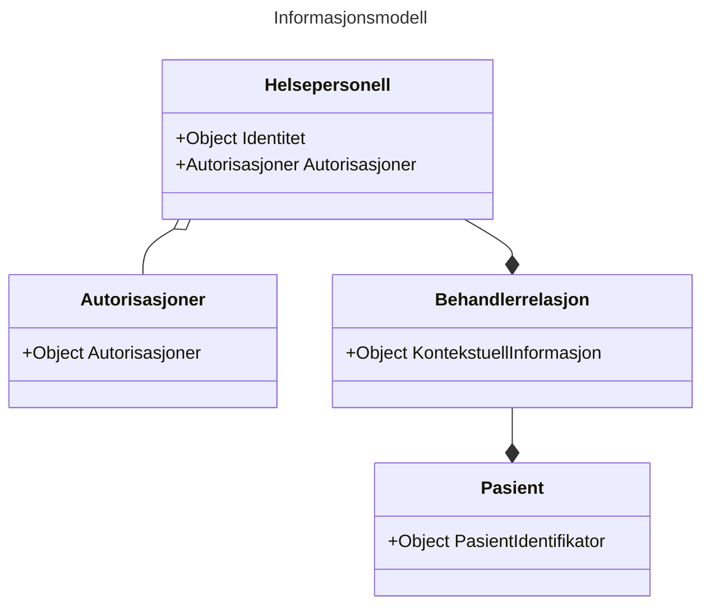

# Informasjons- og datamodell for beskrivelse av tilgangssgrunnlaget ved deling av helseopplysninger
Versjon: 0.1

Dato: 31.01.2023

## Sammendrag
Denne spesifikasjonen definerer en informasjons- og datamodell som skal brukes for å uttrykke et helsepersonells grunnlag for tilgang til helseopplysninger ved deling av helseopplysninger på tvers av helsevirksomheter i helse- og omsorgssektoren i Norge.

## Dokumentets status
Dette dokumentet utgjør ikke en formell standard, men inngår som en del av et kravsett knyttet til tillitsrammeverk for deling av helseopplysninger i helse- og omsorgssektoren.
Spesifikasjonen bør ikke benyttes uten føringene som ligger til grunn i tillitsrammeverket.

Spesifikasjonen skal versjoneres for å støtte endringer over tid.

## Innholdsfortegnelse
1. Innledning 
	1.1 Relasjon til eHSDI 
	1.2 Påkrevd eller valgfri informasjon  
2. Bakgrunn
3. Spesifikasjon 
	3.1 Informasjonsmodell 
		&nbsp;&nbsp;&nbsp;&nbsp;3.1.1  
		&nbsp;&nbsp;&nbsp;&nbsp;3.1.2  
		&nbsp;&nbsp;&nbsp;&nbsp;3.1.3  
	3.2 Datamodell 
		&nbsp;&nbsp;&nbsp;&nbsp;3.2.1 Relasjon til eHSDI datamodell 
		&nbsp;&nbsp;&nbsp;&nbsp;3.2.2 Påkrevd eller valgfri informasjon 
		&nbsp;&nbsp;&nbsp;&nbsp;3.2.3 Prinsipper for datamodellen 
		&nbsp;&nbsp;&nbsp;&nbsp;3.2.4 Attributter i datamodellen
	3.3 Bruk av datamodellen hos konsumenten 
	3.3 Bruk av datamodellen hos NHN 
	3.3 Bruk av datamodellen hos dokumentkilden 
4. Sikkerhetshensyn
5. Takk til de som har bidratt til spesifikasjonen
6. Normative referanser 
7. Vedlegg

## 1. Innledning 
For å gi riktig helsehjelp til riktig tid må helsepersonell ha tilgang til helseopplysninger som ligger lagret hos andre virksomheter enn den virksomheten hvor de yter helsehjelp. Lovverket vårt sier at helsevirksomheter er pliktig til å dele helseopplysninger med alt helsepersonell så fremt de har et tjenstlig behov og at opplysningene er relevante og nødvendige i helsepersonellets behandling av pasienten.

Kravene knyttet til tjenstlig behov og opplysningenes relvans og nødvendighet i behandlingen av pasienten medfører at virksomhetene som har dataansvar for helseopplysningene må styre tilgang på en tilfredsstillende måte.

I tillitsrammeverket legges det opp til en oppgavefordeling knyttet til tilgangsstyring, slik at den konsumerende virksomheten utfører tilgangsstyring til helseopplysninger på vegne av virksomheten som skal dele helseopplysningene. Til tross for at den konsumerende virksomheten er forpliktet til å kontrollere at deres helsepersonell har en gyldig grunn for tilgang til helseopplysninger har virksomheten som deler opplysninger likevel behov for å motta informasjon som beskriver grunnlaget for tilgangen. Informasjonen som beskriver grunnlaget for delingen vil benyttes til flere formål:
* å utføre ytterligere tilgangskontroll
* lovpålagt logging av tilgangen for å avdekke urettmessig tilegnelse av helseopplysninger
* å støtte opp under innbyggers rettigheter

På grunn av at tilgangsstyring er implementert på forskjellig måte i forskjellige systemer og virksomheter er det nødvendig at sektoren samler seg om et felles språk for å uttrykke grunnlaget for tilgang slik at aktørene kan forstå hverandre. Et felles språk vil også bidra til å kommunisere på en konsistent måte til innbygger.

Denne spesifikasjonen definerer et felles språk som skal benyttes til å uttrykke helsepersonells grunnlag for tilgang til helseopplysninger ved deling av helseopplysninger via tekniske grensesnitt.
Spesifikasjonen definerer en informasjonsmodell og en datamodell som skal implementeres i programvare som benyttes av helsepersonell når de yter helsehjelp til sin pasient.

 
## 2. Bakgrunn for spesifikasjonen
Aktørene i helse- og omsorgssektoren har samlet seg rundt en felles tillitsmodell som skisserer tillitsgrunnlaget for å dele helseopplysninger mellom helsepersonell på tvers av virksomhetene i sektoren.

Tillitsmodellen konkretiseres i et tillitsrammeverk som består av vilkår knyttet til bruken av tillitstjenestene. Den første anvendelsen av tillitsrammeverket, og denne spesifikasjonen, er i prosjektet som skal etablere nasjonal dokumentdeling i Kjernejournal.

## 3. Spesifikasjon

Spesifikasjonen inneholder en informasjonsmodell som beskriver hvilken informasjon som skal overføres mellom aktørene, hva denne informasjonen beskriver, og hvorfor den skal overføres.

Spesifikasjonen beskriver også hvilke konkrete attributter som skal brukes for å beskrive informasjonsmodellen i form av en datamodell. Datamodellen beskriver også hvilke verdier som er gyldige for attributtene.

Spesifikasjonen skal benyttes av programvare- og systemleverandører ved implementasjon av programvare som skal brukes ved deling av helseopplysninger på tvers av virksomheter i sektoren. Datamodellen vil implementeres i relevante nasjonale ehelseløsninger og tillitstjenester.

Datamodellen skal benyttes til flere formål:
* for tilgangsstyring og tilgangskontroll i ehelseløsninger, dokumentkilder og i API
* til logging
* for å tilfredsstille pasientens rettigheter

### 3.1 Informasjonsmodell
Informasjonen som skal overføres fra konsument til datakilde kan deles inn i tre hovedkategorier:
1. Informasjon om helsepersonellets identitet
2. Informasjon om helsepersonellets behandlerrelasjon ovenfor pasienten
3. Informasjon om pasienten

#### 3.1.1 Helsepersonellets Identitet
Helsepersonellets grunnleggende identitet består av informasjon som sjelden endres, slik som personens navn og fødselsnummer, i tillegg til helsepersonellets offentlige godkjenninger.

Helsepersonellets identitet er nødvendig å overføre fordi vi må kunne knytte en tilgang til helseopplysninger til en gitt person. Identiteten vil benyttes i forbindelse med tilgangsstyring, tilgangskontroll og logging. 

#### 3.1.2 Helsepersonellets behandlerrelasjon til sin pasient
I delingssammenheng består helsepersonellets digitale identitet også av informasjon som beskriver hvorfor helsepersonellet har behov for tilgang til pasientens helseopplysninger. Disse informasjonselementene forteller noe om helsepersonellets behandlerrelasjon til pasienten.

Norsk lov sier at helsepersonell bare skal gis tilgang til helseopplysninger dersom det foreligger et tjenstlig behov og at opplysningene er relevant og nødvendig i behandlingen av pasienten. Det er helsepersonellet og konsumentens ansvar å sørge for at tilgangen til helseopplysningene er i henhold til loven, men den utleverende part har likevel behov for overført informasjon som beskriver bakgrunnen for forespørselen om helseopplysninger for å tilfredsstille lovkrav knyttet til dokumentasjon og å utføre tilgangskontroll. 

Informasjonen som beskriver helsepersonellets behandlerrelasjon til sin pasient består av følgende informasjon:
* Helsepersonellets rolle i sin behandling av pasienten
* Helsevirksomhet og behandlingssted
* Helsetjenestetype ved behandlingssted
* Formålet med behandlingen av helseopplysninger

#### 3.1.3 Pasientens identitet
Det er en selvfølge at pasienten må identifiseres ved deling av helseopplysninger. Det er ikke nødvendig å overføre annen informasjon om pasienten enn en unik identifikator.

#### 3.1.4 Oppsummert informasjonsmodell

### 3.2 Datamodell 
Informasjonsmodellen skal overføres fra konsument til datakilde i form av attributter formattert som nøkkelverdipar. Disse attributtene danner datamodellen, og er en detaljert beskrivelse av hvordan informasjonen skal uttrykkes.

#### 3.2.1 Prinsipper for datamodellen 
Datamodellen skal legge til rette for at helsevirksomhetene lettere kan samhandle med hverandre ved at man benytter samme språk for å uttrykke informasjonen som beskriver helsepersonellet og konteksten som helsepersonellet befinner seg i når han ber om tilgang til helseopplysningene. Den skisserte datamodellen legger til rette for en viss grad av dynamikk ved å angi hvilket kodeverk eller lister over gyldige verdier som er benyttet i datasettet.

Datamodellen skal brukes i sikkerhetsbilletter som skal behandles av mange aktører og i mange systemer. Aktørene som mottar og behandler sikkerhetsbillettene må ha svært høy tillit til at informasjonen er trygg. Det skal være usannsynlig at datamodellen kan inneholde data som kan brukes til sikkerhetsangrep via sikkerhetsbilletter.

> TODO: Informasjonen i datamodellen skal være sporbar slik at vi ivaretar prinsippet om uavviselighet… 

> TODO: mer her om tillitsnivå/sikkerhetsnivå/identiteter osv.. Hvem er den autoritative kilden til informasjonen osv..

#### 3.2.2 Relasjon til eHSDI datamodell 

I forbindelse med EU regulativet EHDS er det definert en datamodell for utveksling av helseopplysninger på tvers av landegrenser innad i EU. Vi har tatt utgangspunkt i denne datamodellen når vi har beskrevet informasjons- og datamodellen som skal benyttes ved deling av helseopplysninger innad i Helsenettet, men har tilpasset den til våre behov.

#### 3.2.3 Påkrevd eller valgfri informasjon
Ikke all informasjon i datamodellen er relevant, noen informasjonselementer er valgfrie.

Vi har lagt vekt på å ivareta sporbarheten i delingssammenheng, derfor har vi angitt at alle identifikatorer er påkrevd, dette gjelder både fysiske og juridiske personer.

#### 3.2.4 Oversikt over attributter i datamodellen 

<!-- 
| Informasjonskategori | Attributt | Informasjonskilde |
| --- | --- | --- | 
| Helsepersonell | "pid" | HelseID |
| | "navn" | HelseID |
| | "structural_role" | Konsument |
| | "hpr-nummer" | HelseID |
| | "professional_licence" | HelseID |
| Behandlerelasjon | Strukturell rolle | Konsument |
| | "functional_role" |  Konsument |
| | "clinical_speciality" |  Konsument |
| | "legal_entity_id" | Konsument/HelseID |
| | "legal_entity_name" | Konsument/HelseID |
| | "point_of_care_id" | Konsument |
| | "point_of_care_name" | Konsument |
| | "facility_type" | Konsument |
| | "locality" | Konsument |
| | "purpose_of_use" |  Konsument |
| Pasient | "patient_identifier" |  Konsument |

-->

#### 3.2.5 Kategori: Helsepersonell
Helsepersonellets identitet angis ved bruk av identifikator fra folkeregisteret, navn, og identifkator fra HPR.

##### "pid"
Attributtet "pid" er en forkortelse for "personal identifier", hvor verdien identifiserer en fysisk  person. 

|   |   |
| ---| ---|
| Obligatorisk: | Ja |
| Data type: | String |
| Autoritativ kilde: | Folkeregisteret - Skattedirektoratet |
| Informasjonskilde: | HelseID, basert på innlogging via eID ordning |
| Kodeverk: | 2.16.578.1.12.4.1.4.1 (F-nummer), 2.16.578.1.12.4.1.4.2 (D-nummer), 2.16.578.1.12.4.1.4.3 (H-nummer)|

##### "structural_role"
Attributtet "structural_role" angir hvorvidt sluttbrukeren er et helsepersonell med lisens, uten lisens eller om han er et administrativt personell.

|   |   |
| ---| ---|
| Obligatorisk: | Ja |
| Data type: | String |
| Autoritativ kilde: | Konsumenten, helsevirksomhet |
| Informasjonskilde: | Konsumentens EPJ system |
| Kodeverk: | ASTM |
| Gyldige verdier: | "Licensed Health Care Providers", "Non-Licensed Health Care Providers", "Clerical and Administrative Personnel" |

##### "hpr_nr"
Attributtet "hpr_nr" er en forkortelse for "Helsepersonellnummer" hvor verdien identifiserer et helsepersonell som har fått autorisasjon og/eller lisens til å praktisere som et helsepersonell i Norge.
 
|   |   |
| ---| ---|
| Obligatorisk: | Nei |
| Data type: | String |
| Autoritativ kilde: | Helsepersonellregisteret - Helsedirektoratet |
| Informasjonskilde: | HelseID, basert på oppslag mot HPR etter vellykket pålogging av helsepersonell. |
| Kodeverk: | 2.16.578.1.12.4.1.4.4 |

##### "professional_licence"
Verdien for attributtet "professional_licence" beskriver autorisasjoner og lisenser som Helsepersonellet har fått tildelt av statens autorisasjonskontor for helsepersonell.

> *TODO: Spesifiser datasmodell for lisenser og autorisasjoner fra HPR*

|   |   |
| ---| ---|
| Obligatorisk: | Nei |
| Data type: | Object | 
| Autoritativ kilde: | Helsepersonellregisteret - Helsedirektoratet |
| Informasjonskilde: | HelseID, basert på oppslag mot HPR etter vellykket pålogging av helsepersonell |
 

#### 3.2.6 Kategori: Behandlerrelasjon
Helsepersonellets behandlerrelasjon til pasientent angis ved hans rolle, spesialitet, virksomhet hvor han yter helsehjelp, behandlingssted, helsetjenestetype og en angivelse av formålet med behandlingen av helseopplysningene.

##### "functional_role"
Attributtet "functional_role" representerer helsepersonellets rolle hos virksomheten i hans behandling av pasienten, og angis av kode fra STYRK-08.

|   |   |
| ---| ---|
| Obligatorisk: | Ja |
| Data type: | String |
| Autoritativ kilde: | Konsumenten - helsepersonellets rolle i virksomheten |
| Informasjonskilde: | Konsumentens EPJ/HR system |
| Kodeverk: | STYRK-08 (ISCO-08) |
| Gyldige verdier: | Helsefaglige koder (må avklares - subsett av STYRK-08) |

##### "clinical_speciality"
Attributtet "clinical_speciality" representerer helsepersonellets spesialitet i sin behandling av pasienten

|   |   |
| ---| ---|
| Obligatorisk: | Nei |
| Data type: | String |
| Autoritativ kilde: | Konsumenten - helsepersonellets rolle i virksomheten |
| Informasjonskilde: | Konsumentens EPJ/HR system |
| Kodeverk: | SNOMED-CT: Clinical-speciality |
| oid: | 2.16.840.1.113883.3.88.12.80.72 |

##### "legal_entity_id"
Attributtet "legal_entity" identifiserer virksomheten hvor helsepersonellet yter helsehjelp.

|   |   |
| ---| ---|
| Obligatorisk: | Ja |
| Data type: | String |
| Autoritativ kilde: | Enhetsregisteret - SSB |
| Informasjonskilde: | Konsument (HelseID + Altinn) |
| Kodeverk: | (kode for enhetsregisteret)|

##### "legal_entity_name"
Attributtet "legal_entity" inneholder navnet på virksomheten hvor helsepersonellet yter helsehjelp.

|   |   |
| ---| ---|
| Obligatorisk: | Ja *(avvik fra EHDSI)* |
| Data type: | String |
| Autoritativ kilde: | Enhetsregisteret - SSB |
| Informasjonskilde: | Konsument (HelseID + Altinn) |
| Kodeverk: | (kode for enhetsregisteret)|

##### "point_of_care_id"
Attributtet "point_of_care_id" identifiserer behandlingsstedet hvor helsepersonellet yter helsehjelp.

|   |   |
| ---| ---|
| Obligatorisk: | Ja *(avvik fra EHDSI)* |
| Data type: | String |
| Autoritativ kilde: | Enhetsregisteret - SSB |
| Informasjonskilde: | Konsument (HelseID + Altinn) |
| Kodeverk: | (kode for enhetsregisteret)|

##### "point_of_care_name"
Attributtet "point_of_care_name" inneholder navnet på behandlingsstedet hvor helsepersonellet yter helsehjelp.

|   |   |
| ---| ---|
| Obligatorisk: | Ja |
| Data type: | String |
| Autoritativ kilde: | Enhetsregisteret - SSB |
| Informasjonskilde: | Konsument (HelseID + Altinn) |
| Kodeverk: | (kode for enhetsregisteret) |

##### "facility_type"
Attributtet "facility_type" angir hvilken type virksomhet helsepersonellet befinner seg ved.

|   |   |
| ---| ---|
| Obligatorisk: | Ja |
| Data type: | string |
| Autoritativ kilde: | Konsument |
| Informasjonskilde: | Konsumentens EPJ |
| Kodeverk: | eHealth DSI code list |
| oid code: | 1.3.6.1.4.1.12559.11.10.1.3.2.2.2 |
| Gyldige verdier:| Hospital, Resident Physician, Pharmacy, ++? |

##### "locality"
Attributtet "locality" angir fysisk sted/avdeling hvor helsepersonellet yter eller administrerer helsehjelp.

|   |   |
| ---| ---|
| Obligatorisk:| Ja |
| Data type: | String |
| Autoritativ kilde: | Konsument |
| Informasjonskilde: | Konsumentens EPJ |
| Kodeverk: | ingen |
| Gyldige verdier: | kun alfanumeriske tegn (regex: "^[a-zA-Z0-9_]*$") |

##### "purpose_of_use"
Attributtet "purpose_of_use" beskriver det overordnede formålet med behandlingen av personopplysninger.

|   |   |
| ---| ---|
| Obligatorisk: | Ja |
| Autoritativ kilde: | Konsument |
| Informasjonskilde: | Konsumentens EPJ |
| Data type: | String |
| Kodeverk: | urn:oid:2.16.840.1.113883.1.11.20448  HL7 - https://terminology.hl7.org/ValueSet-v3-PurposeOfUse.html |
| Gyldige verdier:| TREAT,  ETREAT, ... |

#### 3.2.7 Kategori: Pasient
##### "patient_identifier"

| Attributt | |
| --- | --- |
| Fødselsnummer | Pasientens fødelsenummer fra folkeregisteret |

## 4. Sikkerhets- og personvernshensyn
### 4.1 Cybersikkerhet
Både egenprodusert og tredjeparts programvarekomponenter som brukes til datalagring samt behandling og presentasjon av informasjonen i datamodellen kan inneholde svakheter som lar en angriper utnytte data som overføres mellom partene til å utføre forskjellige typer angrep på innsiden av en organisasjon.

Informasjonen i datamodellen flyter mellom flere aktører hvor den lagres og behandles av forskjellige typer programvare. Sikkerhetsangrep som utføres i forbindelse med datalagring er svært vanlig, og utgjør en generell sikkerhetsrisiko som kan begrenses ved at verdier som overføres kan valideres og kontrolleres.

Informasjonen i datamodellen vil blant annet benyttes til å utføre analyse av logger, og vil kunne bli vist til sluttbrukere i forskjellige applikasjoner. Dette åpner for angrep mot sårbarheter i programvare, som f.eks. misbruk av makroer eller XSS angrep i nettlesere. Sannsynligheten for denne typen sikkerhetsangrep bør begrenses ved at verdier som overføres kan valideres og kontrolleres.

### 4.2 Personvern
#### 4.2.1 Lekkasje av sensitive personopplysninger
Datamodellen vil bli benyttet til å overføre sensitive personopplysninger om helsepersonellet og helsepersonellets relasjon til sin pasient. Ved å utnytte svakheter og sårbarheter i programvare kan kan en angriper observere sensitiv personinformasjon som overføres mellom de tekniske tjenestene som benyttes ved deling av helseopplysninger. 
Lekkasje av PII kan oppstå mellom flere parter i verdikjeden:
* mellom konsument og autorisasjonsserver/IdP
* mellom konsument og informasjonstjeneste
* mellom informasjonstjeneste og datagrensesnitt

Som tiltak mot potensiell lekkasje av PII bør tiltak for å ivareta konfidensialiteten vurderes.

#### 4.2.2 Mangelfull informasjon om personvernskonsevenser
Det er en risiko for at både pasienten og helsepersonellet mottar mangelfull informasjon om potensielle personvernskonsekvenser ved overføringen av personopplysningene.

#### 4.2.3 Misbruk av data
Datamodellen beskriver behandlerrelasjonen som helsepersonellet har til sin pasient, og kan være sensitiv. Det er en risiko for at denne informasjonen misbrukes av en eller flere av partene som mottar verdiene i datasettet.

#### 4.2.4 Overvåkning av ansatte i andre virksomheter
Datamodellen inneholder en del informasjon som beskriver helsepersonells arbeidsforhold. Denne informasjonen overføres til andre virksomheter enn den virksomheten den ansatte yter helsehjelp hos. Det er en risiko for at denne informasjonen kan benyttes for å overvåke helsepersonell i andre virksomheter.
	
 
## 5. Anerkjennelse av bidragsytere til spesifikasjonen
Vi ønsker å takke kongen, fedrelandet og Ringnes, samt alle andre som har hatt innvirkning på spesifikasjonen..

Norsk Helsenett SF har hatt det overordnede ansvaret for å utvikle denne spesifikasjonen basert på viktige bidrag fra sektoren...

Vi ønsker å takk Ola Nordmann ved EPJ-leverandør x, Berit Bermann ved direktoratet for ehelse, Carla Carlmann ved Kommune x for verdifulle bidrag i utviklingen av spesifikasjonen.

## 6. Normative referanser 

Normative referanser spesifiserer dokumenter som må leses for å forstå eller implementere datamodellen, eller teknologi som må være på plass for å kunne implementere teknologien. 

* Styrk-08
* SNOMED-CT
* ASTM
* Volven
* Enhetsregisteret
* Folkeregisteret
* Helsepersonellregisteret