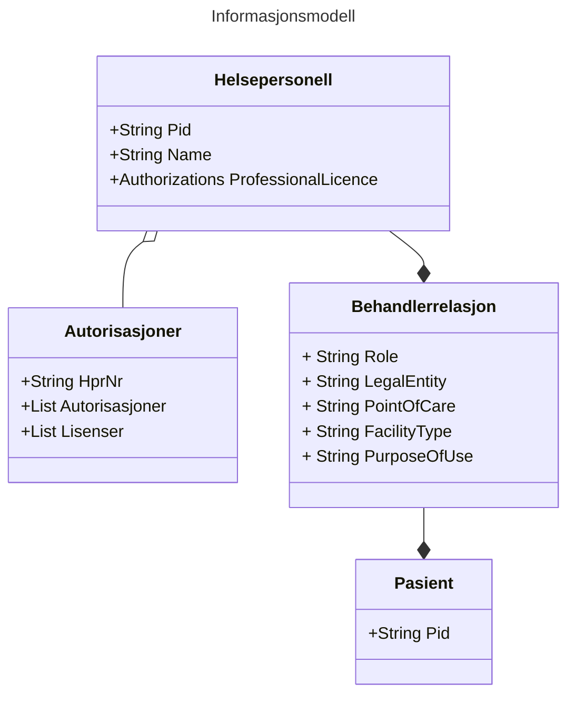

# Informasjons- og datamodell for beskrivelse av tilgangssgrunnlaget ved deling av helseopplysninger
Versjon: 0.1
Dato: 31.01.2023

## Sammendrag
Denne spesifikasjonen definerer en informasjons- og datamodell som skal brukes for å uttrykke et helsepersonells grunnlag for tilgang til helseopplysninger ved deling av helseopplysninger på tvers av helsevirksomheter i helse- og omsorgssektoren i Norge.

## Dokumentets status
Dette dokumentet utgjør ikke en formell standard, men inngår som en del av et kravsett knyttet til tillitsrammeverk for deling av helseopplysninger i helse- og omsorgssektoren.
Spesifikasjonen bør ikke benyttes uten føringene som ligger til grunn i tillitsrammeverket.

Spesifikasjonen skal versjoneres for å støtte endringer over tid.

## Innholdsfortegnelse
1. Innledning 
	1.1 Relasjon til eHSDI 
	1.2 Påkrevd eller valgfri informasjon  
2. Bakgrunn
3. Spesifikasjon 
	3.1 Informasjonsmodell 
		&nbsp;&nbsp;&nbsp;&nbsp;3.1.1  
		&nbsp;&nbsp;&nbsp;&nbsp;3.1.2  
		&nbsp;&nbsp;&nbsp;&nbsp;3.1.3  
	3.2 Datamodell 
		&nbsp;&nbsp;&nbsp;&nbsp;3.2.1 Relasjon til eHSDI datamodell 
		&nbsp;&nbsp;&nbsp;&nbsp;3.2.2 Påkrevd eller valgfri informasjon 
		&nbsp;&nbsp;&nbsp;&nbsp;3.2.3 Prinsipper for datamodellen 
		&nbsp;&nbsp;&nbsp;&nbsp;3.2.4 Attributter i datamodellen
	3.3 Bruk av datamodellen hos konsumenten 
	3.3 Bruk av datamodellen hos NHN 
	3.3 Bruk av datamodellen hos dokumentkilden 
4. Sikkerhetshensyn
5. Takk til de som har bidratt til spesifikasjonen
6. Normative referanser 
7. Vedlegg

## 1. Innledning 
For å gi riktig helsehjelp til riktig tid må helsepersonell ha tilgang til helseopplysninger som ligger lagret hos andre virksomheter enn den virksomheten hvor de yter helsehjelp. Lovverket vårt sier at helsevirksomheter er pliktig til å dele helseopplysninger med alt helsepersonell så fremt de har et tjenstlig behov og at opplysningene er relevante og nødvendige i helsepersonellets behandling av pasienten.

Kravene knyttet til tjenstlig behov og opplysningenes relvans og nødvendighet i behandlingen av pasienten medfører at virksomhetene som har dataansvar for helseopplysningene må styre tilgang på en tilfredsstillende måte.

I tillitsrammeverket legges det opp til en oppgavefordeling knyttet til tilgangsstyring, slik at den konsumerende virksomheten utfører tilgangsstyring til helseopplysninger på vegne av virksomheten som skal dele helseopplysningene. Til tross for at den konsumerende virksomheten er forpliktet til å kontrollere at deres helsepersonell har en gyldig grunn for tilgang til helseopplysninger har virksomheten som deler opplysninger likevel behov for å motta informasjon som beskriver grunnlaget for tilgangen. Informasjonen som beskriver grunnlaget for delingen vil benyttes til flere formål:
* å utføre ytterligere tilgangskontroll
* lovpålagt logging av tilgangen for å avdekke urettmessig tilegnelse av helseopplysninger
* å støtte opp under innbyggers rettigheter

På grunn av at tilgangsstyring er implementert på forskjellig måte i forskjellige systemer og virksomheter er det nødvendig at sektoren samler seg om et felles språk for å uttrykke grunnlaget for tilgang slik at aktørene kan forstå hverandre. Et felles språk vil også bidra til å kommunisere på en konsistent måte til innbygger.

Denne spesifikasjonen definerer et felles språk som skal benyttes til å uttrykke helsepersonells grunnlag for tilgang til helseopplysninger ved deling av helseopplysninger via tekniske grensesnitt.
Spesifikasjonen definerer en informasjonsmodell og en datamodell som skal implementeres i programvare som benyttes av helsepersonell når de yter helsehjelp til sin pasient.

 
## 2. Bakgrunn for spesifikasjonen
Aktørene i helse- og omsorgssektoren har samlet seg rundt en felles tillitsmodell som skisserer tillitsgrunnlaget for å dele helseopplysninger mellom helsepersonell på tvers av virksomhetene i sektoren.

Tillitsmodellen konkretiseres i et tillitsrammeverk som består av vilkår knyttet til bruken av tillitstjenestene. Den første anvendelsen av tillitsrammeverket, og denne spesifikasjonen, er i prosjektet som skal etablere nasjonal dokumentdeling i Kjernejournal.

## 3. Spesifikasjon

Spesifikasjonen inneholder en informasjonsmodell som beskriver hvilken informasjon som skal overføres mellom aktørene, hva denne informasjonen beskriver, og hvorfor den skal overføres.

Spesifikasjonen beskriver også hvilke konkrete attributter som skal brukes for å beskrive informasjonsmodellen i form av en datamodell. Datamodellen beskriver også hvilke verdier som er gyldige for attributtene.

Spesifikasjonen skal benyttes av programvare- og systemleverandører ved implementasjon av programvare som skal brukes ved deling av helseopplysninger på tvers av virksomheter i sektoren. Datamodellen vil implementeres i relevante nasjonale ehelseløsninger og tillitstjenester.

Datamodellen kan benyttes til flere formål:
* tilgangsstyring hos ehelseløsninger, dokumentkilder og i API
* logging
* å tilfredsstille pasientens rettigheter

### 3.1 Informasjonsmodell
"hvilken informasjon, hva og hvorfor"

Informasjonen som skal overføres fra konsument til datakilde kan deles inn i tre hovedkategorier:
1. Informasjon om helsepersonellets identitet
2. Informasjon om helsepersonellets behandlerrelasjon ovenfor pasienten
3. Informasjon om pasienten

#### 3.1.1 Helsepersonellets Identitet
Helsepersonellets grunnleggende identitet består av informasjon som sjelden endres, slik som personens navn og fødselsnummer, i tillegg til helsepersonellets offentlige godkjenninger.

Helsepersonellets identitet er nødvendig å overføre fordi vi må kunne knytte en tilgang til helseopplysninger til en gitt person. Identiteten vil benyttes i forbindelse med tilgangsstyring, tilgangskontroll og logging. 

#### 3.1.2 Helsepersonellets behandlerrelasjon til sin pasient
I delingssammenheng består helsepersonellets digitale identitet også av informasjon som beskriver hvorfor helsepersonellet har behov for tilgang til pasientens helseopplysninger. Disse informasjonselementene forteller noe om helsepersonellets behandlerrelasjon til pasienten.

Norsk lov sier at helsepersonell bare skal gis tilgang til helseopplysninger dersom det foreligger et tjenstlig behov og at opplysningene er relevant og nødvendig i behandlingen av pasienten. Det er helsepersonellet og konsumentens ansvar å sørge for at tilgangen til helseopplysningene er i henhold til loven, men den utleverende part har likevel behov for overført informasjon som beskriver bakgrunnen for forespørselen om helseopplysninger for å tilfredsstille lovkrav knyttet til dokumentasjon og å utføre tilgangskontroll. 

Informasjonen som beskriver helsepersonellets behandlerrelasjon til sin pasient består av følgende informasjon:
* Helsepersonellets rolle i sin behandling av pasienten
* Helsevirksomhet og behandlingssted
* Helsetjenestetype ved behandlingssted
* Formålet med behandlingen av helseopplysninger

#### 3.1.3 Pasientens identitet
Det er en selvfølge at pasienten må identifiseres ved deling av helseopplysninger. Det er ikke nødvendig å overføre annen informasjon om pasienten enn en unik identifikator.

#### Oppsummert informasjonsmodell

### 3.2 Datamodell 
Informasjonsmodellen skal overføres fra konsument til datakilde i form av attributter formattert som nøkkelverdipar. Disse attributtene danner datamodellen.

#### 3.2.1 Relasjon til eHSDI datamodell 

EHDSI har definert en datamodell for utveksling av helseopplysninger på tvers av land i EU. Vi har tatt utgangspunkt i denne datamodellen når vi har beskrevet informasjons- og datamodellen som skal benyttes ved deling av helseopplysninger innad i Helsenettet.

#### 3.2.2 Påkrevd eller valgfri informasjon
Ikke all informasjon i datamodellen er relevant, noen informasjonselementer er valgfrie..

I delingssammenheng er det nødvendig å ivareta sporbarheten - tiltro til identitetene er grunnleggende

#### 3.2.3 Prinsipper for datamodellen 

Datamodellen skal legge til rette for at helsevirksomhetene lettere kan samhandle med hverandre ved at man benytter samme språk for å uttrykke informasjonen som beskriver helsepersonellet og konteksten som helsepersonellet befinner seg i når han ber om tilgang til helseopplysningene. 

Datamodellen skal brukes i sikkerhetsbilletter som skal behandles av mange aktører og i mange systemer. Aktørene som mottar og behandler sikkerhetsbillettene må ha svært høy tillit til at informasjonen er trygg. Det skal være usannsynlig at datamodellen kan inneholde data som kan brukes til sikkerhetsangrep via sikkerhetsbilletter. 

Informasjonen i datamodellen skal være sporbar, og må ivareta prinsippet om uavviselighet… mer her om tillitsnivå/sikkerhetsnivå/identiteter osv.. Hvem er den autoritative kilden til informasjonen osv.. 

#### 3.2.4 Attributter i datamodellen 

##### Oversikt over attributter i datamodellen 

| Informasjonskategori | Attributter | Obligatorisk | Informasjonskilde |
| --- | --- | --- | --- |
| Helsepersonell | Fødselsnummer | | eID-ordning |
| | Navn | | Folkeregisteret |
| | HPR-nummer | | HPR-registeret |
| | Autorisasjoner og lisenser | | HPR-registeret |
| Behandlerelasjon | Strukturell rolle | | Konsument |
| | Funksjonell rolle | | Konsument |
| | Spesialitet | | Konsument |
| | Helsevirksomhet | | Konsument |
| | Helsetjenestetype | | Konsument |
| | Behandlingssted | | Konsument |
| | Formålet med behandlingen | | Konsument |
| Pasient | Fødselsnummer/identifikator | | Konsument |

##### Detaljert beskrivelse av attributter i datamodellen 

##### Helsepersonell 

| Attributt | Beskrivelse | Detaljer |
| --- | --- | --- |
| Fødselsnummer | Skatt (Folkeregisteret) | |
| Navn | Skatt (Folkeregisteret) | |
| HPR-nummer | Helsedirektoratet (HPR) | |
|Autorisasjoner og lisenser | Helsedirektoratet (HPR) | |
 

##### Behandlerrelasjon 

| Attributt | Beskrivelse | Detaljer |
| --- | --- | --- |
| Strukturell rolle | [ASTM strukturelle roller](https://www.standard.no/no/Nettbutikk/produktkatalogen/Produktpresentasjon/?ProductID=629944) | Med autorisasjon,  uten autorisasjon,  og sekretær/adm personell.. |
| Funksjonell rolle | Styrk-08 | Gyldige verdier(?) |
| Spesialitet | SNOMED: [clinical-speciality 2.16.840.1.113883.3.88.12.80.72](https://fhir-ru.github.io/valueset-c80-practice-codes.html) | |
| Helsevirksomhet | Juridisk person - Org.nr fra virksomhetsregisteret | |
| Helsetjenestetype | [Volven koder](https://volven.no/categoryres.asp?open_f=true&catID=3&subID=8&srcTable=KVELEMENT&open=true&subCat=163) | |
| Behandlingssted | Virksomhet - Org.nr fra virksomhetsregisteret | |
| Formålet (PurposeOfUse) | HL7 koder (link) | |

##### Pasient 

| Attributt | |
| --- | --- |
| Fødselsnummer | Pasientens fødelsenummer fra folkeregisteret |

## 4. Sikkerhets- og personvernshensyn
Om fritekst i sikkerhetsbilletter:
* Informasjonen kan bli presentert i forskjellige verktøy
	* Excel
	* Web applikasjoner
* Sikkerhetsutfordringer med logging: Log4J som eksempel

Pasientens identitet, konteksten kan være sensitiv - vurder pseudonymisering eller kryptering for å ivareta konfidensialitet - knytte til overføringsmekansime og kontekst (f.eks sikkerhetsbilletter)
 
## 5. Anerkjennelse av bidrag til spesifikasjonen
Vi ønsker å takke kongen, fedrelandet og Ringnes, samt alle andre som har hatt innvirkning på spesifikasjonen..

Norsk Helsenett SF har hatt det overordnede ansvaret for å utvikle denne spesifikasjonen basert på viktige bidrag fra sektoren...

Vi ønsker å takk Ola Nordmann ved EPJ-leverandør x, Berit Bermann ved direktoratet for ehelse, Carla Carlmann ved Kommune x for verdifulle bidrag i utviklingen av spesifikasjonen.

## 6. Normative referanser 

Normative referanser spesifiserer dokumenter som må leses for å forstå eller implementere datamodellen, eller teknologi som må være på plass for å kunne implementere teknologien. 

* Styrk-08
* SNOMED-CT
* ASTM
* Volven
* Enhetsregisteret
* Folkeregisteret
* Helsepersonellregisteret