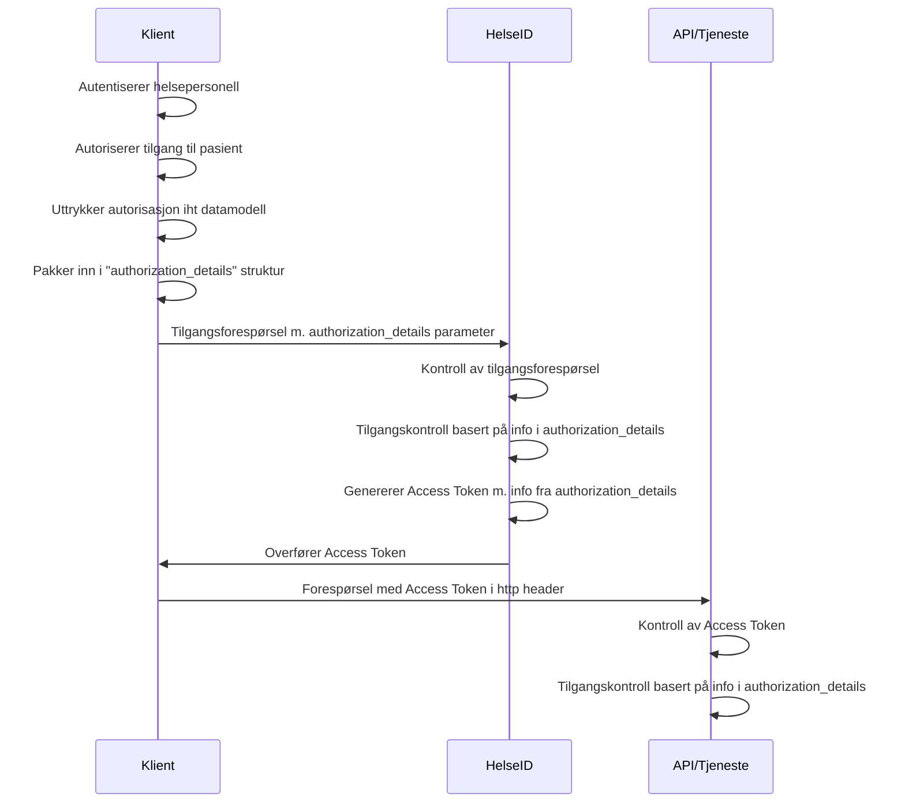

# Profil for bruk av Rich Authorization Requests (authorization_details) i HelseID for bruk av journaldokumenter i Kjernejournal

# TODO
HelseID tar en gjennomgang av spesifikasjonen og flytter ut det som skal i den overliggende spesifikasjonen som beskriver bruk av HelseID for Dokumentdeling i Kjernejournal..

## Sammendrag

## Dokumentets status

| Versjon | Dokumentets status | dato |
| --- | --- | --- |
| 0.1 | Utkast | 26.05.2023 |

Dette dokumentet utgjør ikke en formell standard, men inngår som en del av et kravsett knyttet til dokumentdeling via Kjernejournal for deling av helseopplysninger i helse- og omsorgssektoren. Spesifikasjonen bør ikke benyttes uten føringene som ligger til grunn i tillitsrammeverket.

Spesifikasjonen skal versjoneres for å støtte endringer over tid.


## Definisjon av begrep og forkortelser
Spesifikasjonen benytter begreper og terminologi som er definert i følgende spesifikasjoner: [@!RFC6749], [@!RFC6750], [@!RFC7636], [@!OIDC] og ISO29100.

| Begrep | Definisjon |
| --- | --- |
| API | Application Programming Interface |
| HTTP | Hyper Text Transfer Protocol |
| REST | Representational State Transfer |
| OIDC | [OpenID Connect  Core](https://openid.net/specs/openid-connect-core-1_0.html) |
| OAuth 2.0 | [The OAuth 2.0 Authorization Framework](https://www.ietf.org/rfc/rfc6749.txt) |
| RP | Relying Party |
| Klient | Som i "client" i Client-Server modell |
| RAR | [Rich Authorization Requests](https://datatracker.ietf.org/doc/html/draft-ietf-oauth-rar) |
| JWT | |
| JOSE | |


## Innholdsfortegnelse

## 1. Innledning
Denne spesifikasjonen definerer et JSON-format som skal benyttes til å overføre informasjon om grunnlaget for tilgangen som er gitt i helsepersonellets lokale EPJ-system til den som deler helseopplysningene. Informasjonen som denne strukturen skal inneholde er definert i [spesifikasjon av informasjons- og datamodell for beskrivelse av tilgangsgrunnlaget ved deling av helseopplysninger](https://github.com/NorskHelsenett/Tillitsrammeverk/blob/main/specs/informasjons_og_datamodell.md). TODO: oppdater når begge dokumenter er klare.

Denne spesifikasjonen er en del av et spesifikasjonssett som baserer seg på tillitsrammeverket for deling av helseopplysninger på tvers av helsevirksomheter i helse- og omsorgssektoren, og skal sees i sammenheng med de andre spesifikasjonene.

## 2. Beskrivelse av konsept
Når en klient gjør en tilgangsforespørsel til HelseID, må den legge ved informasjon som beskriver helsepersonellets grunnlag for tilgang i sitt lokale system. Dersom helsepersonellet er autentisert og klient har rett på tilgang til den forespurte tjenesten, vil HelseID utstede et Access Token som inneholder attributtene som klienten overførte.

Informasjonen som beskriver den lokale tilgangen, skal overføres til HelseID ved bruk av mekanismen [Rich Authorization Request](https://www.ietf.org/archive/id/draft-ietf-oauth-rar-23.html) (RAR), hvor attributtene MÅ uttrykkes i henhold til den gjeldende [datamodellen](https://github.com/NorskHelsenett/Tillitsrammeverk/blob/main/specs/informasjons_og_datamodell.md) og formatteres i henhold til denne spesifikasjonen.
TODO: endre lenken når den er klar.

RAR innfører et nytt parameter til protokollen, som heter "authorization_details", som lar klienter uttrykke fingranulerte autorisasjonskrav i tilgangsforespørselen ved bruk av JSON. Informasjonen i "authorization_details" kan benyttes av HelseID og tjenesten som deler helseopplysninger til å begrense tilgang og for å tilfredsstille krav til logging.



## 3. Spesifikasjon
### 3.1 Avvik fra standard
1. vi reflekterer ikke "authorization_details" i access token
2. kan også brukes mot token-endepunktet (via client-assertion) for å endre grant (hmmm...) - risikovurdes
- annet...?

Konklusjon: vi spesifiserer "standard flyt" - men åpner for at det er mulig å bruke client-assertion dersom leverandørene er misfornøyd med standard flyt.

### 3.2 JSON Struktur
#### TODO: legg inn reelle attributter fra datamodellen for dokumentdeling
```JSON
"authorization_details":[
{
	{
		"type": "nhn:trust_framework:parameters",
		"version": "1.0", // hvis utelatt, blir dette versjon 1.0
		"value": {
			"practicioner": {
				"professional_license": {
					"hpr_nr": "9144900",
					"authorization": "LE",
				},
			}
			"care_relationship": {
				"legal_entity": {
					"id": "993467049",
					"name": "OSLO UNIVERSITETSSYKEHUS HF",
				},
				"point_of_care": {
					"id": "974589095",
					"name": "OSLO UNIVERSITETSSYKEHUS HF ULLEVÅL - SOMATIKK",
				}
			}
		}
	},
	{
		"type": "nhn:dokumentdeling:parameters",
		"version": "1.0",				
		"value": {
			"healthcare_service": {
				"code": "S03",
				"system": "urn:oid:2.16.578.1.12.4.1.1.8655"
			},
			"department": {
				"id": "121313", 
				"system": "oid:x.x.x.x.x.x.x",
				"name": "Avdeling ved Sykehus",
			},
			"purpose_of_use": {
				"code": "TREAT",
				"system": "urn:oid:2.16.840.1.113883.1.11.20448"
			},
			"purpose_of_use_details": {
				"code": "15",
				"system": "urn:oid:x.x.x.x.x.9151"
			},
			"decision_ref": {
				"ref_id" : "[id til lokal tilgangsbeslutning som ekstern referanse for kilden]",
			}			
		}
	},
	// Andre elementer:
	{
		"type" : "helseid_authorization" ,
		"practitioner_role" : { 
			"organization" : { 
				"identify" : {
					"system" : "urn: oid: 2.16.578.1.12.4.1.2.101" ,
					"type" : "ENH" ,
					"value" : "[orgnummer]"
				}
			}
		}
	},
	{
		"type": "helseid://claims/external/amk-context",
    	"value": 
    	{ 
      		"foo":
      		[
        		{
					"bar": "role1"
				}, 
        		{
					"bar": "role2"
				}
      		]
    	}
	}
]

```


### 3.3 Overføring av authorization_details strukturen
Authorization_details strukturen som er definert i denne spesifikasjonen skal overføres til HelseID i forespørsler om tilgang til tjenester eller APIer som deler helseopplysninger, og danner grunnlaget for tilgangen som blir gitt i HelseID.

TODO: avgjør hva som skal stå her:
Strukturen kan inngå som parameter i forespørsler til både authorize-endepunktet og token-endepunktet. Se [Profil for bruk av OpenID Connect og OAuth 2.0 i HelseID ved deling av dokumenter i Kjernejournal](https://github.com/NorskHelsenett/Tillitsrammeverk/blob/main/specs/bruk_av_oidc.md) for en detaljert beskrivelse av hvordan HelseID skal brukes.

#### 3.3.1 Via authorization endepunktet - authorization_details i RO
Når authorization_details strukturen overføres som parameter i authorization endepunktet MÅ den inngå som parameter i et Request Object, som beskrevet i [OpenID Connect spesifikasjonen](https://openid.net/specs/openid-connect-core-1_0.html#JWTRequests) og iht [gjeldende krav til bruk av Request Object i HelseID](https://lenke.no).

#### 3.3.2 I token endepunktet - authorization_details i client_assertion
Når authorization_details strukturen overføres som parameter i token endepunktet MÅ den inngå som parameter i Client Assertion, som beskrevet i [OAuth Assertion Framework](https://www.rfc-editor.org/rfc/rfc7521) iht [gjeldende krav til klientautentisering i HelseID](https://lenke.no).


## 4. Sikkerhets- og personvernshensyn

TODO: vurder hvor dette skal vises/puttes:
### Sikkerhetshensyn
Peke til https://www.ietf.org/archive/id/draft-ietf-oauth-rar-23.html#name-security-considerations
Beskriv valgte tiltak som forhindrer deler av problemet..
Beskriv ytterligere tiltak som må vurderes av klient/server/HelseID

### Personvernshensyn
Peke til https://www.ietf.org/archive/id/draft-ietf-oauth-rar-23.html#name-privacy-considerations
Beskriv valgte tiltak som forhindrer deler av problemet
Beskriv ytterligere tiltak som må vurderes av klient/server/HelseID