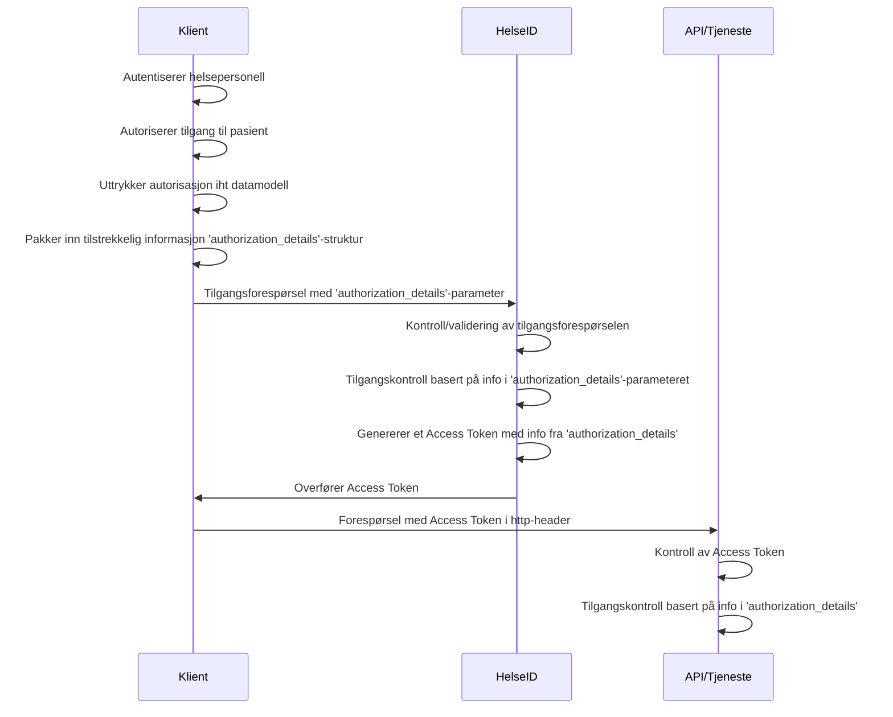

# Spesifikasjon for å beskrive grunnlaget for tilgang til helseopplysninger via HelseID

## Sammendrag
Denne spesifikasjonen definerer et JSON-element med en tilhørende struktur som skal brukes for å formidle informasjon om helsepersonell ved bruk av protokollene OpenID Connect og OAuth 2.0. Tiltroen til informasjonen som ligger i JSON elementet i bygger på Tillitsrammeverket for deling av helseopplysninger i Helsenettet.

Dokumentet er ment å bli brukt sammen med andre spesifikasjoner, som for eksempel «Spesifikasjon for bruk av HelseID for tilgang til journaldokumenter i Kjernejournal» [lenke]

## Dokumentets status

| Versjon | Dokumentets status | dato |
| --- | --- | --- |
| 0.1 | Utkast | 31.02.2023 |
| 1 | Utkast | 20.06.2023 |
Spesifikasjonen vil bli versjonert for å støtte endringer over tid.

## Innholdsfortegnelse
1. [Innledning](#1-innledning)
2. [Beskrivelse av konsept](#2-beskrivelse-av-konsept)
3. [JSON-strukturer](#3-json-strukturer)
4. [Spesifikasjon av strukturen i «nhn:trust_framework:parameters»-elementet](#4-spesifikasjon-av-strukturen-i-nhntrust_frameworkparameters-elementet)
5. [Claims som beskriver parametre for bruk av tillitsrammeverket](#5-claims-som-beskriver-parametre-for-bruk-av-tillitsrammeverket)
6. [Sikkerhets- og personvernhensyn](#6-sikkerhets--og-personvernshensyn)

## 1. Innledning
Å lage et tydelig skille mellom informasjon som inngår i tillitsrammeverket og informasjon som ligger utenfor tillitsrammeverket forhindrer at aktørene i samhandlingen benytter informasjon som ikke inngår i tillitsrammeverket til tilgangsstyring og dokumentasjon.

Norsk Helsenett har derfor spesifisert en JWT-struktur som er tilpasset behovene i forbindelse med deling av helseopplysninger. Strukturen skal inneholde nødvendig informasjon for å tilfredsstille sikkerhetsmessige og lovpålagte krav knyttet til tilgangskontroll, logging og pasientens behov for informasjon om tilganger som er gitt til deres helseopplysninger.

Denne strukturen skal benyttes ved forespørsel til HelseID. Informasjonen fra strukturen brukes som grunnlag for innhold i Access Tokens, som igjen kan brukes til å få tilgang til helseopplysninger. 
 
## 2. Beskrivelse av konsept
Når en klient gjør en tilgangsforespørsel til HelseID, må den legge ved informasjon som beskriver helsepersonellets grunnlag for tilgang i sitt lokale system. Dersom helsepersonellet er autentisert og klient har rett på tilgang til den forespurte tjenesten, vil HelseID utstede et Access Token som inneholder attributtene som klienten overførte.

Informasjonen som beskriver den lokale tilgangen, skal overføres til HelseID ved bruk av mekanismen [Rich Authorization Request](https://www.ietf.org/archive/id/draft-ietf-oauth-rar-23.html) (RAR), hvor attributtene MÅ uttrykkes i henhold til den gjeldende [datamodellen](datamodell_tillitsmodell.md) og formatteres i henhold til denne spesifikasjonen.

RAR innfører et nytt parameter til OpenID Connect-protokollen, som heter "authorization_details". Dette lar klienter uttrykke fingranulerte autorisasjonskrav i tilgangsforespørselen ved bruk av JSON. Informasjonen i "authorization_details" kan benyttes av HelseID og tjenesten som deler helseopplysninger til å begrense tilgang og for å tilfredsstille krav til logging.



## 3. JSON-strukturer
Spesifikasjonen definerer en JSON-struktur som skal benyttes for å beskrive grunnlaget for tilgang til helseopplysninger. Attributter i JSON-strukturen som inneholder informasjon kalles "claims" (påstander).

### Claims i spesifikasjonen
Et claim er et navn/verdi-par, hvor verdien kan være en datatype eller et objekt. Et objekt kan enten være en JSON-struktur eller et JSON-array.

````JSON
Datatype:
"tekstverdi": "Tekst"
"tallverdi": 1234

Vi benytter "_" for å skille mellom ord i navngivingen av claims.

Objekt:
"claim_navn": { 
    "claim_navn2": "claim-verdi2"
},
"claim_navn": [ "element1", "element2" ]
````

#### Fleksibilitet i JSON-strukturen
Spesifikasjonen legger opp til dynamikk med tanke på hvordan informasjonen uttrykkes. Dette lar oss uttrykke metainformasjon om påstandene i en mer konsis form:

````JSON
"claim_name": {
    "claim1": "verdi",
    "claim2": "metainformasjon"
    "claim3": "metainformasjon"
}
````

#### Kodeverk
Mange av verdiene i informasjons- og datamodellen vil være basert på gyldige verdier angitt i ett eller flere kodeverk.

Når kodeverk skal spesifiseres, vil claimet `system` brukes som en indikator for hvilket kodeverk som skal brukes. Innholdet i dette claimet vil være i et [OID-format](https://en.wikipedia.org/wiki/Object_identifier):

````JSON
"claim_name": {
    "claim1": "verdi1",
    "claim2": "verdi2",
    "system": "oid:x.x.x.x.x.x.x.x.x.x",
````

## 4. Spesifikasjon av strukturen i nhn:trust_framework:parameters-elementet

Ved forespørsel til HelseID for å få tilgang til helseopplysninger, er det nødvendig å sende inn en struktur som inneholder informasjon som beskrevet i [datamodellen](https://lenke_her)


### 4.1 JSON-strukturen som beskriver parametrene for Tillitsrammeverket

Dette elemenetet inneholder 4 claims som beskrevet under:

| Claim type | Beskrivelse |
| --- | --- | 
| `type` | Verdi som angir at elementet beskriver tillitsrammeverket. Verdien må være satt som  `nhn:trust_framework:parameters` | 
| `version` | Verdi som angir versjon av tillitrammeverk. Kan utelates; i så fall vil versjonen settes til `1.0`. | 
| `practitioner` | Informasjon om helsepersonellet<br><br> Kilde: HPR, Konsument (klient/IdP) |
| `care_relationship` | Informasjon om helsepersonellets relasjon til pasienten |

````JSON
{
    "type": "nhn:trust_framework:parameters",
    "version": "0.1",
    "practitioner":{
        …
    },
    "care_relationship": {
        …	
    }
}
````

#### Spesifikasjon av «practitioner»- og «care_relationship»-elementene
Semantikken for elementene `practitioner` og `care_relationship` er beskrevet i spesifikasjonen av [informasjons- og datamodell](datamodell_tillitsmodell.md), og vil ikke beskrives i detalj i denne spesifikasjonen.


## 5. Claims som beskriver parametre for bruk av Tillitsrammeverket

JSON-dokumentet under beskriver hvordan en struktur som gjør bruk av Tillitsrammeverket kan se ut. Vær oppmerksom på at en slik struktur som regel vil være kombinert med en annen struktur som beskriver API-spesifikke claims; ett eksempel på dette kan være parametre for dokumentdeling.

````JSON
"authorization_details":[
    {
        "type": "nhn:trust_framework:parameters",
        "version": "0.1",
        "practitioner": {
            "professional_license": {
                "hpr_nr": "9144900",
                "authorization": "LE",
            },
        }
        "care_relationship": {
            "legal_entity": {
                "id": "993467049",
                "name": "OSLO UNIVERSITETSSYKEHUS HF",
                "system": "oid:2.16.578.1.12.4.1.4.101"
            },
            "point_of_care": {
                "id": "974589095",
                "name": "OSLO UNIVERSITETSSYKEHUS HF ULLEVÅL - SOMATIKK",
                "system": "oid:2.16.578.1.12.4.1.4.101"
            }
        }
    },
    {
        …
        // API-spesifikke claims kan opprettes her, for eksempel parametre for Dokumentdeling
    }
]
````
### 5.1 Overføring av «authorization_details»-strukturen

*Dette er en oppsummering, detaljene beskrives i dokumentet [Profil for bruk av OpenID Connect og OAuth 2.0 i HelseID ved deling av dokumenter i Kjernejournal](bruk_av_oidc.md).*

Strukturen `authorization_details` som er beskrevet ovenfor, overføres til HelseID i en forespørsel om tilgang til tjenester eller API-er som deler helseopplysninger. Den danner grunnlaget for tilgangen som blir gitt i HelseID.

Når `authorization_details`-strukturen overføres som parameter i authorization-endepunktet MÅ den inngå som parameter i et Request Object, som beskrevet i [OpenID Connect spesifikasjonen](https://openid.net/specs/openid-connect-core-1_0.html#JWTRequests).

## 6. Sikkerhets- og personvernshensyn

[Se eget dokument.](sikkerhets_og_personvernhensyn.md)