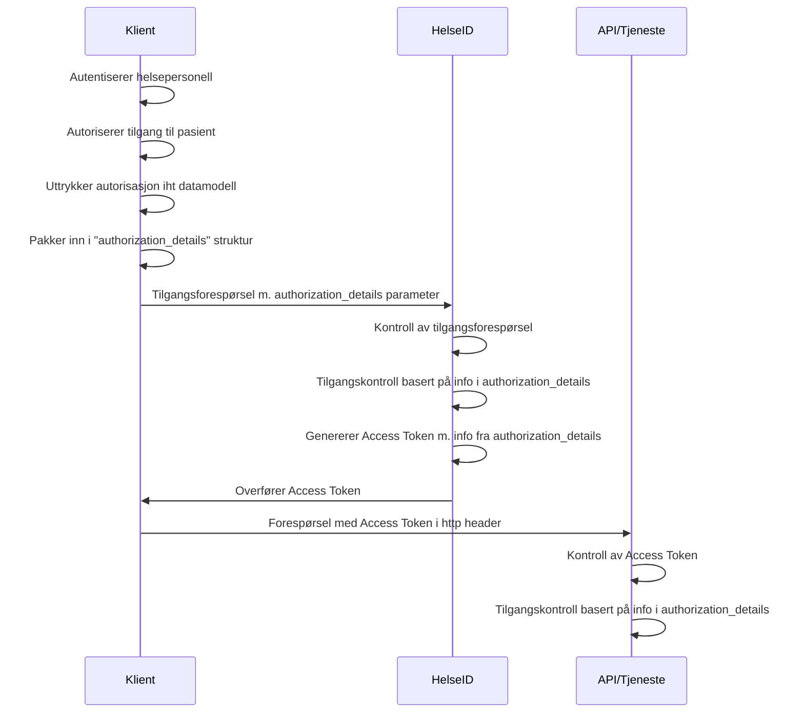

# Profil for bruk av Rich Authorization Requests (authorization_details) i HelseID

## Sammendrag

## Dokumentets status

## Definisjon av begrep og forkortelser
Spesifikasjonen benytter begreper og terminologi som er definert i følgende spesifikasjoner: [@!RFC6749], [@!RFC6750], [@!RFC7636], [@!OIDC] og ISO29100.

| Begrep | Definisjon |
| --- | --- |
| API | Application Programming Interface |
| HTTP | Hyper Text Transfer Protocol |
| REST | Representational State Transfer |
| OIDC | [OpenID Connect  Core](https://openid.net/specs/openid-connect-core-1_0.html) |
| OAuth 2.0 | [The OAuth 2.0 Authorization Framework](https://www.ietf.org/rfc/rfc6749.txt) |
| RP | Relying Party |
| Klient | Som i "client" i Client-Server modell |
| RAR | [Rich Authorization Requests](https://datatracker.ietf.org/doc/html/draft-ietf-oauth-rar) |


## Innholdsfortegnelse

## 1. Innledning
Denne spesifikasjonen definerer et JSON format som skal benyttes til å overføre informasjon om grunnlaget for tilgangen som er gitt i helsepersonellets lokale EPJ system til den som deler helseopplysningene. Informasjonen som denne strukturen skal inneholde er definert i [spesifikasjon av informasjons- og datamodell for beskrivelse av tilgangsgrunnlaget ved deling av helseopplysninger](https://github.com/NorskHelsenett/Tillitsrammeverk/blob/main/specs/informasjons_og_datamodell.md).

Denne spesifikasjonen er en del av et spesifikasjonssett som inngår i tillitsrammeverket for deling av helseopplysninger på tvers av helsevirksomheter i helse- og omsorgssektoren, og skal sees i sammenheng med de andre spesifikasjonene.

Ved deling av helseopplysninger på tvers av helsevirksomhetene i sektoren har virksomheten som deler informasjon en plikt til å etterleve krav i både norm for informasjonssikkerhet og i lovverket. For å tilfredsstille disse kravene har aktører i sektoren samlet seg rundt en modell som beskriver hvordan aktørene kan bygge tilstrekkelig tillit til at delingen skjer innenfor rammene til loven. 

Tillitsmodellen realiseres i et tillitsrammeverk som beskriver konkrete krav til aktørene som skal dele helseopplysninger, og som peker på konkrete tillitsbyggende tjenester som skal benyttes i forbindelse med delingen. I tillitsrammeverket fordeles oppgaver knyttet til tilgangsstyring ved at konsumenten forplikter seg til å utføre tilgangsstyring og tilgangskontroll på vegne av den som deler helseopplysningene. Virksomheten som deler helseopplysningene skal være trygg på at helsepersonellet har et tjenstlig behov, og at helseopplysningene er relevant og nødvendig i behandlingen av pasienten.

Selv om konsumenten skal utføre tilgangsstyring på vegne av den som deler helseopplysningene trenger datakilden informasjon som beskriver grunnlaget for tilgangen slik at de kan utføre ytterligere tilgangsstyring, logging og for å gi informasjon om tilgangen til pasienten. Informasjonen om den lokale tilgangen må overføres fra konsumenten til datakilden, og skal formatteres i henhold til denne spesifikasjonen.


### 1.1 Transport av informasjon om lokal tilgang via HelseID
I tillitsrammeverket stilles det krav til bruk av HelseID for innlogging av helsepersonell for å få tilgang til tjenestene som skal dele helseopplysninger.
Informasjonen som er spesifisert i [spesifikasjon av informasjons- og datamodell for beskrivelse av tilgangsgrunnlaget ved deling av helseopplysninger](https://github.com/NorskHelsenett/Tillitsrammeverk/blob/main/specs/informasjons_og_datamodell.md) utgjør helsepersonellets digitale identitet i jobbsammenheng, og er naturlige attributter  i brukersesjoner som oppstår i HelseID.

HelseID etablerer et tillitsforhold til den kjørende klienten (programvaren som konsumerer tjenesten).
Tjenestene som krever bruk av HelseID må ha høy tillit til sine konsumenter.


## 2. Beskrivelse av konsept
Når en klient gjør en tilgangsforespørsel til HelseID må den legge ved informasjon som beskriver helsepersonellets grunnlag for tilgang i sitt lokale system. Dersom helsepersonellet er autentisert og klient har rett på tilgang til den forespurte tjenesten, vil HelseID utstede et Access Token som inneholder attributtene som klienten overførte.

Tilliten til denne informasjonen hviler på kravene i tillitsrammeverket, samt det tekniske tillitsforholdet som HelseID etablerer til journalsystemet på vegne av tjenesten som skal konsumeres.

Informasjonen som beskriver den lokale tilgangen skal overføres til HelseID ved bruk av mekanismen [Rich Authorization Request](https://www.ietf.org/archive/id/draft-ietf-oauth-rar-23.html)(RAR), hvor attributtene MÅ uttrykkes i henhold til den gjeldende [datamodellen](https://github.com/NorskHelsenett/Tillitsrammeverk/blob/main/specs/informasjons_og_datamodell.md) og formatteres i henhold til denne spesifikasjonen.

Protokollen som HelseID er bygget på definerer en enkel tilgangsstyringsmekanisme som lar klienter be om tilgang til en gitt ressurs hos en tjeneste. Ved å bruke denne mekanismen kan Access Tokens begrenses til å bare gjelde for en gitt ressurs. 
Klienten benytter parameteret "scope" for å angi hviken ressurs den ønsker tilgang til ved en tilgangsforespørsel, og HelseID utsteder Access Tokens som begrenses til denne ressursen dersom klienten har rett til å få tilgang.

Denne tilgangsstyringsmekanismen fungerer godt til enkle formål, men er ikke tilstrekkelig for å støtte mer avanserte behov, som tilgang til helseopplysninger.

RAR innfører et nytt parameter til protokollen, som heter "authorization_details", som lar klienter uttrykke fingranulerte autorisasjonskrav i tilgangsforespørselen ved bruk av JSON. Informasjonen i "authorization_details" kan benyttes av HelseID og tjenesten som deler helseopplysninger til å begrense tilgang og for å tilfredsstille krav til logging.



## 3. Spesifikasjon
### 3.1 Avvik fra standard
- vi reflekterer ikke "authorization_details" i access token
- kan brukes mot token-endepunktet for å endre grant (hmmm...)
- annet...?

### 3.2 JSON Struktur

```JSON
"authorization_details":{
	"type": "medical_records",
	"actions": ["read"],
	"locations": "https://kj.nhn.no/",
	"practicioner": {
		"pid": {
			"value": "22046557946",
			"system_oid": "2.16.578.1.12.4.1.4.1" //F-Nummer
		},
		"structural_role": {
			"value": "Licensed Health Care Providers",
			"system_oid": "oid-code"
		},
	},
	"patient_relationship": {
		"functional_role": {
			"value": "2212",
			"system_oid": "STYRK-08"
		},
		"clinical_speciality": {
			"value": "xxxx",
			"system_oid": "2.16.840.1.113883.3.88.12.80.72" //SNOMED
		},
		"organization":{
			"legal_entity": {
				"name": "Juridisk Enhet AS",
				"org_id": "1231232132",
				"system_oid": "kode for enhetsregisteret"
			},
			"point_of_care": {
				"org_id": "123123123",
				"system_oid": "kode for enhetsregisteret"
			},
			"facility_type": {
				"value": "Hospital",
				"system_oid": "1.3.6.1.4.1.12559.11.10.1.3.2.2.2"//eHealth DSI
			},
			"locality": {
				"value": "Sengepost X" //policy - kun alfanumerisk "^[a-zA-Z0-9_]*$"
			}
		},
		"purpose_of_use": {
			"value": "TREAT",
			"system_oid": "urn:oid:2.16.840.1.113883.1.11.20448"
		}
	},
	"patient":{
		"identifier": {
			"value": "21981298231",
			"system_oid": "2.16.578.1.12.4.1.4.2" //D-nummer
		}
	}
}

```


### 3.3 Overføring av authorization_details strukturen
Authorization_details strukturen som er definert i denne spesifikasjonen skal overføres til HelseID i forespørsler om tilgang til tjenester eller APIer som deler helseopplysninger, og danner grunnlaget for tilgangen som blir gitt i HelseID.

Strukturen kan inngå som parameter i forespørsler til både authorize-endepunktet og token-endepunktet. Dette er spesifisert ytterligere i [Profil for bruk av OpenID Connect og OAuth 2.0 i HelseID ved deling av helseopplysninger](https://github.com/NorskHelsenett/Tillitsrammeverk/blob/main/specs/bruk_av_oidc.md).

#### 3.3.1 Via authorization endepunktet - authorization_details i RO
Når authorization_details strukturen overføres som parameter i authorization endepunktet MÅ den inngå som parameter i et Request Object, som beskrevet i [OpenID Connect spesifikasjonen](https://openid.net/specs/openid-connect-core-1_0.html#JWTRequests) og iht [gjeldende krav til bruk av Request Object i HelseID](https://lenke.no).

#### 3.3.2 I token endepunktet - authorization_details i client_assertion
Når authorization_details strukturen overføres som parameter i token endepunktet MÅ den inngå som parameter i Client Assertion, som beskrevet i [OAuth Assertion Framework](https://www.rfc-editor.org/rfc/rfc7521) iht [gjeldende krav til klientautentisering i HelseID](https://lenke.no).


## 4. Sikkerhets- og personvernshensyn

### Sikkerhetshensyn
Peke til https://www.ietf.org/archive/id/draft-ietf-oauth-rar-23.html#name-security-considerations
Beskriv valgte tiltak som forhindrer deler av problemet..
Beskriv ytterligere tiltak som må vurderes av klient/server/HelseID

### Personvernshensyn
Peke til https://www.ietf.org/archive/id/draft-ietf-oauth-rar-23.html#name-privacy-considerations
Beskriv valgte tiltak som forhindrer deler av problemet
Beskriv ytterligere tiltak som må vurderes av klient/server/HelseID